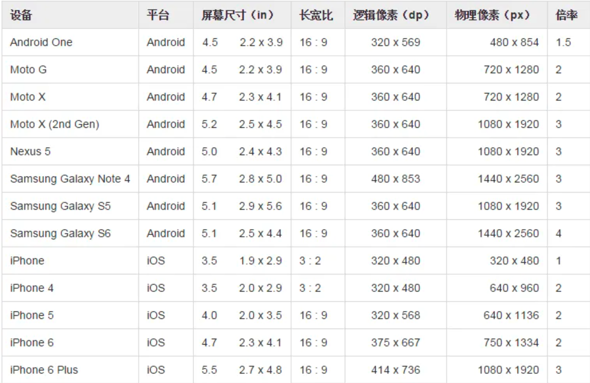
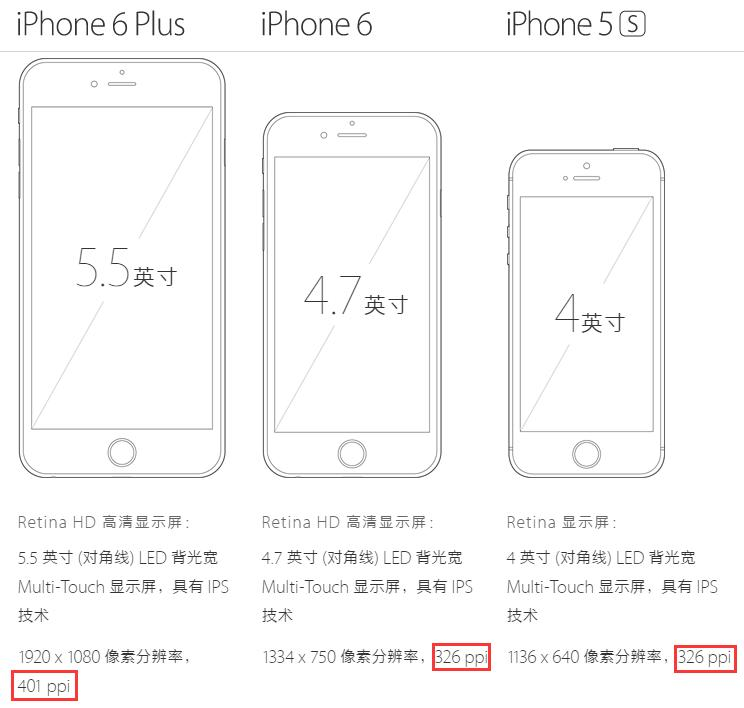
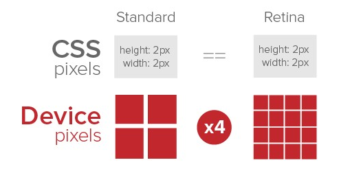
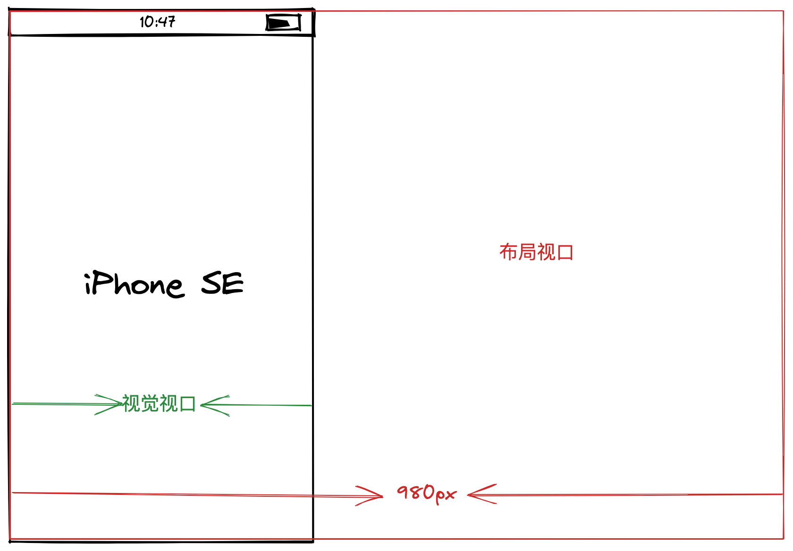
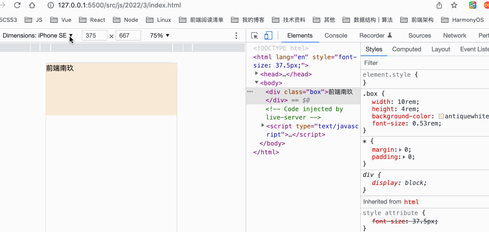
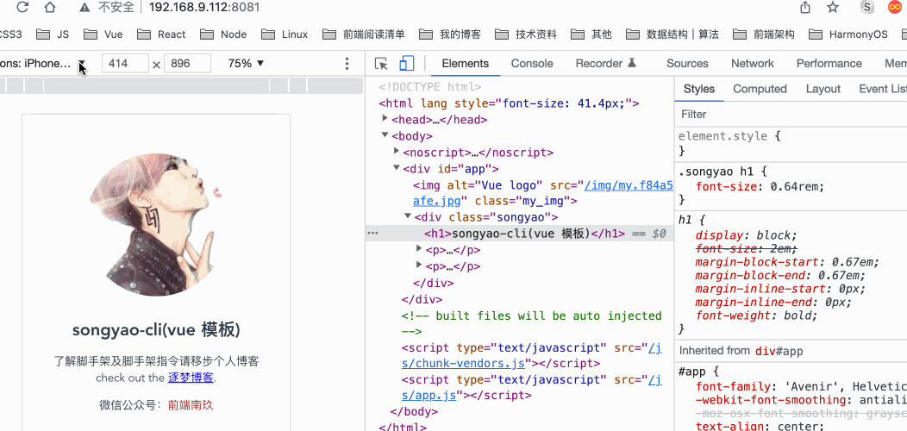
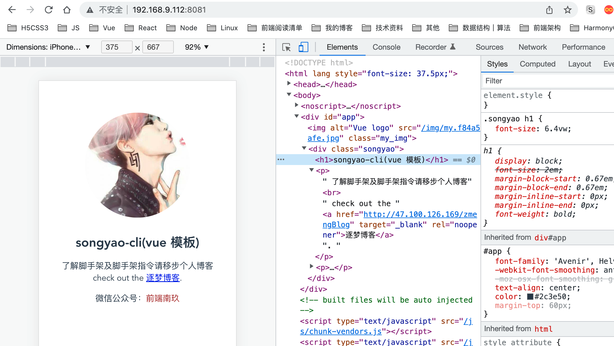

## 前言

移动互联网发展至今，各种移动设备应运而生，但它们的物理分辨率可以说是五花八门，一般情况UI会为我们提供375尺寸的设计稿，所以为了让H5页面能够在这些不同的设备上尽量表现的一致，前端工程师就不得不对页面进行移动端适配了。


## 前置知识

在学习移动端适配前我们需要了解一些相关的前置知识。



### 屏幕尺寸

> 屏幕尺寸指的是以屏幕对角线的长度来计算的，单位是英寸。`1英寸=2.54厘米`

电子设备一般都用英寸来描述屏幕的物理大小，比如我们电脑常见的22、27英寸。英寸（inch，缩写为in）在荷兰语中的意思指的是大拇指，一英寸就是指普通人的拇指宽度。

### 像素pixel

> 从计算机技术的角度来解释，像素是硬件和软件所能控制的最小单位。它指显示屏的画面上表示出来的最小单位，不是图画上的最小单位。一幅图像通常包含成千上万个像素，每个像素都有自己的颜色信息，它们紧密地组合在一起。**一个像素，就是一个点，或者说是一个很小的正方形**。

#### 屏幕分辨率

> 屏幕分辨率指一个屏幕具体由多少个像素点组成，单位是px。

我们可以看到上图中有两种像素：逻辑像素与物理像素，并且它们数值不一样，还有就是为什么一般UI给我们提供的设计稿上的分辨率与真实机型的分辨率不一样，。

#### 物理像素（设备像素）

在同一个设备上，他的物理像素是固定的，也就是厂家在生产显示设备时就决定的实际点的个数，对于不同设备物理像素点的大小是不一样的。（设备控制显示的最小单位，我们常说的1920*1080像素分辨素就是用的物理像素单位）

如果都使用物理像素就会带来问题：举个例子，21英寸显示器的分辨率是1440x1080，5.8英寸的iPhone X的分辨率是2436×1125，我们用CSS画一条线，其长度是20px，如果都以物理像素作为度量单位，那么在显示器上看起来正常，在iPhone X屏幕上就变得非常小。

#### 逻辑像素（设备独立像素）

OK，其实乔帮主在之前就想到了会有这个问题，苹果在iPhone4的发布会上首次提出了`Retina Display`(视网膜屏幕)的概念，在iPhone4使用的视网膜屏幕中，把4个像素当1个像素使用，这样让屏幕看起来更精致，并且在不同屏幕中，相同的逻辑像素呈现的尺寸是一致的。所以高分辨率的设备，多了一个逻辑像素。我们从第一张图中可以看到不同设备的逻辑像素仍然是有差异的，只不过差异没有物理像素那么大，于是便诞生了移动端页面需要适配这个问题。（与设备无关的逻辑像素，代表可以通过程序控制使用的虚拟像素）

#### 每英寸像素点ppi

> **ppi（pixel per inch)**表示每英寸所包含的像素点数目，数值越高，说明屏幕能以更高密度显示图像。

它的计算公式为：`PPI=√（X^2+Y^2）/ Z `（X：长度像素数；Y：宽度像素数；Z：屏幕大小）

ppi在120-160之间的手机被归为低密度手机，160-240被归为中密度，240-320被归为高密度，320以上被归为超高密度



#### 设备像素比dpr

> **dpr（device pixel ratio）**表示设备像素比，设备像素/设备独立像素，代表设备独立像素到设备像素的转换关系，在JS中可以通过 window.devicePixelRatio 获取

计算公式为：`DPR = 物理像素/逻辑像素`

当设备像素比为1:1时，使用1（1×1）个设备像素显示1个CSS像素；

当设备像素比为2:1时，使用4（2×2）个设备像素显示1个CSS像素；

当设备像素比为3:1时，使用9（3×3）个设备像素显示1个CSS像素。



#### 概念关系图

屏幕尺寸、屏幕分辨率-->对角线分辨率/屏幕尺寸-->屏幕像素密度PPI
            														                                 |
             						 设备像素比dpr = 物理像素 / 设备独立像素dip(dp)
                                          														   |
                                      													 viewport: scale
                                          														   |
                                          													CSS像素px

### 视口viewport

viewport指的是视口，他是浏览器或app中webview显示页面的区域。一般来讲PC端的视口指的是浏览器窗口区域，而移动端就有点复杂，它有三个视口：

- **layout viewport**：布局视口
- **visual viewport**：视觉视口
- **ideal viewport**：理想视口

#### 布局视口（layout viewport）

它是由浏览器提出的一种虚拟的布局视口，用来解决页面在手机上显示的问题。这种视口可以通过`<meta>`标签设置`viewport`来改变。移动设备上的浏览器都会把自己默认的viewport设为980px或1024px（也可能是其它值，这个是由设备自己决定的），但带来的后果就是浏览器会出现横向滚动条，因为浏览器可视区域的宽度是比这个默认的viewport的宽度要小的。

我们可以通过`document.documentElement.clientWidth`来获取布局视口大小

#### 视觉视口（visual viewport）

它指的是浏览器的可视区域，也就是我们在移动端设备上能够看到的区域。默认与当前浏览器窗口大小相等，当用户对浏览器进行缩放时，不会改变布局视口的大小，但会改变视觉窗口的大小。



我们可以通过`window.innerWidth`来获取视觉视口大小。

#### 理想视口（ideal viewport）

理想中的视口。这个概念最早由苹果提出，其他浏览器厂商陆续跟进，目的是解决在布局视口下页面元素过小的问题，显示在理想视口中的页面具有最理想的宽度，用户无需进行缩放。所谓理想视口，即页面绘制区域可以完美适配设备宽度的视口大小，不需要出现滚动条即可正常查看网站的所有内容，且文字图片清晰，如所有iphone的理想视口宽度都为320px，安卓设备的理想视口有320px、360px等等。

当页面缩放比例为`100%`时，`理想视口 = 视觉视口`。

我们可以通过`screen.width`来获取理想视口大小。

#### meta viewport

对于移动端页面，可以采用`<meta>`标签来配置视口大小和缩放等。

```html
<meta name="viewport" content="width=device-width, initial-scale=1.0, maximum-scale=1.0, user-scalable=no" />
```

- **width**：该属性被用来控制视窗的宽度，可以将width设置为320这样确切的像素数，也可以设为device-width这样的关键字，表示设备的实际宽度，一般为了自适应布局，普遍的做法是将width设置为`device-width`。
- **height**：该属性被用来控制视窗的高度，可以将height设置为640这样确切的像素数，也可以设为`device-height`这样的关键字，表示设备的实际高度，一般不会设置视窗的高度，这样内容超出的话采用滚动方式浏览。
- **initial-scale**：该属性用于指定页面的初始缩放比例，可以配置`0.0～10`的数字，**initial-scale=1表示不进行缩放，视窗刚好等于理想视窗**，当大于1时表示将视窗进行放大，小于1时表示缩小。这里只表示初始视窗缩放值，用户也可以自己进行缩放，例如双指拖动手势缩放或者双击手势放大。**安卓设备上的initial-scale默认值：** 无默认值，一定要设置，这个属性才会起作用。在iphone和ipad上，无论你给viewport设的宽的是多少，如果**没有指定默认的缩放值**，则iphone和ipad会**自动计算这个缩放值**，以达到当前页面不会出现横向滚动条(或者说viewport的宽度就是屏幕的宽度)的目的。
- **maximum-scale**：该属性表示用户能够手动放大的最大比例，可以配置`0.0～10`的数字。
- **minimum-scale**：该属性类似maximum-scale，用来指定页面缩小的最小比例。通常情况下，不会定义该属性的值，页面太小将难以浏览。
- **user-scalable**：该属性表示是否允许用户手动进行缩放，可配置`no或者yes`。当配置成no时，用户将不能通过手势操作的方式对页面进行缩放。

这里需要注意的是`viewport`只对移动端浏览器有效，对PC端浏览器是无效的。

#### 适配与缩放

为了让移动端页面获得更好的显示效果，我们必须让布局视口、视觉视口都尽可能等于理想视口，所以我们一般会设置`width=device-width`，这就相当于让布局视口等于理想视口；设置`initial-scale=1.0`，相当于让视觉视口等于理想视口；

上面提到`width`可以决定布局视口的宽度，实际上它并不是布局视口的唯一决定性因素，设置`initial-scale`也有肯能影响到布局视口，因为布局视口宽度取的是`width`和视觉视口宽度的最大值。

例如：若手机的理想视口宽度为`400px`，设置`width=device-width`，`initial-scale=2`，此时`视觉视口宽度 = 理想视口宽度 / initial-scale`即`200px`，布局视口取两者最大值即`device-width` `400px`。

若设置`width=device-width`，`initial-scale=0.5`，此时`视觉视口宽度 = 理想视口宽度 / initial-scale`即`800px`，布局视口取两者最大值即`800px`。

## 移动端适配方案

当我们在做H5移动端开发时，用到的最多的单位是PX，也就是CSS像素，当页面缩放比为`1:1`时`，一个CSS像素等于一个设备独立像素。但CSS像素是很容易被改变的，比如用户对页面进行放大，CSS像素会被放大，此时的CSS像素会跨越更多的设备像素。

页面缩放系数 = CSS像素 / 设备独立像素

### rem适配

>  rem（font size of the root element）是CSS3新增的一个相对单位，是指相对于根元素的字体大小的单位。

```html
<!DOCTYPE html>
<html lang="en">
<head>
    <meta charset="UTF-8">
    <meta http-equiv="X-UA-Compatible" content="IE=edge">
    <meta name="viewport" content="width=device-width, initial-scale=1.0, user-scalable=no" />
    <title>Document</title>
    <style>
        *{margin:0;padding:0}
        .box{
            width: 10rem;
            height: 4rem;
            background-color: antiquewhite;
            font-size: 0.53rem; /* 20px*/
        }
    </style>
    <script>
        function setRootRem() {
            const root = document.documentElement;
            /** 以iPhone6为例：布局视口为375px，我们把它分成10份，则1rem = 37.5px，
             * 这时UI给定一个元素的宽为375px（设备独立像素），
             * 我们只需要将它设置为375 / 37.5 = 10rem。
            */
            const scale = root.clientWidth / 10
            root.style.fontSize = scale + 'px'  
        }
        setRootRem()
        window.addEventListener('resize', setRootRem)
    </script>
</head>
<body>
    <div class="box">eee</div>
</body>
</html>
```



Ok,这里我们可以看到，我们在选用不同设备进行测试时，根节点的的font-size会随着设备的布局视口的宽度变化而变化，所以这里的元素宽度10rem永远都是等于当前布局视口的宽度，font-size也会随设备变化而变化。这就是所谓的移动端适配，其实这种方案最早是由阿里提出来的一个开源移动端适配解决方案`flexible`，原理非常简单。

但这样我们会发现在写布局的时候会非常复杂，也就是你需要自己手动去计算一下对应的rem值，比如上面的`font-size`设计稿上是`20px`，那我们就要计算一下20px对应的rem是多少，按我们上面的规则，**1px = 1/37.5rem**，所以20px应该对应`20/37.5 = 0.53rem`。所以这种方案我们通常搭配着CSS预处理器使用，还不了解CSS预处理器的同学推荐看我之前的文章：[谈到CSS预处理器，你是不是只会用嵌套？](https://mp.weixin.qq.com/s/mc6TKwzj9gGfUirtdj8mpQ)

**rem搭配CSS预处理器使用**

这里我就用vue+less来简单操作一下，具体可以封装到底层，这里暂且演示一下原理。

这里推荐一下使用我的自制脚手架**(songyao-cli)**来快速生成一个vue项目，安装完依赖后，开始配置less.

```less
/*rem.less*/
@device-width: 375; /*设备布局视口*/
@rem: (@device-width/10rem);
```

然后将`@rem`配置成less全局变量

```js
//vue.config.js
module.exports = {
    css: {
        loaderOptions:{
            less: {
                additionalData: ` @import '~@/static/rem.less';`
            }
        }
    }
}
```

在vue的入口文件配置计算rem的方法

```js
// toRem.js
export default function() {
    const root = document.documentElement;
    /** 以iPhone6为例：布局视口为375px，我们把它分成10份，则1rem = 37.5px，
     * 这时UI给定一个元素的宽为375px（设备独立像素），
     * 我们只需要将它设置为375 / 37.5 = 10rem。
    */
    const scale = root.clientWidth / 10
    root.style.fontSize = scale + 'px'  
}


//main.js
import Vue from 'vue'
import App from './App.vue'
import toRem from "./utils/toRem" //
toRem()
window.addEventListener('resize', toRem)
Vue.config.productionTip = false

new Vue({
  render: h => h(App),
}).$mount('#app')

```

然后就可以在vue中使用全局变量`@rem`进行移动端开发了

```vue
<template>
    <div class="songyao">
        <h1>{{ username }}</h1>
    <p>
      了解脚手架及脚手架指令请移步个人博客<br>
      check out the
      <a href="http://47.100.126.169/zmengBlog" target="_blank" rel="noopener">逐梦博客</a>.
    </p>
    <p>微信公众号：<span class="wx_name">前端南玖</span></p>
    </div>
</template>

<script>
export default {
    name: 'songyao',
    data() {
        return {
            username: 'songyao-cli(vue 模板)'
        }
    },
}
</script>

<style lang="less">
.songyao{
    h1{
        font-size: (24/@rem);
    }
    p{
        font-size: (16/@rem);
    }
   .wx_name{
    color:brown;
    }
}

</style>
```



不过上面这种方案是一种过渡方案，viewport是由苹果提出的一种方案，之前各大浏览器对其兼容性并不是很好，这才有了这种rem适配方案。

在阿里开源库`flexible`文档上有这么一句话：

> 由于`viewport`单位得到众多浏览器的兼容，`lib-flexible`这个过渡方案已经可以放弃使用，不管是现在的版本还是以前的版本，都存有一定的问题。建议大家开始使用`viewport`来替代此方。

对，这种方案已经在慢慢被抛弃了，不过还有不少企业在用。

### vw、vh适配

`vw（Viewport Width）`、`vh(Viewport Height)`是基于视图窗口的单位，是css3中提出来的，基于视图窗口的单位。

`vh、vw`方案即将视觉视口宽度 `window.innerWidth`和视觉视口高度 `window.innerHeight` 等分为 100 份。

上面的`flexible`方案就是模仿这种方案，因为早些时候`vw`还没有得到很好的兼容。

- `vw(Viewport's width)`：`1vw`等于视觉视口的`1%`
- `vh(Viewport's height)` :`1vh` 为视觉视口高度的`1%`
- `vmin` : `vw` 和 `vh` 中的较小值
- `vmax` : 选取 `vw` 和 `vh` 中的较大值

如果按视觉视口为`375px`，那么`1vw = 3.75px`，这时`UI`给定一个元素的宽为`75px`（设备独立像素），我们只需要将它设置为`75 / 3.75 = 20vw`。

这里我们同样可以借助less来实现，不用自己去手动算，算的过程我们交给less就好了，我们直接按照设计稿上去开发就行

```js
// 还是rem.less 我们加一个@vw变量
@device-width: 375;
@rem: (@device-width/10rem);
@vw: (100vw/@device-width);
```

```vue
<template>
    <div class="songyao">
        <h1>{{ username }}</h1>
    <p>
      了解脚手架及脚手架指令请移步个人博客<br>
      check out the
      <a href="http://47.100.126.169/zmengBlog" target="_blank" rel="noopener">逐梦博客</a>.
    </p>
    <p>微信公众号：<span class="wx_name">前端南玖</span></p>
    </div>
</template>

<script>
export default {
    name: 'songyao',
    data() {
        return {
            username: 'songyao-cli(vue 模板)'
        }
    },
}
</script>

<style lang="less">
.songyao{
    h1{
        // font-size: (24/@rem);
        font-size: 24*@vw;
    }
    p{
        // font-size: (16/@rem);
        font-size: 16*@vw;
    }
   .wx_name{
    color:brown;
    }
}

</style>
```



### viewport+PX

OK，我们再来说一种`flexible`团队推荐的viewport方案。这种方案可以让我们在开发时不用关注设备屏幕尺寸的差异，直接按照设计稿上的标注进行开发，也无需单位的换算，直接用px。

在 HTML 的 head 标签里加入 `<meta name="viewport" content="width={设计稿宽度}, initial-scale={屏幕逻辑像素宽度/设计稿宽度}" >` 。

假如UI给我们提供的设计稿宽度时375px，我们则需要将页面的viewport的width设为375，然后再根据设备的逻辑像素将页面进行整体放缩。

```js
export function initViewport() {
    const width = 375;  // 设计稿宽度
    const scale = window.innerWidth / width
    // console.log('scale', scale)
    let meta = document.querySelector('meta[name=viewport]')
    let content = `width=${width}, init-scale=${scale}, user-scalable=no`
    if(!meta) {
        meta = document.createElement('meta')
        meta.setAttribute('name', 'viewport')
        document.head.appendChild(meta)
    }
    meta.setAttribute('content', content)
}
```

```vue
<template>
    <div class="songyao">
        <h1 class="name_rem">{{ username }}</h1>
        <h1 class="name_vw">{{ username }}</h1>
        <h1 class="name_px">{{ username }}</h1>
    <p>
      了解脚手架及脚手架指令请移步个人博客<br>
      check out the
      <a href="http://47.100.126.169/zmengBlog" target="_blank" rel="noopener">逐梦博客</a>.
    </p>
    <p>微信公众号：<span class="wx_name">前端南玖</span></p>
    </div>
</template>

<script>
export default {
    name: 'songyao',
    data() {
        return {
            username: 'songyao-cli(vue 模板)'
        }
    },
}
</script>

<style lang="less">
.songyao{
    p{
        // font-size: (16/@rem);
        font-size: 16*@vw;
    }
    .name_rem{
        font-size: (24/@rem);
    }
    .name_vw{
        font-size: 24*@vw;
    }
    .name_px{
        font-size: 24px;
    }
   .wx_name{
    color:brown;
    }
}

</style>
```

这里我们将三种方案放在一起对比一下，都是对应375设计稿上24px，三种方案表现出来基本一致。


## 总结

目前来讲这三种方案是现在用的最多的方案，它们都有各自的优缺点。

### **rem方案**

- 适配原理稍复杂
- 需要使用 JS
- 设计稿标注的 px 换算到 css 的 rem 计算简单
- 方案灵活，既能实现整体缩放，又能实现局部不缩放

### **vw 方案**

- 适配原理简单
- 不需要 JS 即可适配
- 设计稿标注的 px 换算到 css 的 vw 计算复杂
- 方案灵活，既能实现整体缩放，又能实现局部不缩放

### **viewport+px方案**

- 适配原理简单
- 需要使用 JS
- 直接使用设计稿标注无需换算
- 方案死板，只能实现页面级别肢体缩放

