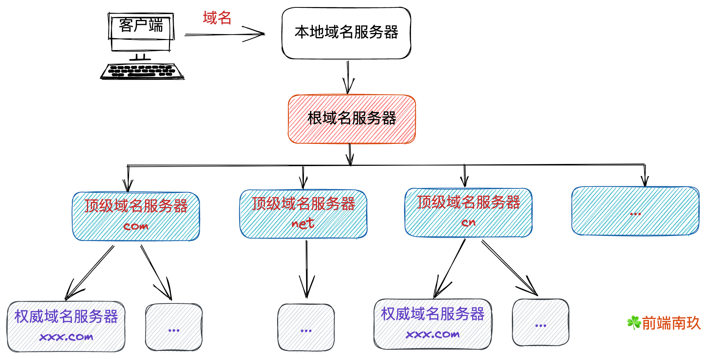
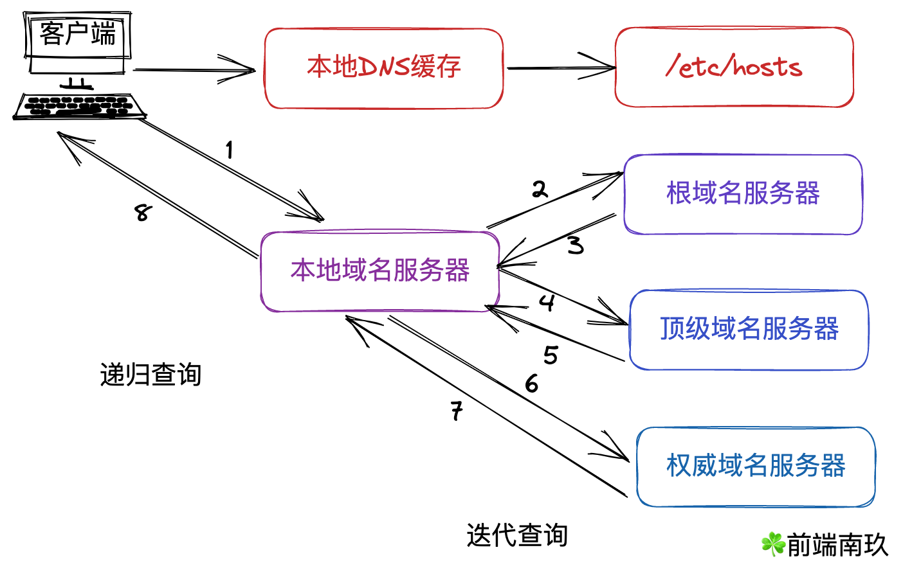

## 	前言

我们在做性能优化的过程中，通常会将一些资源部署在CDN上，还有就是在做资源缓存中会遇到DNS缓存与CDN缓存。什么是DNS与CDN，以及它们是如何缓存的？这篇文章就带大家一起来了解它们相关的知识。

**如果这篇文章有帮助到你，❤️关注+点赞❤️鼓励一下作者，文章公众号首发，关注 `前端南玖` 第一时间获取最新文章～**

> 这是我的Github:[Github](https://github.com/bettersong/interview)，参与每日一题学习，欢迎star🌟

## DNS

> DNS全称Domain Name System，即域名系统。

### 什么是DNS？

DNS往往是网络请求的第一步，在互联网上，通信是基于TCP/IP协议来进行的，如果TCP|UDP定义了数据传输的方式，那么通过IP协议，我们就可以知道数据传输的地点。 不过日常我们也是可以通过`域名`去访问对应的地址，而事实上只有IP地址才可以寻找到对应服务器，因此当你使用域名去访问，首先经历的是一个`域名解析`的过程，将域名转换成对应的IP地址，再去寻址。**它实质上是一个` 域名 `和 `IP`相互映射的分布式数据库，有了它我们就可以通过域名更方便的访问互联网。**DNS有以下特点:

- 分布式的
- 协议支持TCP 和 UDP, 常用端口是53
- 每一级域名的长度限制是63
- 域名总长度限制是253

### DNS解析过程

DNS域名系统是一个四层树状结构的分布式系统，分别包括：本地域名服务器、跟域名服务器、顶级域名服务器、权威域名服务器

**本地域名服务器**（Local Name Server，local DNS）：如果通过 DHCP 配置，local DNS 由互联网服务提供商（ISP，如联通、电信）提供；

**根域名服务器**（Root Name Server）：当 local DNS 查询不到解析结果时，第一步会向它进行查询，并获取顶级域名服务器的IP地址。全球一共有 13 个根域名服务器（除了它们的镜像），它们并不直接用于域名解析，仅用于指出可查询的顶级域名服务器；

**顶级域名服务器**（Top-level Name Server）：负责管理在该顶级域名服务器下注册的二级域名，例如**.com 顶级域名服务器**，而 **baidu.com 权威服务器**是注册在 **.com** 的权威域名服务器；

**权威域名服务器**（Authoritative Name Server）：在特定区域内具有唯一性，负责维护该区域内的域名与 IP 地址的映射关系。在 DNS 应答报文中，标志位 **AA** 标识本次 DNS 记录是否来自权威域名服务器，否则可能来自缓存。

### 递归查询与迭代查询

DNS解析分为**递归查询** 与 **迭代查询**，从上图我们可以看出客户端与本地服务器之间一般采用递归查询，而各域名服务器之间一般采用迭代查询。

#### 主机向本地域名服务器的查询一般都是采用递归查询

所谓递归查询就是：如果主机所询问的本地域名服务器不知道被查询的域名的IP地址，那么本地域名服务器就以DNS客户的身份，向其它根域名服务器继续发出查询请求报文(即替主机继续查询)，而不是让主机自己进行下一步查询。

因此，递归查询返回的查询结果或者是所要查询的IP地址，或者是报错，表示无法查询到所需的IP地址。

#### 本地域名服务器向根域名服务器的查询的迭代查询

迭代查询的特点：当根域名服务器收到本地域名服务器发出的迭代查询请求报文时，要么给出所要查询的IP地址，要么告诉本地服务器：“你下一步应当向哪一个域名服务器进行查询”。然后让本地服务器进行后续的查询。根域名服务器通常是把自己知道的顶级域名服务器的IP地址告诉本地域名服务器，让本地域名服务器再向顶级域名服务器查询。顶级域名服务器在收到本地域名服务器的查询请求后，要么给出所要查询的IP地址，要么告诉本地服务器下一步应当向哪一个权限域名服务器进行查询。最后，知道了所要解析的IP地址或报错，然后把这个结果返回给发起查询的主机。

### DNS缓存

为了提升域名查询效率，DNS也有它自己的缓存机制，当访问过某个网站并得到其IP地址后，会将其域名与IP缓存下来，下一次访问的时候，就不需要再请求域名服务器获取IP，直接使用缓存中的IP，提高响应速度。当缓存的有效时间（TTL）过了，再次请求网站，还是需要先请求域名解析。

有dns的地方,就有缓存。浏览器、操作系统、Local DNS、根域名服务器，它们都会对DNS结果做一定程度的缓存。

DNS查询过程如下:

1. 首先搜索浏览器自身的DNS缓存,如果存在，则域名解析到此完成。
2. 如果浏览器自身的缓存里面没有找到对应的条目，那么会尝试读取操作系统的hosts文件看是否存在对应的映射关系,如果存在，则域名解析到此完成。
3. 如果本地hosts文件不存在映射关系，则查找本地DNS服务器(ISP服务器,或者自己手动设置的DNS服务器),如果存在,域名到此解析完成。
4. 如果本地DNS服务器还没找到的话,它就会向根服务器发出请求,进行递归查询。

缓存并不是永久有效的，上面提到过有效时间 TTL（Time to Live），它决定了 DNS 记录在缓存中的有效时间。需要注意的是，TTL 只是一个参考值，实际使用的缓存有效时间不一定等于该值，甚至是固定值。

### DNS存在的问题

- **查询路径过长导致业务访问延时**

DNS查询一般为毫秒级，但是如果存在多个域名需要查询或者网络不佳，可能导致延时大量增加

- **缓存时间不规范**

本地域名服务器是分地区和运营商的，各大运营商在域名解析缓存的处理上实现的策略不统一，有时候本地域名服务器的解析结果可能不是最近或最优的节点，有时候并不会遵循有效时间TTL的限制，这就会导致域名变更IP地址后，一些客户端仍然访问到的是旧的IP地址。

- **DNS劫持**

由于DNS没有加密等安全机制，部分运营商会在本地域名服务器劫持域名解析结果，在访问网站过程中插入广告，如果被黑客劫持了LDNS，则会造成个人信息泄漏、密码获取等不良后果。

- **根服务器停止服务的风险**

域名查询都是从根服务器开始递归，根服务器一旦被攻击或者关闭服务，将会导致全球互联网瘫痪。

- **无法精准调度用户流量**

大部分DNS权威域名服务器都是具备智能解析的功能，DNS服务器依据DNS请求的IP地址判断用户所在的位置以及运营商，以此分配离用户最近的访问节点IP给用户。但DNS服务器上可以看到的都是本地域名服务器地址，也就意味着如果用户使用其他运营商的本地域名服务器来进行域名解析将无法获取到最佳的访问节点地址。

## CDN

> CDN全称Content Delivery Network，即内容分发网络

### 什么是CDN？

CDN是一种内容分发网络，它能够实时地根据网络流量和各节点的连接、负载状况以及到用户的距离和响应时间等综合信息将用户重新导向离用户最近的服务节点上。其目的是使用户就近获取内容，解决网络拥挤的状况，提高用户访问网站的响应速度。

CDN技术诞生于二十多年前，随着网络的快速发展，日益增长的数据传输，网络面临的压力越来越大，所以1995年，MIT的应用数学教授

Tom Leighton与团队开始尝试运用数学的方法来解决网络堵塞的问题，他们使用数学算法处理内容的动态路由安排，并最终解决了这一难题。

### CDN的工作原理

说直白点就是CDN其实是一个离用户较近的由一个DNS服务器和几台缓存服务器运行起来的，该服务器可以获取到完整的网站资源，并且它会定期与源站进行同步，保证自身服务器上的内容是最新的。

- 当用户输入URL，首先会经过本地DNS域名系统解析，DNS系统会最终将域名的解析权交给CNAME指向的CDN专用DNS服务器。

- CDN的DNS服务器将CDN的全局负载均衡设备IP地址返回用户。

- 用户向CDN的全局负载均衡设备发起访问请求。

- CDN全局负载均衡设备根据用户IP地址，以及用户请求的内容URL，选择一台用户所属区域的区域负载均衡设备，告诉用户向这台设备发起请求。

- 区域负载均衡设备会为用户选择一台合适的缓存服务器提供服务，选择的依据包括：根据用户IP地址，判断哪一台服务器距用户最近；根据用户所请求的URL中携带的内容名称，判断哪一台服务器上有用户所需内容；查询各个服务器当前的负载情况，判断哪一台服务器尚有服务能力。基于以上这些条件的综合分析之后，区域负载均衡设备会向全局负载均衡设备返回一台缓存服务器的IP地址。

- 全局负载均衡设备把服务器的IP地址返回给用户。

- 用户向缓存服务器发起请求，缓存服务器响应用户请求，将用户所需内容传送到用户终端。如果这台缓存服务器上并没有用户想要的内容，而区域均衡设备依然将它分配给了用户，那么这台服务器就要向它的上一级缓存服务器请求内容，直至追溯到网站的源服务器将内容拉到本地。

### CDN的组成部分

典型的CDN由三个部分组成：分发服务系统、负载均衡系统、运营管理系统

- **分发服务系统**：最基本的工作单元是`Cache`设备，cache负责直接响应最终用户的访问请求，把缓存在本地的内容快速提供给用户。同时cache还负责与源站点进行内容同步，把最新的内容从源站获取下来并保存在本地。cache设备的数量、规模、总服务能力是衡量一个CDN系统服务能力的最基本指标。
- **负载均衡系统**：主要功能是负责对所有发起请求的用户进行访问调度，确定提供给用户的最终实际访问地址。两级调度体系分为`全局负载均衡（GSLB）`和`本地负载均衡（SLB）`。全局负载均衡主要根据用户的就近原则，通过对每个服务节点进行最优判断，确定向用户提供服务的cache的物理地址。本地负载均衡主要负责节点内部的设备负载均衡。
- **运营管理系统**：运营管理系统分为运营管理和网络管理子系统，负责处理业务层面与外界系统交互所必须的手机、整理与交互。

### CDN的作用

- **加速**：这应该可以说是CDN最常用的功能了，使用CDN可以让用户获取最近的服务器内容，降低网络拥塞，提高访问的响应速度，还可以提供服务端加速。
- **跨运营商、跨地域的全网覆盖**：在国内访问中，经常会出现跨运营商访问所造成的访问延时的问题，或者跨运营商无法正常访问的问题。通过使用高防CDN加速是可以完美的解决跨运营商访问难的问题的。
- **安全防护**：使用CDN可以隐藏源站，防止因为域名暴露被黑客发起流量攻击，全面提升网站运营的安全性。
- **提高网站的稳定性**：通过采用负载均衡，多节点分布的模式，可以有效解决因为单一节点路由故障带来的不良影响。
- **节省成本**：根据用户的分布区域统计，通过配置合适的骨干节点网络，可以避免物理距离较远，需要重新安排服务器的支出。通过合理配置节点，可以直接在不增加服务器的基础上，提升各地区的用户访问速度。

### CDN对网络的优化主要体现在这几个方面

- 解决服务器端的“第一公里”问题
- 缓解甚至消除了不同运营商之间互联的瓶颈造成的影响
- 减轻了各省的出口带宽压力
- 缓解了骨干网的压力
- 优化了网上热点内容的分布

### CDN缓存

当网站接入了CDN，浏览器本地缓存的资源过期后，浏览器不是直接向源服务器请求资源，而是转向CDN边缘节点请求资源。CDN边缘节点中会将用户请求的资源缓存下来，如果CDN中的缓存也过期了，CDN边缘节点则会向源服务器发出回源请求，从而来获取最新资源。

#### CDN缓存策略

CDN节点缓存策略一般都会遵循HTTP协议，在没有匹配到自定义缓存规则且源服务器也没有返回任何有效缓存头的情况下，默认配置策略为：

- 针对静态资源，所有正常状态码（200<=code<400）均缓存8天。301 响应缓存 2 小时，302 响应缓存 20 分钟；
- 针对动态资源，程序会自动识别，则不进行缓存
- 对于其他大于等于400的不正常响应都不会进行缓存

#### CDN缓存的缺陷

CDN 缓存不仅减少了用户的访问延时，相应的也减少了源服务器的负载，但这里需要注意，当源服务器资源更新后，如果 CDN 节点上缓存数据还未过期，用户访问到的依旧是过期的缓存资源，这会导致用户最终访问出现偏差。因此，开发者需要手动刷新相关资源，使 CDN 缓存保持为最新的状态。

#### 如何解决CDN缓存更新不及时

- 通过URL上加上时间戳参数，使CDN边缘节点同步源站最新资源
- 调用CDN服务商提供的刷新缓存的接口

### CDN的特点

- 本地Cache加速 提高了企业站点（尤其含有大量图片和静态页面站点）的访问速度，并大大提高以上性质站点的稳定性 　　
- 镜像服务 消除了不同运营商之间互联的瓶颈造成的影响，实现了跨运营商的网络加速，保证不同网络中的用户都能得到良好的访问质量。
- 远程加速 远程访问用户根据DNS负载均衡技术智能自动选择Cache服务器，选择最快的Cache服务器，加快远程访问的速度 　　
- 带宽优化 自动生成服务器的远程Mirror（镜像）cache服务器，远程用户访问时从cache服务器上读取数据，减少远程访问的带宽、分担网络流量、减轻原站点WEB服务器负载等功能。 　　
- 集群抗攻击 广泛分布的CDN节点加上节点之间的智能冗余机制，可以有效地预防黑客入侵以及降低各种D.D.o.S攻击对网站的影响，同时保证较好的服务质量 。

### CDN的应用场景

#### 1.网站与应用加速

CDN可用于网站或者应用中大量静态资源的加速分发，如html、css、js、img等，可以通过CDN缓存在边缘节点上，当用户访问时可就近获取，提高了用户的访问速度以及降低了源站的压力。

#### 2.大文件下载分发加速（视频等文件）

CDN可以针对各类文件、在线点播视频提供下载、分发加速，比如mp4、flv视频文件或大小在20M以上的文件，CDN可以搭配对象存储OSS使用，提升回源速度，节约回源带宽成本。

#### 3.移动应用加速

CDN可以为移动APP更新文件分发，为移动APP内图片、页面、短视频、UGC等内容的优化提供加速分发效果。同时可提供HTTP DNS服务，避免DNS劫持并获得精确的DNS解析结果。

#### 4.直播加速

CDN可以为直播分发提供流畅的播放下行链路，借助负载均衡系统将主播端采集的音视频数据推送到接近观众的数千个边缘节点，当

观众端发起请求，就可以就近获取资源，减少网络抖动，增加直播链路的稳定性。