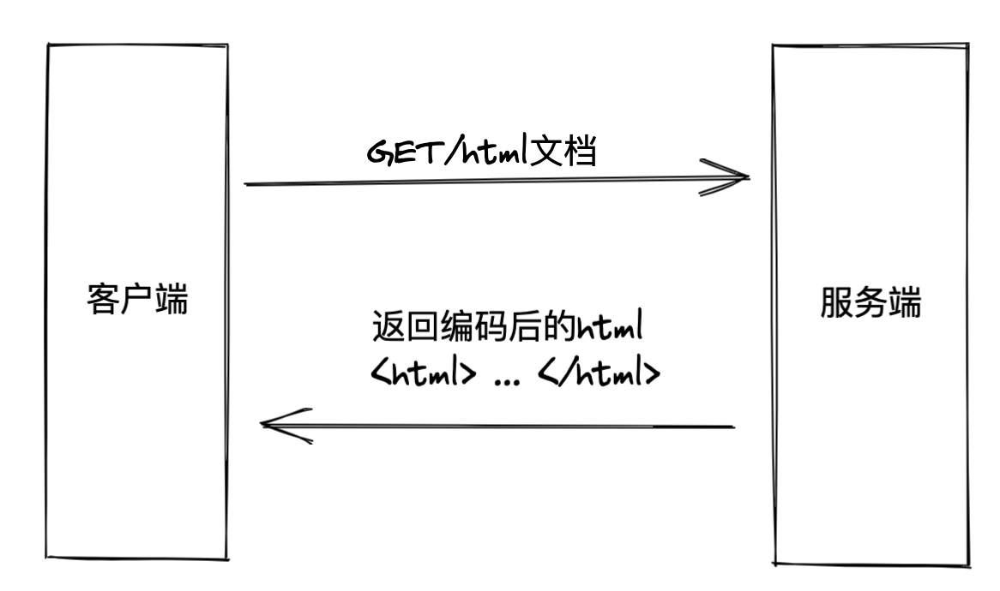
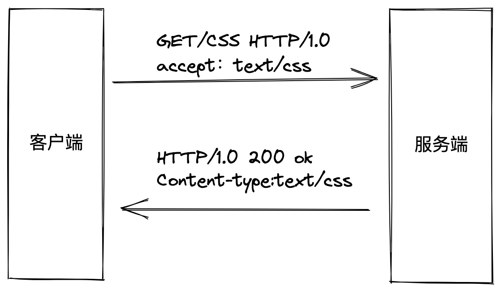
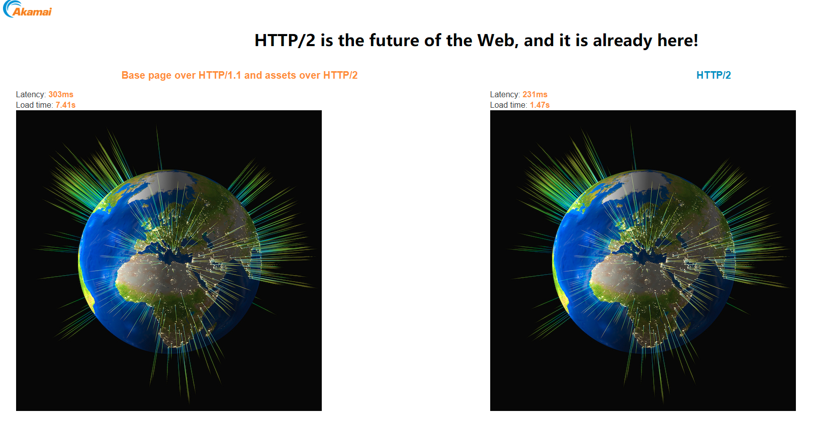

## 前言

我们知道HTTP是浏览器中最重要且使用最多的协议，它不仅是浏览器与服务端的通信语言，更是互联网的基石。随着浏览器的不断更新迭代，HTTP为了适应技术的更新也在不断进化，学习HTTP的最佳途径就是从浏览器的发展视角来了解HTTP的演进：**即将完成使命的HTTP/1、正在向我们走来的HTTP/2、未来的HTTP/3**

**如果这篇文章有帮助到你，❤️关注+点赞❤️鼓励一下作者，文章公众号首发，关注 `前端南玖` 第一时间获取最新文章～**

## HTTP发展史

**HTTP 是浏览器与服务端最主要的通信协议**

20 世纪 60 年代，美国国防部高等研究计划署（ARPA）建立了 ARPA 网，这被认为是互联网的起源。70 年代，研究人员基于对 ARPA 网的实践和思考，发明出了著名的 TCP/IP 协议。该协议具有良好的分层结构和稳定的性能，并在 80 年代中期进入了 UNIX 系统内核，促使更多的计算机接入了网络。

1989 年，蒂姆伯纳斯-李博士发表了一篇论文，提出了在互联网上构建超链接文档系统的构想。在篇文章中他确立了三项关键技术：URI、HTML、HTTP。


### HTTP/0.9

1991年HTTP（HyperText Transfer Protocol，超文本传输协议）正式诞生，万维网协会（World Wide Web Consortium，W3C）和互联网工程任务组（IETF）制定了 HTTP 0.9 标准。该协议诞生之初的作用是传输超文本内容HTML，并且只支持GET请求。

协议定义了客户端发起请求、服务端响应请求的通信模式。所以当时的请求报文只有一行：

> GET + 请求的文件路径

服务端在收到请求后会返回一个以 ASCII 字符流编码的 HTML 文档。



**请求：** GET /index.html

**响应：** `<html><body>Hello HTTP/0.9</body></html>`

**流程：**

- 客户端和服务端建立TCP连接。
- 客户端发送GET请求到服务端，请求index.html页面的数据。
- 服务端发送完响应，关闭TCP连接。

**特点：** 简单，一个请求需要一个连接。

**HTTP/0.9 虽然简单，但是它充分验证了 Web 服务的可行性**

- 首先它只有一个命令GET。
- 它没有HEADER等描述数据的信息。因为这个时候的请求非常简单，它需要达到的目的也非常简单，没有那么多数据格式。
- 服务器发送完内容之后，就关闭TCP连接。这里需要注意一点，这里的TCP连接和http请求是不一样的。http请求和TCP连接不是一个概念。一个http请求通过TCP连接发送，而一个TCP连接里面可以发送很多个http请求（HTTP/0.9不能这么做，但是HTTP/1.1可以这么做，而且在HTTP/2这方面会更大程度地优化，来提高HTTP协议传输的效率以及服务器的性能）

### HTTP/1.0

随着互联网的发展，之前的HTTP/0.9已经无法满足用户需求了，浏览器希望通过HTTP来传输脚本、样式、图片、音视频等不同类型的文件，所以在1996年HTTP进行了一次版本更新：

- 增加了HEAD、POST等新方法
- 增加了响应状态码，标记可能的错误原因
- 引入了协议版本号概念
- 引入了HTTP header的概念，让HTTP处理请求和响应更加灵活
- 传输的数据不再局限于文本



**请求：** 第一行请求命令+版本信息，后面的多行为头信息

```http
GET / HTTP/1.0
User-Agent: Mozilla/5.0 (Macintosh; Intel Mac OS X 10_10_5)
Accept: */*
```

**响应：** 响应头信息 + 空行(\r\n) + 数据部分

```http
HTTP/1.0 200 OK
Content-Type: text/plain
Content-Length: 2345
Expires: Thu, 05 Dec 2020 16:00:00 GMT
Last-Modified: Wed, 5 August 2020 15:55:28 GMT
Server: Apache 0.84

<html>
   <body>Hello World</body>
</html>
```

HTTP/1.0最主要的缺点还是跟HTTP/0.9一样，每一个TCP连接只能发送一个HTTP请求，服务器发送完响应，就关闭连接。如果后面需要请求新的数据，则需要再次建立TCP连接，但是TCP建立连接的三次握手成本比较高，并且TCP连接初始的时候发送数据的速度相对较慢，有一个慢启动和拥塞避免的阶段。极端情况，如果每次请求的数据很少，但是请求很频繁，这样每次请求很少的数据都需要建立连接然后断开。

为了解决这个问题，在1.0版本使用了一个非标准的`Connection`头部字段。当客户端再请求头部信息里面带上`Connection：keep-alive`的时候，服务器在发送完响应数据之后，就不会断开TCP连接了，从而达到复用同一个TCP连接的目的。但是由于不是标准字段，不同的实现可能导致表现得不一致，因此不能从根本上解决这个问题。

HTTP/1.0最核心的改变是增加了头部设定，头部内容以键值对的形式设置。请求头部通过 Accept 字段来告诉服务端可以接收的文件类型，响应头部再通过 `Content-Type` 字段来告诉浏览器返回文件的类型。头部字段不仅用于解决不同类型文件传输的问题，也可以实现其他很多功能如缓存、认证信息等。

**HTTP/1.0 并不是一个“标准”，只是一份参考文档，不具有实际的约束力。**

### HTTP/1.1

随着互联网的快速发展，HTTP/1.0也无法满足用户需求了，最根本的问题就是链接问题， HTTP/1.0 每进行一次通信，都需要经历**建立连接**、**传输数据**和**断开连接**三个阶段。当一个页面引用了较多的外部文件时，这个建立连接和断开连接的过程就会增加大量网络开销。

**为了解决 HTTP/1.0 的问题，1999 年推出的 HTTP/1.1 有以下特点：**

- 长连接：引入了 TCP 连接复用，即一个 TCP 默认不关闭，可以被多个请求复用
- 并发连接：对一个域名的请求允许分配多个长连接（缓解了长连接中的「队头阻塞」问题）
- 引入管道机制（pipelining），一个 TCP 连接，可以同时发送多个请求。（响应的顺序必须和请求的顺序一致，因此不常用）
- 增加了 PUT、DELETE、OPTIONS、PATCH 等新的方法
- 新增了一些缓存的字段（If-Modified-Since, If-None-Match）
- 请求头中引入了 range 字段，支持断点续传
- 允许响应数据分块（chunked），利于传输大文件
- 强制要求 Host 头，让互联网主机托管称为可能


#### HTTP管道机制（pipelining）

它指的是在一个TCP连接内，多个HTTP请求可以并行，客户端不用等待上一次请求结果返回，就可以发出下一次请求，但服务器端必须按照接收到客户端请求的先后顺序依次回送响应结果，以保证客户端能 够区分出每次请求的响应内容。

#### 随着网络的发展，HTTP 1.1 还是暴露出一些局限性:

1. 虽然加入 `keep-alive` 可以复用一部分连接，但域名分片等情况下仍然需要建立多个` connection`，耗费资源，给服务器带来性能压力。
2. `pipeling` 只部分解决了队头阻塞（ `HOLB`）。 HTTP 1.1 尝试使用 `pipeling` 来解决队头阻塞问题，即浏览器可以一次性发出多个请求（同个域名、同一条 TCP 链接）。 但 pipeling 要求返回是按序的，那么前一个请求如果很耗时（比如处理大图片），那么后面的请求即使服务器已经处理完，仍会等待前面的请求处理完才开始按序返回。
3. 协议开销大，没有相应的压缩传输优化方案。 HTTP/1.1 在使用时，header 里携带的内容过大，在一定程度上增加了传输的成本，并且每次请求 header 基本不怎么变化，尤其在移动端增加用户流量。

**HTTP/1.1 通过长连接减少了大量创建/断开连接造成的性能消耗，但是它的并发能力受到限制，表现在两个方面：**

- HTTP/1.1 中使用持久连接时，一个连接中同一时刻只能处理一个请求。当前的请求没有结束之前，其他的请求只能处于阻塞状态，这种情况被称为**队头阻塞**
- 浏览器为了减轻服务器的压力，限制了同一个域名下的 HTTP 连接数，一般为 6 ~ 8 个。为了解决数量限制，出现了 `域名分片` 技术，其实就是资源分域，将资源放在不同域名下 (比如二级子域名下)，这样就可以针对不同域名创建连接并请求，以一种讨巧的方式突破限制，但是滥用此技术也会造成很多问题，比如每个 TCP 连接本身需要经过 DNS 查询、三步握手、慢启动等，还占用额外的 CPU 和内存，对于服务器来说过多连接也容易造成网络拥挤、交通阻塞等。

### SPDY：HTTP1.X的优化（改进版HTTP/1.1）

2012年google提出了SPDY的方案，优化了HTTP1.X的请求延迟，解决了HTTP1.X的安全性，具体如下：

1. **降低延迟**： 针对HTTP高延迟的问题，SPDY优雅的采取了多路复用（multiplexing）。多路复用通过多个请求stream共享一个tcp连接的方式，解决了HOL blocking的问题，降低了延迟同时提高了带宽的利用率。
2. **请求优先级**（request prioritization）：多路复用带来一个新的问题是，在连接共享的基础之上有可能会导致关键请求被阻塞。SPDY允许给每个request设置优先级，这样重要的请求就会优先得到响应。比如浏览器加载首页，首页的html内容应该优先展示，之后才是各种静态资源文件，脚本文件等加载，这样可以保证用户能第一时间看到网页内容。
3. **header压缩**：前面提到HTTP1.x的header很多时候都是重复多余的。选择合适的压缩算法可以减小包的大小和数量。
4. **基于HTTPS的加密协议传输**：大大提高了传输数据的可靠性。
5. **服务端推送**（server push）：可以让服务端主动把资源文件推送给客户端。当然客户端也有权利选择是否接收。


### HTTP/2

2015 年正式发布的 HTTP/2 默认不再使用 ASCII 编码传输，而是改为二进制数据，来提升传输效率。

客户端在发送请求时会将每个请求的内容封装成不同的带有编号的二进制帧（Frame），然后将这些帧同时发送给服务端。服务端接收到数据之后，会将相同编号的帧合并为完整的请求信息。同样，服务端返回结果、客户端接收结果也遵循这个帧的拆分与组合的过程。

有了二进制分帧后，对于同一个域，客户端只需要与服务端建立一个连接即可完成通信需求，这种利用一个连接来发送多个请求的方式称为**多路复用**。每一条路都被称为一个` stream（流）`。

**特点：**

- **二进制协议：** HTTP/1.1版本的头部信息是文本，数据部分可以是文本也可以是二进制。HTTP/2版本的头部和数据部分都是二进制，且统称为‘帧’
- **多路复用：** 废弃了 HTTP/1.1 中的管道，同一个TCP连接里面，客户端和服务器可以同时发送多个请求和多个响应，并且不用按照顺序来。由于服务器不用按顺序来处理响应，所以避免了“对头堵塞”的问题。
- **头部信息压缩：** 使用专用算法压缩头部，减少数据传输量，主要是通过服务端和客户端同时维护一张头部信息表，所有的头部信息在表里面都会有对应的记录，并且会有一个索引号，这样后面只需要发送索引号即可
- **服务端主动推送：** 允许服务器主动向客户推送数据

- **数据流：** 由于HTTP/2版本的数据包不是按照顺序发送的，同一个TCP连接里面相连的两个数据包可能是属于不同的响应，因此，必须要有一种方法来区分每一个数据包属于哪个响应。HTTP/2版本中，每个请求或者响应的所有数据包，称为一个`数据流（stream）`，并且每一个数据流都有一个唯一的编号ID，请求数据流的编号ID为奇数，响应数据流的编号ID为偶数。每个数据包在发送的时候带上对应数据流的编号ID，这样服务器和客户端就能分区是属于哪一个数据流。最后，客户端还能指定数据流的优先级，优先级越高，服务器会越快做出响应。


**缺点：**

HTTP/2虽然解决了许多问题，但在TCP协议级别上仍然存在类似的队头问题，而TCP仍然是Web的构建基础。当 TCP 数据包在传输过程中丢失时，在服务器重新发送丢失的数据包之前，接收方无法确认传入的数据包。由于 TCP 在设计上不遵循 HTTP 之类的高级协议，因此单个丢失的数据包将阻塞所有进行中的 HTTP 请求的流，直到重新发送丢失的数据为止。这个问题在不可靠的连接上尤为突出，这在无处不在的移动设备时代并不罕见。

### HTTP/3

HTTP/2 由于采用二进制分帧进行多路复用，通常只使用一个 TCP 连接进行传输，在丢包或网络中断的情况下后面的所有数据都被阻塞。

HTTP/2 的问题不能仅靠应用程序层来解决，因此协议的新迭代必须更新传输层。但是，创建新的传输层协议并非易事。传输协议需要硬件供应商的支持，并且需要大多数网络运营商的部署才能普及。

幸运的是还有另一种选择。UDP 协议与 TCP 一样得到广泛支持，但前者足够简单，可以作为在其之上运行的自定义协议的基础。**UDP 数据包是一劳永逸的：没有握手、持久连接或错误校正。**HTTP3 背后的主要思想是放弃 TCP，转而使用基于 UDP 的 QUIC （快速UDP互联网连接）协议。

与 HTTP2 在技术上允许未加密的通信不同，QUIC 严格要求加密后才能建立连接。此外，加密不仅适用于 HTTP 负载，还适用于流经连接的所有数据，从而避免了一大堆安全问题。建立持久连接、协商加密协议，甚至发送第一批数据都被合并到 QUIC 中的单个请求/响应周期中，从而大大减少了连接等待时间。如果客户端具有本地缓存的密码参数，则可以通过简化的握手重新建立与已知主机的连接。

为了解决传输级别的线头阻塞问题，通过 QUIC 连接传输的数据被分为一些流。流是持久性 QUIC 连接中短暂、独立的“子连接”。每个流都处理自己的错误纠正和传递保证，但使用连接全局压缩和加密属性。每个客户端发起的 HTTP 请求都在单独的流上运行，因此丢失数据包不会影响其他流/请求的数据传输。

## 各版本对比

| 协议版本 |      解决的核心问题      |                解决方式                |
| :------: | :----------------------: | :------------------------------------: |
|   0.9    |      HTML 文件传输       | 确立了客户端请求、服务端响应的通信流程 |
|   1.0    |     不同类型文件传输     |              设立头部字段              |
|   1.1    | 创建/断开 TCP 连接开销大 |           建立长连接进行复用           |
|    2     |        并发数有限        |               二进制分帧               |
|    3     |       TCP 丢包阻塞       |             采用 UDP 协议              |
|   SPDY   |    HTTP1.X的请求延迟     |                多路复用                |

## HTTP的三次握手🤝与四次挥手🙋‍♂️

一个完整的HTTP是包含请求与响应的，所以需要通过TCP来创建连接通道

**一个TCP通道可以通过多个HTTP请求**

一般来讲需要通过三次握手来确认连接过程，规避因为网络原因从而产生的资源消耗，从而创建TCP连接


### 三次握手

**第一次握手：** 客户端发送syn包(syn=x)到服务器，并进入SYN_SEND状态，等待服务器确认；

**第二次握手：** 服务器收到syn包，必须确认客户的SYN（ack=x+1），同时自己也发送一个SYN包（syn=y），即SYN+ACK包，此时服务器进入SYN_RECV状态；

**第三次握手：** 客户端收到服务器的SYN＋ACK包，向服务器发送确认包ACK(ack=y+1)，此包发送完毕，客户端和服务器进入ESTABLISHED状态，完成三次握手。

握手过程中传送的包里不包含数据，三次握手完毕后，客户端与服务器才正式开始传送数据。理想状态下，TCP连接一旦建立，在通信双方中的任何一方主动关闭连接之前，TCP 连接都将被一直保持下去。

### 四次挥手

与建立连接的“三次握手”类似，断开一个TCP连接则需要“四次握手”。

**第一次挥手：** 主动关闭方发送一个FIN，用来关闭主动方到被动关闭方的数据传送，也就是主动关闭方告诉被动关闭方：我已经不 会再给你发数据了(当然，在fin包之前发送出去的数据，如果没有收到对应的ack确认报文，主动关闭方依然会重发这些数据)，但是，此时主动关闭方还可 以接受数据。

**第二次挥手：** 被动关闭方收到FIN包后，发送一个ACK给对方，确认序号为收到序号+1（与SYN相同，一个FIN占用一个序号）。
**第三次挥手：** 被动关闭方发送一个FIN，用来关闭被动关闭方到主动关闭方的数据传送，也就是告诉主动关闭方，我的数据也发送完了，不会再给你发数据了。
**第四次挥手：** 主动关闭方收到FIN后，发送一个ACK给被动关闭方，确认序号为收到序号+1，至此，完成四次挥手。

## HTTP/1.0与HTTP/1.1的区别

### 长连接

HTTP 1.1支持长连接（PersistentConnection）和请求的管道（Pipelining）处理，在一个TCP连接上可以传送多个HTTP请求和响应，减少了建立和关闭连接的消耗和延迟，在HTTP1.1中默认开启`Connection: Keep-Alive`； HTTP1.0默认使用短连接，规定浏览器与服务器只保持短暂的连接，浏览器的每次请求都需要与服务器建立一个TCP连接，服务器完成请求处理后立即断开TCP连接，服务器不跟踪 每个客户也不记录过去的请求。要建立长连接，可以在请求消息中包含`Connection: Keep-Alive`头域，如果服务器愿意维持这条连接，在响应消息中也会包含一个`Connection: Keep-Alive`的头域。

### 缓存处理

在HTTP1.0中主要使用header里的`If-Modified-Since`,`Expires`来做为缓存判断的标准，HTTP1.1则引入了更多的缓存控制策略例如`Entity tag`，`If-Unmodified-Since`,` If-Match`, `If-None-Match`等更多可供选择的缓存头来控制缓存策略。

- `Expires`：浏览器会在指定过期时间内使用本地缓存，指明应该在什么时候认为文档已经过期，从而不再缓存它，时间为格林威治时间GMT。例如: Expires: Thu, 19 Nov 1981 08:52:00 GMT　

- `Last-Modified`：请求对象最后一次的修改时间 用来判断缓存是否过期 通常由文件的时间信息产生    

- `Date`：生成消息的具体时间和日期，即当前的GMT时间。例如:`Date: Sun, 17 Mar 2013 08:12:54 GMT`

- `If-Modified-Since`：客户端存取的该资源最后一次修改的时间，用来和服务器端的Last-Modified做比较

- `Set-Cookie`: 用于把cookie 发送到客户端。例如: `Set-Cookie: PHPSESSID=c0huq7pdkmm5gg6osoe3mgjmm3; path=/`
- `Pragma:no-cache`：客户端使用该头域说明请求资源不能从cache中获取，而必须回源获取。

### 带宽优化

HTTP1.0中，存在一些浪费带宽的现象，例如客户端只是需要某个对象的一部分，而服务器却将整个对象送过来了，并且不支持断点续传功能，HTTP1.1则在请求头引入了range头域，它允许只请求资源的某个部分，即返回码是206（Partial Content），这样就方便了开发者自由的选择以便于充分利用带宽和连接。

### 错误通知的管理（状态码）

在HTTP1.1中新增了24个错误状态响应码，如409（Conflict）表示请求的资源与资源的当前状态发生冲突；410（Gone）表示服务器上的某个资源被永久性的删除。

### Host头处理

在HTTP1.0中认为每台服务器都绑定一个唯一的IP地址，因此，请求消息中的URL并没有传递主机名（hostname）。但随着虚拟主机技术的发展，在一台物理服务器上可以存在多个虚拟主机（Multi-homed Web Servers），并且它们共享一个IP地址。HTTP1.1的请求消息和响应消息都应支持Host头域，且请求消息中如果没有Host头域会报告一个错误（400 Bad Request）。

## HTTP/2与SPDY的区别

1. HTTP2.0 支持明文 HTTP 传输，而 SPDY 强制使用 HTTPS
2. HTTP2.0 消息头的压缩算法采用 **HPACK**，而非 SPDY 采用的 **DEFLATE**

## HTTP/1.1与HTTP/2的区别

- **新的二进制格式**（Binary Format），HTTP1.x解析是基于文本的，基于文本协议的格式解析存在天然缺陷，文本的表现形式有多样性，要做到健壮性考虑的场景必然很多，二进制则不同，只认0和1的组合。基于这种考虑HTTP2.0的协议解析决定采用二进制格式，实现方便且健壮。
- **多路复用**（MultiPlexing），即连接共享，即每一个request都是是用作连接共享机制的。一个request对应一个id，这样一个连接上可以有多个request，每个连接的request可以随机的混杂在一起，接收方可以根据request的 id将request再归属到各自不同的服务端请求里面。
- **header压缩**，如上文中所言，对前面提到过HTTP1.x的header带有大量信息，而且每次都要重复发送，HTTP2.0使用encoder来减少需要传输的header大小，通讯双方各自cache一份header fields表，既避免了重复header的传输，又减小了需要传输的大小。
- **服务端推送**（server push），同SPDY一样，HTTP2.0也具有server push功能。

## HTTP/2的多路复用和HTTP/1.X中的长连接复用的区别

- HTTP/1.X 一次请求-响应，建立一个连接，用完关闭；每一个请求都要建立一个连接；
- HTTP/1.1 Pipeling解决方式为，若干个请求排队串行化单线程处理，后面的请求等待前面请求的返回才能获得执行机会，一旦有某请求超时等，后续请求只能被阻塞，毫无办法，也就是人们常说的线头阻塞；
- HTTP/2多个请求可同时在一个连接上并行执行。某个请求任务耗时严重，不会影响到其它连接的正常执行；

## HTTP/1.1与HTTP/2性能对比

官网提供了多种版本的对比测试有HTTP1.1与HTTP2的比较，还有服务器端推送(server-push)不同个数之间的比较：（由于网络延迟不同，测试结果或有差异）



可以看到分别使用HTTP/1.1和HTTP/2加载同一张由多张小图片组成的大图片：HTTP/1.1用了7.41s，而HTTP/2只用了1.47s。HTTP2比HTTP/1.1快了将近5倍。
因为为了加载这张大图，需要请求许多的小图，HTTP/1.1采用的是串行请求，所以速度要比采用并行请求的HTTP/2要慢上许多。

## HTTP与HTTPS的区别

### HTTPS

HTTPS是以安全为目标的 HTTP 通道，是 HTTP 的安全版。HTTPS 的安全基础是 SSL。SSL 协议位于 TCP/IP 协议与各种应用层协议之间，为数据通讯提供安全支持。

**SSL 协议可分为两层：**

- SSL 记录协议（SSL Record Protocol），它建立在可靠的传输协议（如TCP）之上，为高层协议提供数据封装、压缩、加密等基本功能的支持。

- SSL 握手协议（SSL Handshake Protocol），它建立在 SSL 记录协议之上，用于在实际的数据传输开始前，通讯双方进行身份认证、协商加密算法、交换加密密钥等。

**HTTPS的优点**

- 使用 HTTPS 协议可认证用户和服务器，确保数据发送到正确的客户机和服务器。

- HTTPS 协议是由SSL+HTTP 协议构建的可进行加密传输、身份认证的网络协议，要比 HTTP 协议安全，可防止数据在传输过程中不被窃取、修改，确保数据的完整性。

- HTTPS 是现行架构下最安全的解决方案，虽然不是绝对安全，但它大幅增加了中间人攻击的成本。

**HTTPS的缺点**

- HTTPS 协议握手阶段比较费时，会使页面的加载时间延长近。

- HTTPS 连接缓存不如 HTTP 高效，会增加数据开销，甚至已有的安全措施也会因此而受到影响。

- HTTPS 协议的安全是有范围的，在黑客攻击、拒绝服务攻击和服务器劫持等方面几乎起不到什么作用。

- SSL 证书通常需要绑定 IP，不能在同一 IP 上绑定多个域名，IPv4 资源不可能支撑这个消耗。

- 部署 HTTPS 后，因为 HTTPS 协议的工作要增加额外的计算资源消耗，例如 SSL 协议加密算法和 SSL 交互次数将占用一定的计算资源和服务器成本。

- HTTPS 协议的加密范围也比较有限。最关键的，SSL 证书的信用链体系并不安全，特别是在某些国家可以控制 CA 根证书的情况下，中间人攻击一样可行。

### 与HTTP的区别

- HTTP 是超文本传输协议，信息是明文传输，HTTPS 则是具有安全性的 SSL 加密传输协议。
- HTTP与HTTPS的连接方式不同，端口也不同，HTTP端口用的是80，HTTPS端口用的是443。
- HTTP 的连接很简单，是无状态的。HTTPS 协议是由 SSL+HTTP 协议构建的可进行加密传输、身份认证的网络协议，比 HTTP 协议安全。(无状态的意思是其数据包的发送、传输和接收都是相互独立的。无连接的意思是指通信双方都不长久的维持对方的任何信息。)
- HTTPS协议需要申请证书，一般免费的证书很少。

## 常见状态码及含义

| **状态码** | **原因短语**                                       | **代表含义**                                                 |
| ---------- | -------------------------------------------------- | ------------------------------------------------------------ |
| 100        | Continue (继续)                                    | 这个临时响应表明，迄今为止的所有内容都是可行的，客户端应该继续请求，如果已经完成，则忽略它。 |
| 101        | Switching Protocol (切换协议)                      | 该代码是响应客户端的 Upgrade (en-US)标头发送的，并且指示服务器也正在切换的协议。 |
| 200        | OK (成功)                                          | 请求成功.成功的意义根据请求所使用的方法不同而不同.         · GET: 资源已被提取,并作为响应体传回客户端.         · HEAD: 实体头已作为响应头传回客户端         · POST: 经过服务器处理客户端传来的数据,适合的资源作为响应体传回客户端.         · TRACE: 服务器收到请求消息作为响应体传回客户端.         PUT, DELETE, 和 OPTIONS 方法永远不会返回 200. |
| 201        | Created (已创建)                                   | 请求成功，而且有一个新的资源已经依据请求的需要而建立，通常这是 PUT 方法得到的响应码. |
| 202        | Accepted (已创建)                                  | 请求已经接收到，但还未响应，没有结果。意味着不会有一个异步的响应去表明当前请求的结果，预期另外的进程和服务去处理请求，或者批处理。 |
| 203        | Non-Authoritative Information (未授权信息)         | 服务器已成功处理了请求,但返回的实体头部元信息不是在原始服务器上有效的确定集合，而是来自本地或者第三方的拷贝,如果不是上述情况,使用200状态码才是最合适的. |
| 204        | No Content (无内容)                                | 该响应没有响应内容,只有响应头,响应头也可能是有用的.用户代理可以根据新的响应头来更新对应资源的缓存信息. |
| 205        | Reset Content (重置内容)                           | 告诉用户代理去重置发送该请求的窗口的文档视图.                |
| 206        | Partial Content (部分内容)                         | 当客户端通过使用range头字段进行文件分段下载时使用该状态码    |
| 300        | Multiple Choice (多种选择)                         | 该请求有多种可能的响应,用户代理或者用户必须选择它们其中的一个.服务器没有任何标准可以遵循去代替用户来进行选择. |
| 301        | Moved Permanently (永久移动)                       | 该状态码表示所请求的URI资源路径已经改变,新的URL会在响应的Location:头字段里找到. |
| 302        | Found (临时移动)                                   | 该状态码表示所请求的URI资源路径临时改变,并且还可能继续改变.因此客户端在以后访问时还得继续使用该URI.新的URL会在响应的Location:头字段里找到. |
| 303        | See Other (查看其他位置)                           | 服务器发送该响应用来引导客户端使用GET方法访问另外一个URI.    |
| 304        | Not Modified (未修改)                              | 告诉客户端,所请求的内容距离上次访问并没有变化. 客户端可以直接从浏览器缓存里获取该资源. |
| 305        | Use Proxy (使用代理)                               | 所请求的资源必须统过代理才能访问到.由于安全原因,该状态码并未受到广泛支持. |
| 306        | unused (未使用)                                    | 这个状态码已经不再被使用,当初它被用在HTTP 1.1规范的旧版本中. |
| 307        | Temporary Redirect (临时重定向)                    | 服务器发送该响应用来引导客户端使用相同的方法访问另外一个URI来获取想要获取的资源.新的URL会在响应的Location:头字段里找到.与302状态码有相同的语义,且前后两次访问必须使用相同的方法(GET POST). |
| 308        | Permanent Redirect (永久重定向)                    | 所请求的资源将永久的位于另外一个URI上.新的URL会在响应的Location:头字段里找到.与301状态码有相同的语义,且前后两次访问必须使用相同的方法(GET POST). |
| 400        | Bad Request (错误请求)                             | 因发送的请求语法错误,服务器无法正常读取.                     |
| 401        | Unauthorized (未授权)                              | 需要身份验证后才能获取所请求的内容,类似于403错误.不同点是.401错误后,只要正确输入帐号密码,验证即可通过. |
| 402        | Payment Required (需要付款)                        | 该状态码被保留以供将来使用.创建此代码最初的目的是为数字支付系统而用,然而,到现在也没投入使用. |
| 403        | Forbidden (禁止访问)                               | 客户端没有权利访问所请求内容,服务器拒绝本次请求.             |
| 404        | Not Found (未找到)                                 | 服务器找不到所请求的资源.由于经常发生此种情况,所以该状态码在上网时是非常常见的. |
| 405        | Method Not Allowed (不允许使用该方法)              | 该请求使用的方法被服务器端禁止使用,RFC2616中规定, GET 和 HEAD 方法不能被禁止. |
| 406        | Not Acceptable (无法接受)                          | 在进行服务器驱动内容协商后,没有发现合适的内容传回给客户端.   |
| 407        | Proxy Authentication Required (要求代理身份验证)   | 类似于状态码 401,不过需要通过代理才能进行验证.               |
| 408        | Request Timeout (请求超时)                         | 客户端没有在服务器预备等待的时间内完成一个请求的发送.这意味着服务器将会切断和客户端的连接. 在其他浏览器中,这种响应更常见一些, 例如Chrome 和 IE9, 目的是为了使用HTTP 预连机制加快浏览速度. 同时注意,一些服务器不发送此种响应就直接切断连接. |
| 409        | Conflict (冲突)                                    | 该请求与服务器的当前状态所冲突.                              |
| 410        | Gone (已失效)                                      | 所请求的资源已经被删除.                                      |
| 411        | Length Required (需要内容长度头)                   | 因服务器在本次请求中需要 Content-Length 头字段,而客户端没有发送.所以,服务器拒绝了该请求. |
| 412        | Precondition Failed (预处理失败)                   | 服务器没能满足客户端在获取资源时在请求头字段中设置的先决条件. |
| 413        | Request Entity Too Large (请求实体过长)            | 请求实体大小超过服务器的设置的最大限制,服务器可能会关闭HTTP链接并返回Retry-After 头字段. |
| 414        | Request-URI Too Long (请求网址过长)                | 客户端请求所包含的URI地址太长,以至于服务器无法处理.          |
| 415        | Unsupported Media Type (媒体类型不支持)            | 服务器不支持客户端所请求的媒体类型,因此拒绝该请求.           |
| 416        | Requested Range Not Satisfiable (请求范围不合要求) | 请求中包含的Range头字段无法被满足,通常是因为Range中的数字范围超出所请求资源的大小. |
| 417        | Expectation Failed (预期结果失败)                  | 在请求头 Expect 中指定的预期内容无法被服务器满足.            |
| 500        | Internal Server Error (内部服务器错误)             | 服务器遇到未知的无法解决的问题.                              |
| 501        | Implemented (未实现)                               | 服务器不支持该请求中使用的方法,比如POST 和 PUT.只有GET 和 HEAD 是RFC2616规范中规定服务器必须实现的方法. |
| 502        | Bad Gateway (网关错误)                             | 服务器作为网关且从上游服务器获取到了一个无效的HTTP响应.      |
| 503        | Service Unavailable (服务不可用)                   | 由于临时的服务器维护或者过载,服务器当前无法处理请求.这个状况是临时的,并且将在一段时间以后恢复.如果能够预计延迟时间,那么响应中可以包含一个Retry-After:头用以标明这个延迟时间.如果没有给出这个Retry-After:信息，那么客户端应当以处理500响应的方式处理它.同时,这种情况下,一个友好的用于解释服务器出现问题的页面应当被返回,并且,缓存相关的HTTP头信息也应该包含,因为通常这种错误提示网页不应当被客户端缓存. |
| 504        | Gateway Timeout  (网关超时)                        | 服务器作为网关且不能从上游服务器及时的得到响应返回给客户端.  |
| 505        | HTTP Version Not Supported (HTTP版本不受支持)      | 服务器不支持客户端发送的HTTP请求中所使用的HTTP协议版本.      |
