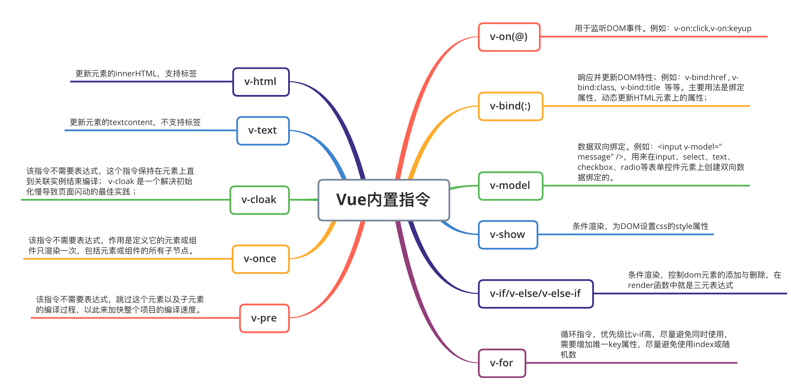
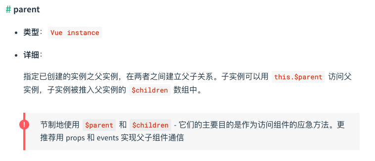

## 前言

本文会对Vue中一些常见的重要知识点以及框架原理进行整理汇总，意在帮助作者以及读者自测Vue的熟练度以及方便查询与复习。金三银四的到来，想必vue会是很多面试官的重点考核内容，希望小伙伴们读完本文，能够有一定自我提升，也希望这篇文章能够为大家的面试的保驾护航～

**如果这篇文章有帮助到你，❤️关注+点赞❤️鼓励一下作者，文章公众号首发，关注 `前端南玖` 第一时间获取最新文章～**

## 1.MVC 与 MVVM的区别

### MVC

MVC 全名是 Model View Controller，是模型(model)－视图(view)－控制器(controller)的缩写，一种软件设计典范

- Model（模型）：是应用程序中用于处理应用程序数据逻辑的部分。通常模型对象负责在数据库中存取数据
- View（视图）：是应用程序中处理数据显示的部分。通常视图是依据模型数据创建的
- Controller（控制器）：是应用程序中处理用户交互的部分。通常控制器负责从视图读取数据，控制用户输入，并向模型发送数据

下面看斯坦福大学公开课上的这幅图来说明，这可以说是最经典和最规范的MVC标准


> 几乎所有的App都只干这么一件事：将数据展示给用户看，并处理用户对界面的操作。
> MVC的思想：一句话描述就是Controller负责将Model的数据用View显示出来，换句话说就是在Controller里面把Model的数据赋值给View。

### MVVM

MVVM：Model、View、ViewModel。

你会下意识地把它和MVC来对比，你会发现，MVVM多了一个ViewModel而少了Controller。

首先说一下多出来的ViewModel（VM，不是显存）。
VM的意义，和Model一样，在于数据。
Model负责对数据进行取和存，然而我们对数据的操作除了取和存以外，还有一个非常重要的操作：解析


M：对应于MVC的M

V：对应于MVC的V

VM：ViewModel，是把MVC里的controller的数据加载，加工功能分离出来

### 区别

> MVVM 与 MVC 最大的区别就是：它实现了 View 和 Model 的自动同步，也就是当 Model 的属性改变时，我们不用再自己手动操作 Dom 元素，来改变 View 的显示，而是改变属性后该属性对应 View 层显示会自动改变（对应Vue数据驱动的思想）

### Vue 并没有完全遵循 MVVM 的思想

这一点Vue官网自己也有说明


这是因为从严格意义上来讲，MVVM要求View与Model是不能直接通信的，而 Vue 提供了$refs 这个属性，让 Model 可以直接操作 View，违反了这一规定，所以说 Vue 没有完全遵循 MVVM。

## 2.为什么data需要是一个函数？

这个说法主要是在组件中出现，因为组件是可以复用的，js里对象是引用关系，如果组件data是一个对象，那么子组件中的data 属性值会相互污染，产生副作用。如果组件中 data 选项是一个函数，那么每个实例可以维护一份被返回对象的独立的拷贝，组件实例之间的 data 属性值不会互相影响；而 new Vue 的实例，是不会被复用的，因此不存在引用对象的问题。

## 3.v-if与v-show

### v-if与v-show的区别

**v-if** 是**真正**的条件渲染，因为它会确保在切换过程中条件块内的事件监听器和子组件适当地被销毁和重建；也是**惰性的**：如果在初始渲染时条件为假，则什么也不做——直到条件第一次变为真时，才会开始渲染条件块。

**v-show** 就简单得多——不管初始条件是什么，元素总是会被渲染，并且只是简单地基于 CSS 的 “display” 属性进行切换。

所以，v-if 适用于在运行时很少改变条件，不需要频繁切换条件的场景；v-show 则适用于需要非常频繁切换条件的场景。

### v-show指令算是重排吗？

v-show本质是通过元素css的display属性来控制是否显示，在DOM渲染时仍然会先渲染元素，然后才会进行判断是否显示（通过display属性），而对于重排的定义是渲染树中的节点信息发生了大小、边距等改变，要重新计算各节点和css具体的大小和位置。
当用display来控制元素的显示和隐藏时，会改变节点的大小和渲染树的布局，导致发生重排，因此v-show指令算是重排。

## 4.v-for

### v-if 与 v-for 为什么不建议一起使用？

首先，关于v-if和v-for的优先级，可以在源码compiler/codegen/index.js中找到genElement方法，里面的if else判断，可以清楚看到for的判断在if判断之上，由此，可证明v-for的优先级高于v-if

如果v-if和v-for同时出现，分两种情况：

- 当同时出现在同一标签内,可以通过`vue.$options.render`打印出渲染函数，可以清晰的看到会优先执行for循环，再执行if判断

- 当v-if出现在父级中，子级有v-for，此时再打印`vue.$options.render`，会发现会优先执行if判断。

若想优化，提升性能，v-if需要优先执行，可以在v-for外层加一层template搭配v-if使用。
若是v-if与v-for必须出现在同一层或v-if为v-for的子级的情况下，优化的方式可以将for循环的数组提前通过计算属性处理，尽量减少过多渲染导致的性能消耗。

### v-for中的key有什么作用？为什么在v-for中的key不推荐使用随机数或者index？

**key的作用：**可以使vue的diff操作更加准确和快速

如果不使用 key，Vue 会使用一种最大限度减少动态元素并且尽可能的尝试就地修改/复用相同类型元素的算法。key 是为 Vue 中 vnode 的唯一标记，通过这个 key，我们的 diff 操作可以更准确、更快速

**更准确**：因为带 key 就不是就地复用了，在 sameNode 函数 a.key === b.key 对比中可以避免就地复用的情况。所以会更加准确。

**更快速**：利用 key 的唯一性生成 map 对象来获取对应节点，比遍历方式更快

**为什么在v-for中的key不推荐使用随机数或者index？**

因为在插入数据或者删除数据的时候，会导致后面的数据的key绑定的index变化，进而导致重新渲染，效率会降低，同时也会导致渲染出错；当数据进行更改的时候，会通过key来判断虚拟dom树是否进行了更改。如果发现了相同的dom-key就可以直接复用。减少了渲染的性能损耗。所以使用随机数或index作为key会导致性能浪费，并且使用index作为key可能会导致渲染出错。

### v-for遍历对象时，是按什么顺序遍历的？如何保证顺序？

1、会先判断是否有iterator接口，如果有循环执行next()方法

2、没有iterator的情况下，会调用Object.keys()方法，在不同浏览器中，JS引擎不能保证输出顺序一致

3、保证对象的输出顺序可以把对象放在数组中，作为数组的元素

## 5.常见的Vue内置指令



## 6.Vue组件通信的几种方式

### props/$emit

> 这个一般用于父子组件之间的通信，父组件通过`props`的方式向子组件传递数据，子组件可以通过`$emit`的方式向父组件进行通信。

```vue
<!-- 父组件 -->
<template>
 <div class="section">
 <childItem :list="list" @update="update"></childItem>
 </div>
</template>
 
<script>
import childItem from './childItem'
export default {
 name: 'parent',
 components: { childItem },
 data() {
 return {
   currentIndex: 0,
   list: [{id:1,title: 'nanjiu'}, {id:2, title:'FE'}, {id:3, title:'boy'}]
   }
 },
  methods: {
    update(index) {
      this.currentIndex = index
    }
  }
}
</script>
```

```vue
<!-- 子组件 -->
<template>
 <div>
 <span v-for="(item, index) in list" :key="item.id" @click="update(index)">{{item}}</span>
 </div>
</template>
 
<script>
export default {
 props: {
   list: Array
 },
  methods: {
    update(index) {
      this.$emit('update', index)
    }
  }
}
</script>
```

**总结: **

- `props` 只可以从上一级组件传递到下一级组件（父子组件），即所谓的单向数据流。而且是 `props` 只读的，不可被修改，所有修改都会失效并警告。
- `$emit`绑定一个自定义事件, 当这个语句被执行时, 就会将参数传递给父组件,父组件通过`v-on`监听并接收参数。 

### `$parent/$Children`

我们来看看官方是怎么解释这两个API的：



从上面详细中我们可以知道，通过`$parent`和`$children`就可以访问到对应组件的实例，既然都访问到组件实例了，那么组件内的所有内容（`data`、`methods`等）就都能够访问到了。

```vue
<!-- 父组件 -->
<template>
  <div class="section">
    <childItem></childItem>
  </div>
</template>

<script>
import childItem from "./components/item";
export default {
  name: "parent",
  components: { childItem },
  data() {
    return {
      currentIndex: 0,
      msg: "父组件",
    };
  },
  mounted() {
    console.log(`我是父组件,我正在访问${this.$children[0].msg}...`);
  }
};
</script>
```

```vue
<!-- 子组件 --> 
<template>
  <div class="item">
  </div>
</template>

<script>
export default {
  name: "item",
  data() {
    return {
      msg: "子组件"
    };
  },
  mounted() {
    console.log(`我是子组件,我正在访问${this.$parent.msg}...`);
  }
};
</script>
```


### ref

> 如果在普通的 DOM 元素上使用，引用指向的就是 DOM 元素；如果用在子组件上，引用就指向组件实例

``` vue
<!-- 子组件 -->
export default {
 data () {
   return {
    name: 'nanjiu'
   }
 },
 methods: {
   sayHello () {
    console.log('hello, I am nanjiu')
   }
 }
}
```

```vue
<!-- 父组件 -->
<template>
 <child ref="child"></child>
</template>
<script>
  import child from "./child"
 export default {
   components: {child},
   mounted () {
    const child = this.$refs.child;
    console.log(child.name); // nanjiu
    child.sayHello(); // hello, I am nanjiu
   }
 }
</script>
```

### provide/inject

> provide/ inject 是vue2.2.0新增的api, 简单来说就是父组件中通过provide来提供变量, 然后再子组件中通过inject来注入变量。并且不论子组件嵌套有多深, 只要调用了inject 那么就可以注入provide中的数据

```vue
<!-- 根组件 -->
<template>
  <div class="section">
    <childItem></childItem>
  </div>
</template>

<script>
import childItem from "./components/item";
export default {
  name: "parent",
  components: { childItem },
  data() {
    return {
      currentIndex: 0,
      msg: "根组件"
    };
  },
  provide() {
    return {
      rootMsg: this.msg
    };
  },
  mounted() {
    console.log(`我是父组件,我正在访问${this.$children[0].msg}...`);
  }
};
</script>
```

```vue
<!-- 子组件 -->
<template>
  <div class="item">
    <subItem />
  </div>
</template>
<script>
import subItem from "./subItem.vue";
export default {
  name: "item",
  components: {
    subItem
  },
  inject: ["rootMsg"],
  data() {
    return {
      msg: "子组件"
    };
  },
  mounted() {
    console.log(`我是子组件,我正在访问${this.rootMsg}...`); //我是子组件,我正在访问根组件...
  }
};
</script>
```

```vue
<!-- 孙子组件-->
<template>
  <div class="sub_item"></div>
</template>

<script>
export default {
  name: "subItem",
  inject: ["rootMsg"],
  mounted() {
    console.log(`我是孙子组件，我正在访问${this.rootMsg}`); // 我是孙子组件，我正在访问根组件
  }
};
</script>
```

### eventBus

> eventBus 又称为事件总线，在vue中可以使用它来作为沟通桥梁的概念, 就像是所有组件共用相同的事件中心，可以向该中心注册发送事件或接收事件， 所以组件都可以通知其他组件。使用`$on`订阅事件，`$emit`发布事件

```vue
// index.js
Vue.prototype.$bus = new Vue() //使用一个vue实例来承载中央事件

// 订阅事件
<template>
  <div class="section">
    <childItem :list="list" @update="update"></childItem>
  </div>
</template>

<script>
import childItem from "./components/item";
export default {
  name: "parent",
  components: { childItem },
  mounted() {
    // 订阅事件
    this.$bus.$on("childLoad", () => {
      console.log(`我是父组件，已监测到子组件加载完成`); //我是父组件，已监测到子组件加载完成
    });
  }
};
</script>

// 发布事件
<template>
  <div class="item">
    child
  </div>
</template>

<script>
export default {
  name: "item",
  mounted() {
    window.addEventListener("load", e => {
      this.$bus.$emit("childLoad");
    });
  }
};
</script>
```

### `$attrs/$listeners`

如果遇到跨级组件使用props与emit来通信的话，那么就需要将数据与事件一层一层往下传递，这样做太麻烦了。所以在vue2.4中，为了解决该需求，引入了`$attrs` 和`$listeners` ， 新增了`inheritAttrs `选项。 在版本2.4以前，默认情况下,父作用域中不作为 props 被识别 (且获取) 的特性绑定 (class 和 style 除外)，将会“回退”且作为普通的HTML特性应用在子组件的根元素上。

```vue
// 根组件
<template>
  <div class="section">
    <childItem
      :list="list"
      :msg="msg"
      @update="update"
      @rootFun="rootFun"
    ></childItem>
  </div>
</template>
<script>
import childItem from "./components/item";
export default {
  name: "parent",
  components: { childItem },

  data() {
    return {
      currentIndex: 0,
      msg: "根组件",
      list: [
        { id: 1, title: "nanjiu" },
        { id: 2, title: "FE" },
        { id: 3, title: "boy" }
      ]
    };
  },
  methods: {
    rootFun() {
      console.log("我是根组件的方法");
    },
    update(index) {
      this.currentIndex = index;
    }
  }
};
</script>

//子组件
<template>
  <div class="item">
    <subItem v-bind="$attrs" v-on="$listeners" />
  </div>
</template>

<script>
import subItem from "./subItem.vue";
export default {
  name: "item",
  components: {
    subItem
  }
};
</script>
//孙子组件
<template>
  <div class="sub_item"></div>
</template>

<script>
export default {
  name: "subItem",
  mounted() {
    console.log(this.$attrs); // {list: Array(3), msg: '根组件'}
    console.log(this.$listeners); //{update: ƒ, rootFun: ƒ}
  }
};
</script> 
```

### Vuex

**1. Vuex介绍**

Vuex 是一个专为 Vue.js 应用程序开发的状态管理模式。它采用集中式存储管理应用的所有组件的状态，并以相应的规则保证状态以一种可预测的方式发生变化.

Vuex 解决了多个视图依赖于同一状态和来自不同视图的行为需要变更同一状态的问题，将开发者的精力聚焦于数据的更新而不是数据在组件之间的传递上

**2. Vuex各个模块**

1. state：用于数据的存储，是store中的唯一数据源
2. getters：如vue中的计算属性一样，基于state数据的二次包装，常用于数据的筛选和多个数据的相关性计算
3. mutations：类似函数，改变state数据的唯一途径，且不能用于处理异步事件
4. actions：类似于mutation，用于提交mutation来改变状态，而不直接变更状态，可以包含任意异步操作
5. modules：类似于命名空间，用于项目中将各个模块的状态分开定义和操作，便于维护

### localStorage/sessionStorage

使用localStorage/sessionStorage也能够进行通信，缺点就是不易维护

### 总结

1. 父子组件通信: props; `$parent / $children`; provide / inject ; ref ; `$attrs / $listeners`
2. 兄弟组件通信: eventBus ;  vuex
3. 跨级通信: eventBus；Vuex；provide / inject 、`$attrs / $listeners`

## 7.怎么理解Vue的单向数据流？

在Vue中，所有的 prop 都使得其父子 prop 之间形成了一个**单向数据流**：父级 prop 的更新会向下流动到子组件中，但是反过来则不行。这样会防止从子组件意外改变父级组件的状态，从而导致你的应用的数据流向难以理解。

额外的，每次父级组件发生更新时，子组件中所有的 prop 都将会刷新为最新的值。这意味着你不应该在一个子组件内部改变 prop。如果你这样做了，Vue 会在浏览器的控制台中发出警告。子组件想修改时，只能通过 $emit 派发一个自定义事件，父组件接收到后，由父组件修改。

## 8.computed 和 watch 的区别和运用的场景？

**区别：**

**computed：**  是计算属性，依赖其它属性值，并且 computed 的值有缓存，只有它依赖的属性值发生改变，下一次获取 computed 的值时才会重新计算 computed  的值；

- 支持缓存，只有依赖数据发生改变，才会重新进行计算

- 不支持异步，当computed内有异步操作时无效，无法监听数据的变化

- computed 属性值会默认走缓存，计算属性是基于它们的响应式依赖进行缓存的，也就是基于data中声明过或者父组件传递的props中的数据通过计算得到的值

- 如果一个属性是由其他属性计算而来的，这个属性依赖其他属性，是一个多对一或者一对一，一般用computed

- 如果computed属性属性值是函数，那么默认会走get方法；函数的返回值就是属性的属性值；在computed中的，属性都有一个get和一个set方法，当数据变化时，调用set方法。

**watch：**  更多的是「观察」的作用，类似于某些数据的监听回调 ，每当监听的数据变化时都会执行回调进行后续操作；

- 不支持缓存，数据变，直接会触发相应的操作；

- watch支持异步；

- 监听的函数接收两个参数，第一个参数是最新的值；第二个参数是输入之前的值；

- 当一个属性发生变化时，需要执行对应的操作；一对多；

- 监听数据必须是data中声明过或者父组件传递过来的props中的数据，当数据变化时，触发其他操作，

**watch和computed各自处理的数据关系场景不同: **

- watch擅长处理的场景：一个数据影响多个数据

- computed擅长处理的场景：一个数据受多个数据影响

## 9.Vue2最低兼容到IE几？

vue2兼容IE8以上版本，IE8及以下版本不支持`Object.defineProperty`方法，但这个是vue实现响应式的所必须的。

## 10.说说Vue的生命周期，一般在哪个钩子发请求？

**beforeCreate** 在实例初始化之后，数据观测(data observer) 和 event/watcher 事件配置之前被调用。在当前阶段 data、methods、computed 以及 watch 上的数据和方法都不能被访问

**created** 实例已经创建完成之后被调用。在这一步，实例已完成以下的配置：数据观测(data observer)，属性和方法的运算， watch/event 事件回调。这里没有$el,如果非要想与 Dom 进行交互，可以通过 vm.$nextTick 来访问 Dom

**beforeMount** 在挂载开始之前被调用：相关的 render 函数首次被调用。

**mounted** 在挂载完成后发生，在当前阶段，真实的 Dom 挂载完毕，数据完成双向绑定，可以访问到 Dom 节点

**beforeUpdate** 数据更新时调用，发生在虚拟 DOM 重新渲染和打补丁（patch）之前。可以在这个钩子中进一步地更改状态，这不会触发附加的重渲染过程

**updated** 发生在更新完成之后，当前阶段组件 Dom 已完成更新。要注意的是避免在此期间更改数据，因为这可能会导致无限循环的更新，该钩子在服务器端渲染期间不被调用。

**beforeDestroy** 实例销毁之前调用。在这一步，实例仍然完全可用。我们可以在这时进行善后收尾工作，比如清除计时器。

**destroyed** Vue 实例销毁后调用。调用后，Vue 实例指示的所有东西都会解绑定，所有的事件监听器会被移除，所有的子实例也会被销毁。 该钩子在服务器端渲染期间不被调用。

**activated** keep-alive 专属，组件被激活时调用

**deactivated** keep-alive 专属，组件被销毁时调用

> 异步请求在哪一步发起？

可以在钩子函数 created、beforeMount、mounted 中进行异步请求，因为在这三个钩子函数中data 已经创建，可以将服务端返回的数据进行赋值。

如果异步请求不需要依赖 Dom 推荐在 created 钩子函数中调用异步请求，因为在 created 钩子函数中调用异步请求有以下优点：

- 能更快获取到服务端数据，减少页面  loading 时间；
- ssr  不支持 beforeMount 、mounted 钩子函数，所以放在 created 中有助于一致性；

## 11.说说Vue2的数据响应式原理

推荐阅读

[【Vue源码学习】响应式原理探秘](https://mp.weixin.qq.com/s/xUiXUVgQKoMhKp_TujVuyw)

[【Vue源码学习】依赖收集](https://mp.weixin.qq.com/s/R92WHF8-E5ntU-9Rh4ZBCA)

### Vue2与Vue3的数据响应式原理有什么区别

- Vue2 中的变化侦测实现对 Object 及 Array 分别进行了不同的处理，Objcet 使用了`Object.defineProperty` API ，Array 使用了拦截器对 Array 原型上的能够改变数据的方法进行拦截。虽然也实现了数据的变化侦测，但存在很多局限 ，比如对象新增属性无法被侦测，以及通过数组下边修改数组内容，也因此在 Vue2 中经常会使用到 `$set` 这个方法对数据修改，以保证依赖更新。

- Vue3 中使用了 es6 的 `Proxy` API 对数据代理，没有像 Vue2 中对原数据进行修改，只是加了代理包装，因此首先性能上会有所改善。其次解决了 Vue2 中变化侦测的局限性，可以不使用 $set 新增的对象属性及通过下标修改数组都能被侦测到。

## 12.Vue 的父组件和子组件生命周期钩子函数执行顺序？

- 加载渲染过程

  父 beforeCreate -> 父 created -> 父 beforeMount -> 子 beforeCreate -> 子 created -> 子 beforeMount -> 子 mounted -> 父 mounted

- 子组件更新过程

  父 beforeUpdate -> 子 beforeUpdate -> 子 updated -> 父 updated

- 父组件更新过程

  父 beforeUpdate -> 父 updated

- 销毁过程

  父 beforeDestroy -> 子 beforeDestroy -> 子 destroyed -> 父 destroyed

## 13.Vue事件绑定原理

> 原生事件绑定是通过 addEventListener 绑定给真实元素的，组件事件绑定是通过 Vue 自定义的$on 实现的。如果要在组件上使用原生事件，需要加.native 修饰符，这样就相当于在父组件中把子组件当做普通 html 标签，然后加上原生事件。

1.原生`dom`事件的绑定,采用的是`addEventListener`实现

- `Vue`在创建真是`dom`时会调用`createElm`,默认会调用`invokeCreateHooks`
- 会遍历当前平台下相对的属性处理代码,其中就有`updateDOMListeners`方法,内部会传入`add`方法

```js
function updateDOMListeners (oldVnode: VNodeWithData, vnode: VNodeWithData) {
  if (isUndef(oldVnode.data.on) && isUndef(vnode.data.on)) {
    return
  }
  const on = vnode.data.on || {}
  const oldOn = oldVnode.data.on || {}
  target = vnode.elm
  normalizeEvents(on)
  updateListeners(on, oldOn, add, remove, createOnceHandler, vnode.context)
  target = undefined
}
function add (
  name: string,
  handler: Function,
  capture: boolean,
  passive: boolean
) {
  target.addEventListener( // 给当前的dom添加事件
    name,
    handler,
    supportsPassive
      ? { capture, passive }
      : capture
  )
}
```

2.组件绑定事件采用的是`$on`方法

```js
export function updateComponentListeners (
  vm: Component,
  listeners: Object,
  oldListeners: ?Object
) {
  target = vm
  updateListeners(listeners, oldListeners || {}, add, remove, createOnceHandler, vm)
  target = undefined
}
function add (event, fn) {
  target.$on(event, fn)
}

```

## 14.直接给一个数组项赋值，Vue 能检测到变化吗？

看过源码应该都知道这是不能的，因为Vue2对数组的劫持本质上是劫持数组原型上的那七个方法，所以只有通过调用这七个方法中的其中一个Vue才能够监测到变化。

但我们可以通过调用set或`$set`来来触发视图更新

```vue
mounted() {
    this.$set(this.list, this.list[0], { id: 1, title: "南玖" });
  },
```

**vm.$set 的实现原理是：**

- 如果目标是数组，直接使用数组的 splice 方法触发相应式；
- 如果目标是对象，会先判读属性是否存在、对象是否是响应式，最终如果要对属性进行响应式处理，则是通过调用   defineReactive 方法进行响应式处理（ defineReactive 方法就是  Vue 在初始化对象时，给对象属性采用 Object.defineProperty 动态添加 getter 和 setter 的功能所调用的方法）

## 15.vue中data的属性可以和methods中的方法同名吗？为什么？

这个通过看源码也能知道这个不行的，vue在初始化过程中会先进行初始化`props`(initProps)，然后会初始化`methods`(initMethods)，这里会判断是否与props中有重名的key，有的话会告警，然后再初始化`data`( initData)，这里又会判断是否有与`props`和`methods`重名的属性，有的话会告警。

## 16.父组件可以监听到子组件的生命周期吗？

答案是可以的。

**第一种可以使用`$emit`来实现**

```vue
// Parent.vue
<Child @mounted="doSomething"/>

// Child.vue
mounted() {
  this.$emit("mounted");
}

```

**第二种可以使用`@hook`来实现**

```vue
// Parent.vue
<template>
  <div class="section">
    <childItem
      @hook:mounted="childMounted"
    ></childItem>
  </div>
</template>
<script>
export default {
  name: "parent",
  components: { childItem },
  mounted() {
    console.log("父组件mounted");
  },
  methods: {
    childMounted() {
      console.log("父组件监听到子组件mounted");
    }
  }
};
</script>

// Child.vue
mounted() {
    console.log("子组件mounted");
}
```

打印顺序应该是：子组件mounted --> 父组件监听到子组件mounted --> 父组件mounted

## 17.虚拟DOM

### 虚拟DOM是什么？

虚拟DOM是将状态映射成试图的众多解决方案之一。页面交互的本质还是通过改变状态(变量)来改变试图渲染，而框架（像主流框架vue、react、angular）的应用可以让我们把关注的焦点更多的放在状态上，省略对DOM的操作（框架内部已经帮我们完成了）。
而虚拟DOM映射视图的方式是通过状态生成一个虚拟节点树，然后通过虚拟节点树进行渲染。虚拟DOM本质上是一个普通的js对象，它包含了创建一个DOM元素所需要的属性。

### 虚拟DOM的优缺点

**优点：**

- 保证性能下限： 框架的虚拟 DOM 需要适配任何上层 API 可能产生的操作，它的一些 DOM 操作的实现必须是普适的，所以它的性能并不是最优的；但是比起粗暴的 DOM 操作性能要好很多，因此框架的虚拟 DOM 至少可以保证在你不需要手动优化的情况下，依然可以提供还不错的性能，即保证性能的下限；
- 无需手动操作 DOM： 我们不再需要手动去操作 DOM，只需要写好 View-Model 的代码逻辑，框架会根据虚拟 DOM 和 数据双向绑定，帮我们以可预期的方式更新视图，极大提高我们的开发效率；
- 具备跨平台的优势：由于 虚拟 DOM 是以 JavaScript 对象为基础而不依赖真实平台环境，所以使它具有了跨平台的能力，比如说浏览器平台、Weex、Node 等。

**缺点：**

- 首次渲染大量DOM时，由于多了一层虚拟DOM的计算，会比innerHTML插入慢。

## 18.Vue-router 的路由钩子函数是什么，以及执行顺序是怎样的？

> `vue-router` 提供的导航守卫主要用来通过 **跳转** 或 **取消** 的方式 **守卫导航** ，Vue的路由钩子分为：**全局守卫、路由守卫、组件守卫**

### 执行顺序

1. 导航被触发。
2. 在失活的组件里调用 beforeRouteLeave 守卫。
3. 调用全局的 beforeEach 守卫。
4. 在重用的组件里调用 beforeRouteUpdate 守卫 (2.2+)。
5. 在路由配置里调用 beforeEnter。
6. 解析异步路由组件。
7. 在被激活的组件里调用 beforeRouteEnter。
8. 调用全局的 beforeResolve 守卫 (2.5+)。
9. 导航被确认。
10. 调用全局的 afterEach 钩子。
11. 触发 DOM 更新。
12. 调用 beforeRouteEnter 守卫中传给 next 的回调函数，创建好的组件实例会作为回调函数的参数传入。

## 19.说说你对slot的理解

> `Slot` 名为插槽，我们可以理解为`solt`在组件模板中占好了位置，当使用该组件标签时候，组件标签里面的内容就会自动填坑（替换组件模板中`slot`位置），作为承载分发内容的出口

### slot可以分为三类

**默认插槽**

子组件用`<slot>`标签来确定渲染的位置，标签里面可以放`DOM`结构，当父组件使用的时候没有往插槽传入内容，标签内`DOM`结构就会显示在页面

父组件在使用的时候，直接在子组件的标签内写入内容即可

```vue
<!-- 父组件 -->
<Child>
  <div>默认插槽</div>  
</Child>

<!-- 子组件-->
<template>
    <slot>
      <p>插槽后备的内容</p>
    </slot>
</template>
```

**具名插槽**

子组件用`name`属性来表示插槽的名字，不传为默认插槽

父组件中在使用时在默认插槽的基础上加上`slot`属性，值为子组件插槽`name`属性值

```vue
<!-- 父组件 -->
<child>
    <template v-slot:default>具名插槽</template>
    <!-- 具名插槽⽤插槽名做参数 -->
    <template v-slot:content>内容...</template>
</child>

<!-- 子组件-->
<template>
    <slot>插槽后备的内容</slot>
    <slot name="nanjiu">插槽后备的内容</slot>
</template>
```

**作用域插槽**

子组件在作用域上绑定属性来将子组件的信息传给父组件使用，这些属性会被挂在父组件`v-slot`接受的对象上

父组件中在使用时通过`v-slot:`（简写：#）获取子组件的信息，在内容中使用

```vue
<!-- 父组件 -->
<child> 
    <!-- 把v-slot的值指定为作⽤域上下⽂对象 -->
    <template v-slot:default="slotProps">
      来⾃⼦组件数据：{{slotProps.testProps}}
    </template>
  <template #default="slotProps">
      来⾃⼦组件数据：{{slotProps.testProps}}
    </template>
</child>

<!-- 子组件-->
<template> 
  <slot name="footer" testProps="子组件的值">
          <h3>没传footer插槽</h3>
    </slot>
</template>
```

**小结：**

- v-slot属性只能在`<template>`上使用，但在只有默认插槽时可以在组件标签上使用

- 默认插槽名为default，可以省略default直接写v-slot

- 缩写为#时不能不写参数，写成#default

- 使用作用域插槽时可以通过解构获取`v-slot={msg}`，还可以重命名`v-slot="{msg: newMsg}"`和定义默认值`v-slot="{msg = '默认值'}"`

**插槽的原理：**

slot本质上是返回VNode的函数，一般情况下，Vue中的组件要渲染到页面上需要经过 `template >> render function >> VNode >> DOM` 过程。 组件挂载的本质就是执行渲染函数得到VNode，至于data/props/computed这些属性都是给VNode提供数据来源。

在2.5之前，如果是普通插槽就**直接是VNode**的形式了，而如果是作用域插槽，由于子组件需要在父组件访问子组件的数据，所以父组件下是一个**未执行的函数** `(slotScope) => return h('div', slotScope.msg)` ，接受子组件的slotProps参数，在子组件渲染实例时会调用该函数传入数据。

在2.6之后，两者合并，普通插槽也变成一个函数，只是不接受参数了。

## 20.说说Vue的$nextTick的原理

Vue 在更新 DOM 时是异步执行的。只要侦听到数据变化，Vue 将开启一个队列，并缓冲在同一事件循环中发生的所有数据变更。如果同一个 watcher 被多次触发，只会被推入到队列中一次。这种在缓冲时去除重复数据对于避免不必要的计算和 DOM 操作是非常重要的。然后，在下一个的事件循环“tick”中，Vue 刷新队列并执行实际 (已去重的) 工作。Vue 在内部对异步队列尝试使用原生的 Promise.then、MutationObserver 和 setImmediate，如果执行环境不支持，则会采用 setTimeout(fn, 0) 代替。（后面会写一篇关于nextTick的源码的文章）

## 21.说说你对函数式组件的理解

1.函数式组件需要在声明组件是指定 functional:true 

2.不需要实例化，所以没有this,this通过render函数的第二个参数context来代替 

3.没有生命周期钩子函数，不能使用计算属性，watch 

4.不能通过`$emit` 对外暴露事件，调用事件只能通过context.listeners.click的方式调用外部传入的事件 

5.因为函数式组件是没有实例化的，所以在外部通过ref去引用组件时，实际引用的是HTMLElement 6.函数式组件的props可以不用显示声明，所以没有在props里面声明的属性都会被自动隐式解析为prop,而普通组件所有未声明的属性都解析到$attrs里面，并自动挂载到组件根元素上面(可以通过inheritAttrs属性禁止)

**优点 **

- 1.由于函数式组件不需要实例化，无状态，没有生命周期，所以渲染性能要好于普通组件

- 2.函数式组件结构比较简单，代码结构更清晰

## 22.常见的Vue性能优化有哪些？

- 响应式数据对象层级不要过深，非响应式数据不要放在data里面或者使用`Object.freeze()` 冻结数据

- 合理使用v-if 和 v-show ，v-if适用于切换不频繁的场景，v-show适用于切换频繁的场景

- computed 和 watch 区分使用场景，能使用computed实现的就不用watch（computed具有缓存效果）

- v-for 遍历必须加 key，key 最好是 id 值，并且避免同时使用 v-if

- 大数据列表和表格性能优化-虚拟列表/虚拟表格

- 防止内部泄漏，组件销毁后还应该把全局变量和事件销毁

- 图片懒加载

- 路由懒加载

- 第三方插件的按需引入

- 适当采用 keep-alive 缓存组件

- 防抖、节流运用

- 服务端渲染 SSR 或者 预渲染

## 23.Vue.mixin的使用场景及原理

> mixin（混入），提供了一种非常灵活的方式，来分发 Vue 组件中的可复用功能。混入对象可以包含任意组件选项。当组件使用混入对象时，所有混入对象的选项将被混入该组件本身的选项。混入也可以进行全局注册。使用时格外小心！一旦使用全局混入，它将影响每一个之后创建的 Vue 实例。

```js
// mixin.js
export default {
  data() {
    return {
      title: '我是mixin中的title'
    }
  },
  
}
```

```vue
<template>
  <div class="section">
  </div>
</template>

<script>
import mixin from "./mixin";
export default {
  name: "parent",
  mixins: [mixin],
  data() {
    return {
      currentIndex: 0,
      msg: "根组件",
    };
  },
  created() {
    console.log(this.$data);
    console.log("我是根组件中的created");
  },
</script>
```

先打印出`我是mixin中的created`，然后接着打印合并后的data（包含根组件的data与mixin中的data），再打印出`我是根组件中的created`

**使用场景：**

在日常的开发中，我们经常会遇到在不同的组件中经常会需要用到一些相同或者相似的代码，这些代码的功能相对独立
这时，可以通过Vue的mixin功能将相同或者相似的代码提出来。

**原理：**

主要原理就在于这个`merOptions`方法

```js
export function mergeOptions (
  parent: Object,
  child: Object,
  vm?: Component
): Object {

if (child.mixins) { // 判断有没有mixin 有的话递归进行合并
    for (let i = 0, l = child.mixins.length; i < l; i++) {
    parent = mergeOptions(parent, child.mixins[i], vm)
    }
}
  const options = {} 
  let key
  for (key in parent) {
    mergeField(key) // 先遍历parent的key
  }
  for (key in child) {
    if (!hasOwn(parent, key)) { // 如果parent已经处理过某个key 就不处理了
      mergeField(key) // 处理child中的key 也就parent中没有处理过的key
    }
  }
  function mergeField (key) {
    const strat = strats[key] || defaultStrat
    options[key] = strat(parent[key], child[key], vm, key) // 根据不同类型的options调用strats中不同的方法进行合并
  }
  return options
}
```

优先递归处理 mixins，先遍历合并parent 中的key，调用mergeField方法进行合并，然后保存在变量options，再遍历 child，合并补上 parent 中没有的key，调用mergeField方法进行合并，保存在变量options。

## 24.Vue.extend的作用与原理

> 使用基础 Vue 构造器，创建一个“子类”。参数是一个包含组件选项的对象。
>
> `data` 选项是特例，需要注意 - 在 `Vue.extend()` 中它必须是函数，该方法返回一个与Vue具有相同功能的构造函数（其实为创建了一个组件）-属性options是 合并 **基础 Vue 构造器** 与 extend的参数 的对象，

**原理：**

Vue.extend 核心思路就是新建一个 VueComponent构造函数 命名为 Sub，通过将 VueComponent 的原型指向 Vue构造函数 的原型的方式继承 Vue构造函数 原型上所有的属性和方法，接着检查传入的 extendOptions 是否拥有 props 和 computed 属性，如果有就进行初始化。如果检测出传入的 extendOptions 中含有 name 属性，则将其自动放入 VueComponent 的全局组件中。然后将 Vue.options 保存到 VueComponent.superOptions 属性中，将传入的 extendOptions 保存到 VueComponent.extendOptions 属性中，并将传入的 extendOptions 封存一份保存到 VueComponent.sealedOptions 中。最后将 VueComponent 返回，这就是继承了 Vue构造函数 的 Vue组件 的构造函数。（后面会写文章细讲）

**与mixin的区别：**

- mixin是对Vue类的options进行混入。所有Vue的实例对象都会具备混入进来的配置行为。

- extend是产生一个继承自Vue类的子类，只会影响这个子类的实例对象，不会对Vue类本身以及Vue类的实例对象产生影响。

## 25.既然vue通过数据劫持可以精准的探测数据变化，为什么还要进行diff检测差异？

**现在前端框架有两种数据变动侦测方式，一种是pull，一种是push.**

- pull 的代表是React ，在进行 setState 操作后显示更新数据，React 会使用 diff 算法一层层找出差异，然后 patch 到 DOM 树上，React 一开始不知道那里变化了，只是知道变化了，然后暴力进行查找那变化了，另一个代表是 Angular 的脏检查。

- Vue 的响应式系统就是 Push 的代表，Vue 初始化的时候就会对 data 的数据进行依赖收集，因此Vue能实时知道那里发生了变化，一般绑定的细粒度过高，会生成大量的Watcher 实例，则会造成过大的内存和依赖追踪的开销，而细粒度过低无法侦测到变化。因此，Vue采用的是中等细粒度的方案，只针对组件级别的进行响应式监听也就是push，这样可以知道那个组件发生了变化，再对组件进行diff算法找到具体变化的位置，这是pull操作，vue是pull + push 结合进行变化侦测的。

