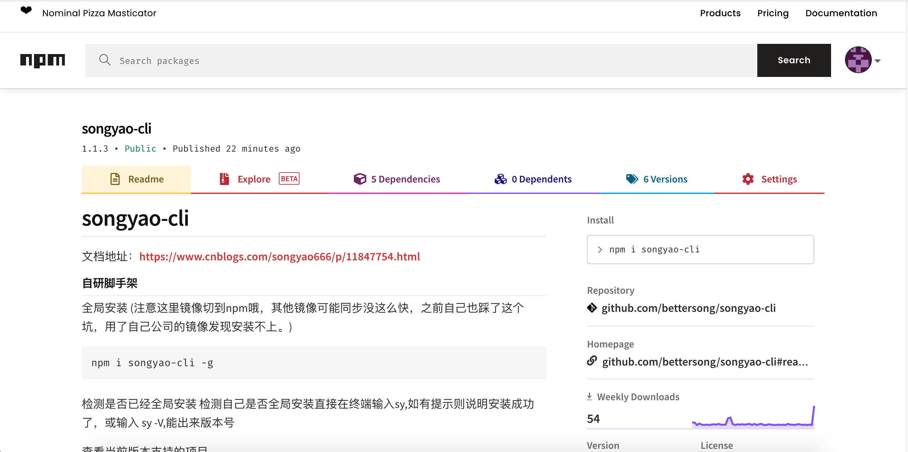
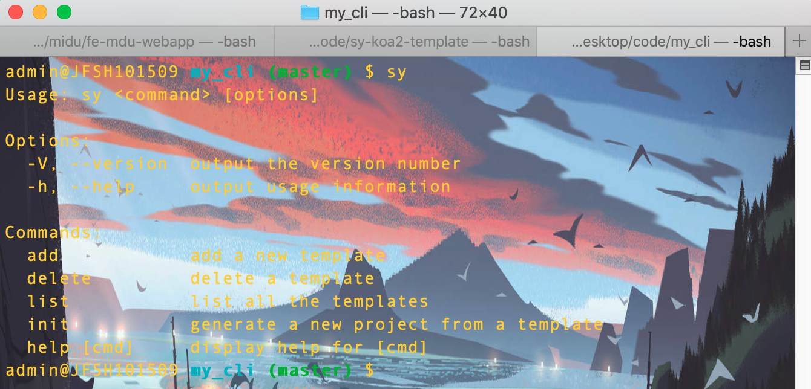
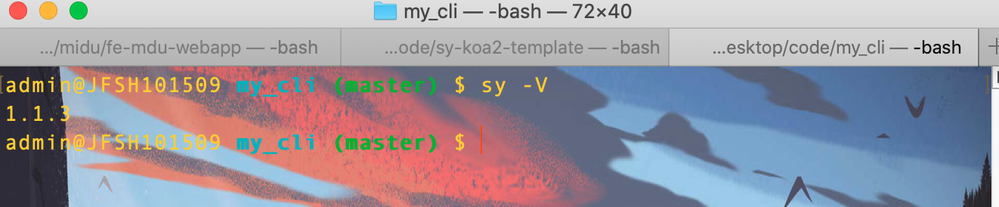
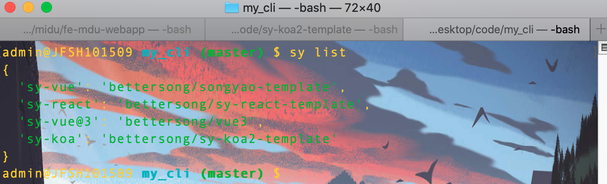
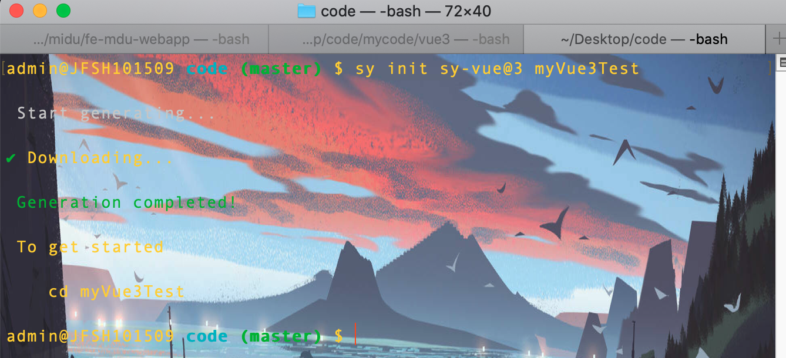

## 前言

时间过得真快，转眼间离我当时发布的第一版脚手架已经两年了，当时正在QTT实习的我在工作之余写了一个可以说是万能脚手架的东西，我为什么要写这个东西呢，当时正在做毕设我用的是框架是react和thinkPHP，然后公司多半项目使用的vue，平时写写node(express,koa等)都要安装各种脚手架，于是我就想有没有可能让一种脚手架就支持各种项目的初始化，所以就写了这么个号称万能脚手架的东西。

具体有多万能呢？这么说吧，万能程度取决于我或者说取决于你自己。取决于我怎么理解呢？只要我往上面放了几个项目模板那他就能够初始化多少个模版。取决于你自己是因为它支持用户自己添加模版。原理其实就是帮你从仓库把我配好的项目模板帮你下载到本地使用，你会发现任何脚手架干的都是这件事。




**如果这篇文章有帮助到你，❤️关注+点赞❤️鼓励一下作者，文章公众号首发，关注 `前端南玖` 第一时间获取最新文章～**

## 使用文档

### 全局安装

```shell
npm i songyao-cli -g
```

(注意这里镜像切到npm哦，其他镜像可能同步没这么快，之前自己也踩了这个坑，用了自己公司的镜像发现安装不上。)

### 检测安装是否成功

检测自己是否全局安装直接在终端输入sy,如过能看到下面的内容则说明脚手架安装成功了

```shell
sy
```



### 查看版本

```shell
sy -V
```



### 查看当前版本支持的项目

```shell
sy list
```



你会看到当前版本支持`vue2`、`react`、`vue3`、`koa`项目

### 初始化一个项目试试吧（以vue3为例）

```shell
sy init sy-vue@3 myVue3Test

## sy-vue@3 是你想要初始化的项目模版（对应sy list 中的模版key)
## myVue3Test 这个是你想要命名的项目名称（可自行定义）
```



然后再进入项目安装依赖

```shell
## 安装依赖
npm i 
```


最后启动项目（启动命令到package.json中查找，每个项目可能不一样）

```shell
npm run dev
```

启动完你就能够看到下面这个页面


到这里一个vue3+vite的项目就初始化好了，项目内默认已经配置好了eslint。

初始化其它项目与这个类似，只需选择好对应的模板初始化，然后再安装依赖就OK了。

## 最后

觉得不错的话，给作者点个赞吧，如果你有什么需要的项目模版欢迎找我添加，欢迎各位在GitHub给我star✨

**github:**

[songyao-cli](https://github.com/bettersong/songyao-cli)欢迎star🌟       [南玖的前端学习乐园](https://github.com/bettersong/interview)欢迎star🌟，感谢支持🙏

