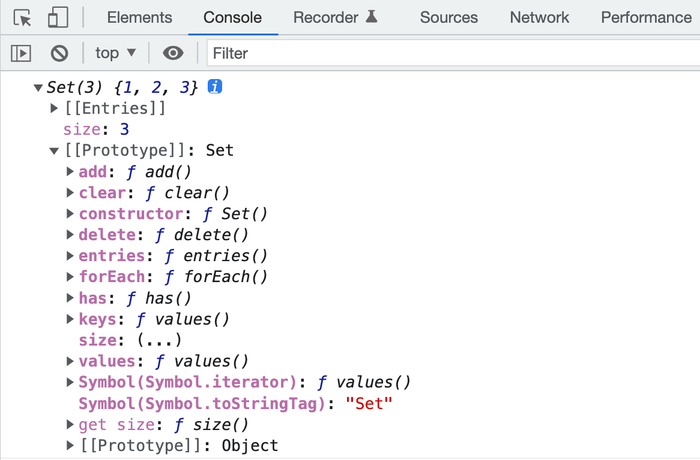
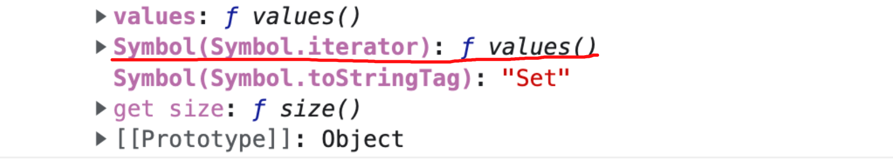
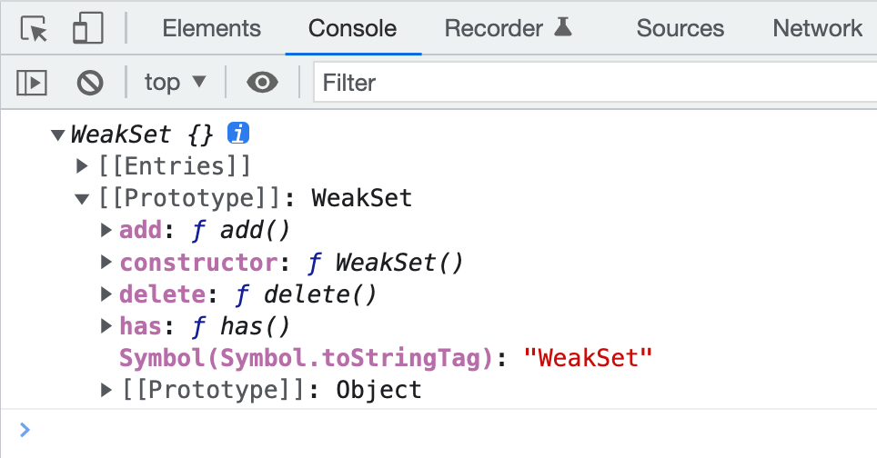
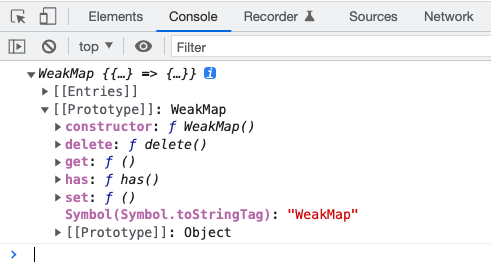

## 前言

写这篇文章文章主要是看到vue3源码中的响应式原理是用了WeakMap做缓存处理，我们平时工作中接触的更多的应该是`Set`, `Map`这两种，而`weakSet`与`weakMap`并没有前两者那么常见，今天我们就一起来了解一下这四种数据结构吧

**如果这篇文章有帮助到你，❤️关注+点赞❤️鼓励一下作者，文章公众号首发，关注 `前端南玖` 第一时间获取最新文章～**

## Set

> ES6提供了新的数据结构Set。它类似于数组，但是成员的值都是唯一的，没有重复的值

`Set`本身是一个构造函数，用来生成`Set`数据结构，**它可以接收一个数组（或具有iterable接口的数据结构）作为参数来初始化**。`Set`允许存储任何类型的数据。

了解`Set`，我们可以看下它有哪些属性和方法，我们可以直接把`Set`打印出来，在它原型链上查找：



### 属性

从上面可以看到`Set`的属性就只有一个`size`

**size** : 返回集合包含元素的数量，类似于数组的`length`属性

```js
const set = new Set([1,2,3])
console.log(set.size)  //3
```

### 操作方法

- **Set.prototype.add(value)** :  添加元素，返回添加后的`Set`
- **Set.prototype.delete(value)** :  删除元素，返回一个布尔值，表示是否删除成功
- **Set.prototype.has(value)** : 返回一个布尔值，表示该元素是否是`Set`的成员
- **Set.prototype.clear()** :清空`Set`集合，无返回值

```js
const obj = {name: 'nanjiu'}
const set = new Set([1,2,3,obj])

console.log(set.size)  //4

console.log('delete', set.delete(3), set) // true {1,2,{name:'nanjiu'}}
console.log('delete', set.delete({name: 'nanjiu'}), set) // false {1,2,{name:'nanjiu'}}
console.log('delete', set.delete(obj), set) // true {1,2}

console.log('add', set.add(6), set.size) //  {1, 2, 6}, 3
console.log('add', set.add({name: 'FE'})) // {1, 2, 6, {name: 'FE'}}
console.log('add', set.add(obj)) // {1, 2, 6, {name: 'FE'}, {name: 'nanjiu'}}


console.log('has', set.has(1)) // true
console.log('has', set.has(obj)) // true
console.log('has', set.has({name: 'FE'})) // false
```

这里就是需要注意一下引用数据类型，set中存储以及判断是否存在都是用的引用数据类型的指针，这一点可以从上面`set.delete({name: 'nanjiu'})`和`set.has({name: 'FE'})`可以看出。

### 遍历方法

- **Set.prototype.keys()** : 返回Set的键名的遍历器
- **Set.prototype.values()** : 返回Set的键值的遍历器
- **Set.prototype.entries()** : 返回Set的键值对的遍历器
- **Set.prototype.forEach()** : 使用回调函数遍历每个成员

**Set会维护值插入时的顺序，因此支持按顺序迭代。由于Set没有键名，只有键值，所以`keys`与`values`方法行为完全一致。**

```js
const mySet = new Set([1, 2, 'nanjiu', [3], {age: 18}])
console.log('keys', mySet.keys()) // SetIterator {1, 2, 'nanjiu', [3], {age: 18}}
console.log('values', mySet.values()) // SetIterator {1, 2, 'nanjiu', [3], {age: 18}}
console.log('entries', mySet.entries()) // SetIterator SetIterator {1 => 1, 2 => 2, 'nanjiu' => 'nanjiu', Array(1) => Array(1), {…} => {…}}
```

首先前三个方法都是返回遍历器，用于遍历Set，当然`Set`结构默认是可遍历的，它的默认遍历器生成函数就是它的`values`方法，这个从上面第一张图可以看出来。



```js
console.log(Set.prototype[Symbol.iterator] === Set.prototype.values) // true
```

这也就意味着`Set`可直接使用`for...of`遍历，以及使用扩展操作，把`Set`集合转换成数组

```js
const mySet = new Set([1, 2, 'nanjiu', [3], {age: 18}])
for(let v of mySet) {
    console.log(v) // 1, 2, 'nanjiu', [3], {age:18}
}

console.log([...mySet])
```

最后这个`forEach`方法基本与数组的`forEach`方法一致，主要区别就是Set的key与value是一样的

```js
mySet.forEach((item,index) => {
    console.log(item, index)
    /**
     * 1 1
     * 2 2
     * 'nanjiu' 'nanjiu'
     * [3] [3]
     * {age: 18} {age: 18}
     */
})
```

### Set是如何判断内部值是否相等的

向`Set`中加入值的时候，不会发生类型转换，它内部判断两个值是否相等使用的算法是`Same-value-zero equality`，有点类似于`===`全等运算符，主要区别是这个算法认为`NaN`等于自身，而精确相等认为`NaN`不等于自身。

```js
let newSet = new Set([NaN,+0,undefined,null,{}])

console.log(newSet.add(NaN)) // {NaN, 0, undefined, null, {}}
console.log(NaN === NaN) // false
console.log(newSet.has(NaN)) // true


console.log(+0 === -0, newSet.add(-0)) // true {NaN, 0, undefined, null, {}}
console.log(undefined === undefined, newSet.add(undefined)) // true {NaN, 0, undefined, null, {}}
console.log(null === null, newSet.add(null)) // true {NaN, 0, undefined, null, {}}}
console.log({} === {}, newSet.add({})) // false {NaN, 0, undefined, null, {}}, {}}
```

**除了NaN，其余表现与`===`一致**

### Set与Array的区别

- Set中的元素不可重复，而Array中的元素是可重复的
- 构建方式不同，Array支持多种构建方式（构造函数、字面量），而Set只支持使用构造函数来构建
- Set不支持像Array一样通过索引随机访问元素
- Set只提供了一些基本的操作数据的方法，Array提供了更多实用的原生方法（`reduce()`,`map()`,`sort()`等）

### Set的应用场景

#### 数组去重

```js
const boy = {name: 'nanjiu'}
const arr = [1,2,3,2,4,boy,1,6,boy]
console.log([...new Set(arr)]) //[1, 2, 3, 4, {…}, 6]
```

#### 数组转换

```js
const set = new Set([1,2,3,4,5])
const arr = Array.from(set) // [1,2,3,4,5]
```

#### 取数组的并集

```js
 const arr1 = [1,2,3,4,5,6]
 const arr2 = [3,4,5,6,7,8]

 const mergeArr = [...new Set([...arr1,...arr2])] // 利用set去重
 console.log(mergeArr) //  [1, 2, 3, 4, 5, 6, 7, 8]
```

#### 取数组的交集

```js
const arr1 = [1,2,3,4,5,6]
const arr2 = [3,4,5,6,7,8]

const overlapArr = [...new Set(arr1)].filter(item => {
  // 先利用set去重，再利用set判断元素是否在另一个集合中存在
  return new Set(arr2).has(item)
})
console.log(overlapArr) // [3, 4, 5, 6]
```

#### 取数组的差集

```js
const arr1 = [1,2,3,4,5,6]
const arr2 = [3,4,5,6,7,8]

const diffArr = [...new Set(arr1)].filter(item => {
  // 与交集取反
  return !new Set(arr2).has(item)
})
console.log(diffArr) // [1, 2] 
```

## WeakSet

> ES6中新增的弱集合是一种新的集合类型，WeakSet是Set的兄弟类型。其API也是Set的子集。WeakSet中的Weak（弱），描述的是JavaScript垃圾回收程序对待弱集合中值的方式。

**弱集合中的值只能是Object或者继承自Object的类型，尝试使用非对象设置值会抛出错误**

```js
const ws = new WeakSet([{}])

console.log(ws) //WeakSet {{…}}
```

### 方法

我们也还是把`WeakSet`打印出来看一下它有哪些属性和方法吧：



**从上图我们可以看到，`WeakSet`没有了`size`属性，并且只有`add`, `delete`, `has`方法，还有就是它没有了默认遍历器生成函数（Symbol.iterator），这也就说明它是不可遍历的。**

- **WeakSet.prototype.add(value)** :  添加元素，返回添加后的`WeakSet`
- **WeakSet.prototype.delete(value)** :  删除元素，返回一个布尔值，表示是否删除成功
- **WeakSet.prototype.has(value)** : 返回一个布尔值，表示该元素是否是`WeakSet`的成员

```js
const per = {name: 'nanjiu'}
const per2 = {name: 'WeakSet'}
const ws = new WeakSet([{}, per])

console.log('add', ws.add(per2))
console.log('delete', ws.delete({})) // false
console.log('delete', ws.delete(per2)) // true
console.log('has', ws.has(per)) // true
console.log(ws) // {{…}, {…}}
```

### 弱值

WeakSet中 ‘weak’ 表示弱集合的值是 ‘弱弱的拿着’。意思就是这些值不属于正式的引用，不会阻止垃圾回收，也就是说如果其它对象都不再引用该对象，那么垃圾回收机制会自动回收该对象所占用的内存，不考虑该对象在存在于`WeakSet`中。因此，WeakSet 适合临时存放一组对象，以及存放跟对象绑定的信息。只要这些对象在外部消失，它在 WeakSet 里面的引用就会自动消失。

由于`WeakSet`内部有多少个成员，取决于垃圾回收机制有没有运行，运行前后可能成员个数是不一样的，而**垃圾回收机制什么时候运行是不可预测的**，所以`WeakSet`没有size属性以及不可遍历。

### WeakSet与Set的区别

- WeakSet的成员只能是对象，而Set的成员可以是任何类型
- WeakSet没有size属性且不可遍历，而Set有size属性且可遍历
- WeakSet中的成员都是弱引用，即垃圾回收机制不考虑WeakSet对该对象的引用，其它对象都不再引用该对象，那么垃圾回收机制会自动回收该对象所占用的内存

### WeakSet的应用场景

**可以用于存储DOM节点，而不用担心节点从文档移除时引发内存泄漏**

```js
const disabledElements = new WeakSet(); 
const loginButton = document.querySelector('.login');  // 通过加入对应集合，给这个节点打上“禁用”标签 
disabledElements.add(loginButton);

// 这样，只要 WeakSet 中任何元素从 DOM 树中被删除，垃圾回收程序就可以忽略其存在，而立即释放其内存（假设没有其他地方引用这个对象）。
```

## Map

> JavaScript 的对象（Object），本质上是键值对的集合（Hash 结构），但是传统上只能用字符串当作键。这给它的使用带来了很大的限制。为了解决这个问题，ES6 提供了 Map 数据结构。它类似于对象，也是键值对的集合，但是“键”的范围不限于字符串，各种类型的值（包括对象）都可以当作键。也就是说，Object 结构提供了“字符串—值”的对应，Map 结构提供了“值—值”的对应，是一种更完善的 Hash 结构实现。如果你需要“键值对”的数据结构，Map 比 Object 更合适。

### 生成Map

> Map作为构造函数接受数组（任何具有Iterator接口、且每个成员都是一个双元素的数组的数据结构）作为参数来生成Map

```js
const map = new Map([
    ['name', 'nanjiu'],
    ['age', 18],
    ['hobby', 'FE']
])
console.log(map)
```


### 属性

从上图我们可以看到Map也有一个size属性

- **size** ： 返回集合所包含元素的数量

```js
const map = new Map([
    ['name', 'nanjiu'],
    ['age', 18],
    ['hobby', 'FE']
])
console.log(map.size) //3
```

### 操作方法

- **set(key, value)** : 向map中添加新元素，返回添加后的新map
- **get(key)** : 通过键值查找对应的值，返回对象的值
- **has(key)** : 判断map中是否包含该键值，返回布尔值
- **delete(key)** : 删除map中对应的键值，返回布尔值代表是否删除成功
- **clear()** : 清空整个map，无返回值

```js
const map = new Map([
    ['name', 'nanjiu'],
    ['age', 18],
    ['hobby', 'FE']
])
console.log(map)
console.log(map.size) //3

console.log('set', map.set([1], 'set[1]')) //  {'name' => 'nanjiu', 'age' => 18, 'hobby' => 'FE', Array(1) => 'set[1]'}
console.log('get', map.get('name')) // nanjiu
console.log('has', map.has('age')) // true
console.log('delete', map.delete('age')) // true
console.log('clear', map.clear()) // undefined
```

### 遍历方法

- **keys()** ：返回键名的遍历器
- **values()** ：返回键值的遍历器
- **entries()** ：返回键值对的遍历器
- **forEach()** ：使用回调函数遍历每个成员

```js
{
    const map = new Map([
        ['name', 'nanjiu'],
        ['age', 18],
        ['hobby', 'FE']
    ])
    
    for(let key of map.keys()) {
        console.log('key',key)
        /**
         * key name
         * key age
         * key hobby
         */
    }

    for(let value of map.values()) {
        console.log('value', value)
        /**
         * value 'nanjiu'
         * value 18
         * value 'FE'
         */
    }

    for(let entry of map.entries()) {
        console.log('entry', entry)
        /**
         * entry ['name', 'nanjiu']
         * entry ['age', 18]
         * entry ['hobby', 'FE']
         */
    }

    map.forEach((item, index) => {
        console.log('forEach', item, index)
        /**
         * forEach 'nanjiu' 'name'
         * forEach 18 'age'
         * forEach 'FE' 'hobby'
         */
    })
}
```

**从上面那张图我们可以发现`Map`的遍历器生成函数就是它的`entries()`方法**


```js
console.log(Map.prototype[Symbol.iterator] === Map.prototype.entries) //true
```

这么说来map也可以直接使用`for...of`遍历，并且跟遍历`entries()`是一样的

```js
for(let m of map) {
  console.log('for...of', m)
  /**
   * for...of ['name', 'nanjiu']
   * for...of ['age', 18]
   * for...of ['hobby', 'FE']
   */
}
```

### Map与Object的区别

- Map可以使用任何数据类型作为键，而Object只能使用数值、字符串或symbol
- Map元素的顺序遵循插入的顺序，而Object则没有这一特性
- Map自身支持迭代，而Object不支持
- Map自身有size属性，而Object则需要借助`Object.keys()`来计算

### 何时选用Map何时选用Object

- **内存占用** ：固定大小的内存，Map 约比 Object 多存储 50%的键值对
- **插入性能** ：涉及大量插入操作，Map 性能更佳
- **查找性能** ：涉及大量查找操作，Object 更适合
- **删除性能** ：涉及大量删除操作，毫无疑问选择 Map

## WeakMap

> ES6中新增的 ‘弱映射’ 是一种新的集合类型，为这门语言带来了增强的键/值队存储机制。`WeakMap`是`Map`的兄弟类型，其API也是Map的子集。WeakMap中的 ‘Weak’（弱）描述的是JavaScript垃圾回收程序对待 ‘弱映射’ 中键的方式。

**注意，WeakMap 弱引用的只是键名，而不是键值。键值依然是正常引用。**

```js
const wm = new WeakMap([[{name:'11'},{}]])
console.log(wm)
```




### 方法

从上图中我们可以看到，`WeakMap`没有遍历操作（keys(), values(), entries()），也没有`size`属性

- **set(key, value)** : 向map中添加新元素，返回添加后的新WeakMap
- **get(key)** : 通过键值查找对应的值，返回对象的值
- **has(key)** : 判断WeakMap中是否包含该键值，返回布尔值
- **delete(key)** : 删除WeakMap中对应的键值，返回布尔值代表是否删除成功

```js
const wm = new WeakMap([[{name:'11'},{}]])
console.log(wm)
const obj = {name: 'nanjiu'}
console.log('set', wm.set(obj, 1234)) // {{…} => 1234, {…} => {…}}
console.log('get', wm.get(obj)) // 1234
console.log('has', wm.has(obj)) // true
console.log('delete', wm.delete(obj)) //true
```

### WeakMap与Map的区别

- WeakMap只接受对象作为键名，而Map的键名可以是任何数据类型
- WeakMap的键名所指的对象不计入垃圾回收机制
- WeakMap没有size属性且不可遍历，Map有size属性且可遍历

### WeakMap的应用场景

#### 在 DOM 对象上保存相关数据

传统使用 jQuery 的时候，我们会通过 `$.data() `方法在 DOM 对象上储存相关信息(就比如在删除按钮元素上储存帖子的 ID 信息)，jQuery 内部会使用一个对象管理 DOM 和对应的数据，当你将 DOM 元素删除，DOM 对象置为空的时候，相关联的数据并不会被删除，你必须手动执行 `$.removeData()` 方法才能删除掉相关联的数据，WeakMap 就可以简化这一操作：

```js
let wm = new WeakMap(), element = document.querySelector(".element")
wm.set(element, "data")

let value = wm.get(elemet)
console.log(value) // data

element.parentNode.removeChild(element)
element = null
```

#### 私有属性

通过WeakMap也可以实现私有属性

```js
const privateData = new WeakMap()

export default class Student {
  constructor(name, age) {
    privateData.set(this, {name, age})
  }

  getName() {
    return privateData.get(this).name
  }

  getAge() {
    return privateData.get(this).age
  }
}
```

## 总结

- Set

- - 成员唯一、无序且不重复
  - [value, value]，键值与键名是一致的（或者说只有键值，没有键名）
  - 可以遍历，方法有：add、delete、has、clear、keys、values、entries、forEach

- WeakSet

- - 成员都是对象
  - 成员都是弱引用，可以被垃圾回收机制回收，可以用来保存DOM节点，不容易造成内存泄漏
  - 不能遍历，方法有add、delete、has

- Map

- - 本质上是键值对的集合，类似集合，键名可以是任何数据类型
  - 可以遍历，方法有get、set、has、delete、clear、keys、values、entries、forEach
  - 可以跟各种数据格式转换

- WeakMap

- - 只接受对象最为键名（null除外），不接受其他类型的值作为键名
  - 键名是弱引用，键值可以是任意的，键名所指向的对象可以被垃圾回收，此时键名是无效的
  - 不能遍历，方法有get、set、has、delete

