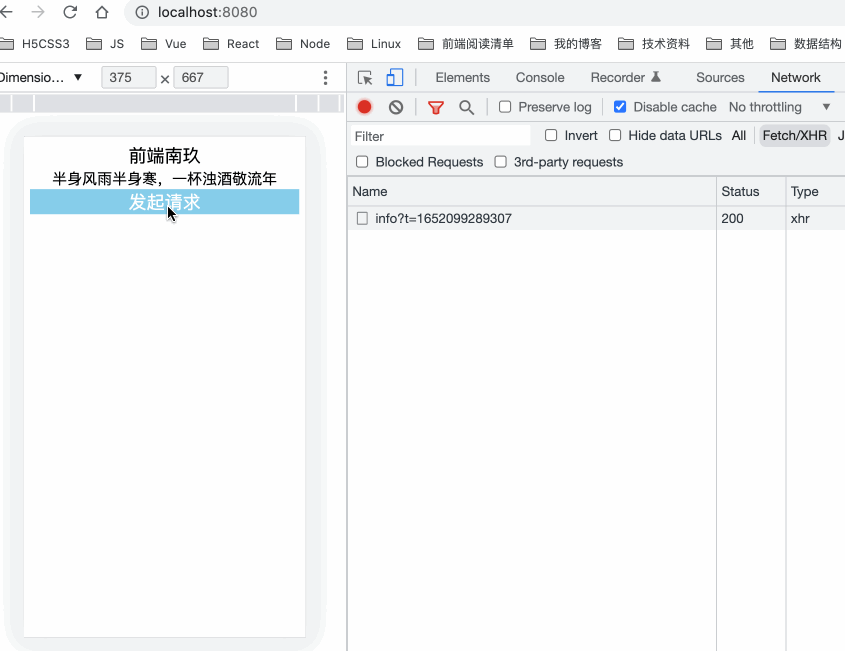
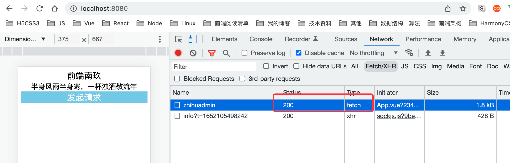
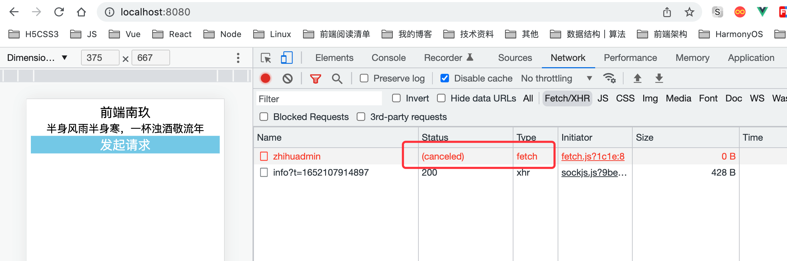

## 前言

想必很多同学会好奇为什么需要中断请求，这种应用场景都一般出现在哪？首先我们常见的有点类似于防抖，即减少不必要的请求，我们可以使用防抖也可以使用请求中断；还有就是单页应用中，在组件挂在完成之后向服务器发送请求，但在请求回来之前，用户跳转了其他路由，导致该组件销毁，虽然组件销毁了，但我们发出去的请求却并没有销毁，这时候就可以使用请求中断来解决；上面这两种是比较常见的请求中断应用场景，当然还有很多，自己可以结合业务去慢慢研究。

你是否还会好奇请求都已经发出去了，怎么还能取消？想要了解的，慢慢往下看~

**如果这篇文章有帮助到你，❤️关注+点赞❤️鼓励一下作者，文章公众号首发，关注 `前端南玖` 第一时间获取最新文章～**

## 请求方式

我们常见的请求方式有：浏览器原生的`XMLHttpRequest`、第三方HTTP库`Axios`以及浏览器最新实现的`Fetch`。

### XMLHttpRequest

先来看一下`XMLHttpRequest`，虽然我们实际项目中用这个方法比较少，一般都是用`axios`等这些封装好的第三方请求库来提高开发效率，但我们也需要了解它的一些操作流程，毕竟第三方库底层用的也是`XHR`对象来实现的。

#### XHR请求的一般步骤

- 新建xhr对象
- 调用`open`创建http请求
- 调用`onreadystatechange`监听请求状态
- 调用`send`发送请求

```js
// xhr.js
export default function xhr({
    url,
    method = 'get',
    data = null,
} = {}) {
    return new Promise((resolve, reject) => {
        if(!url) {
            return reject(new Error('request url is missing'))
        }
        if(data && method.toLowerCase() === 'get') {
            url += `${qs(data)}`
        }
        // 新建xhr对象
        const xhr = new XMLHttpRequest()
        // 创建http请求
        xhr.open(method, url, false)
        //监听请求状态
        xhr.onreadystatechange = function() {
            if(xhr.readyState === 4) {
                if(xhr.status >= 200 && xhr.status <300 || xhr.status === 304) {
                    resolve(JSON.parse(xhr.response))
                }
            }
        }
        xhr.onerror = function(error) {
            reject('请求失败' + error)
        }
        // 发送请求
        xhr.send(method.toLowerCase() === 'get' ? null : JSON.stringify(data))
    })
}

function qs(data) {
    if(data && typeof data === 'object') {
        const res = []

        Object.keys(data).forEach(k => {
            res.push(`${k}=${JSON.stringify(data[k])}`)
        })
        return res.join('&')
    }

    return data
}
```

写完再来看下是否能够成功发起请求

```js
async getData() {
  const res = await xhr({
    url: '/api/columns/zhihuadmin',
    method: 'get'
  })
  console.log(res)
}
```


从上图我们可以看到请求是已经成功发出去了，并且接口也已经成功返回了数据。

#### XHR请求中断abort

我们知道`XHRHttpRequest`对象上有个`abort`方法，这个方法就是用来终止请求的，当一个请求被终止，它的  `readyState` 将被置为 `XMLHttpRequest.UNSENT` (0)，并且请求的 `status`置为 0。

OK，我们来模拟一下重复请求一个接口，让其除第一次以外的请求都中断

```vue
<template>
  <div id="app">
    <next/> 
    <div class="btn" @click="getData">发起请求</div>
  </div>
</template>

<script>
import next from "./components/nextTick.vue"
import xhr from "./utils/xhr"
export default {
  name: 'app',
  components: {
    next
  },
  data() {
    return {
      t1:0,
      name:'南玖',
      hobby: 'front'
    }
  },
  methods: {
    async getData() {
      const res = await xhr({
        url: '/api/columns/zhihuadmin',
        method: 'get'
      })
      console.log(res)
    }
  }
}
</script>

<style lang="less">
.title, .btn{
  font-size: (24/@rem);
}
.btn{
  background: skyblue;
  color: #fff;
}
</style>

```

```js
// xhr.js
export default function request({
    url,
    method = 'get',
    data = null,
} = {}) {
    return new Promise((resolve, reject) => {
        if(!url) {
            return reject(new Error('request url is missing'))
        }
        if(data && method.toLowerCase() === 'get') {
            url += `${qs(data)}`
        }
        // 新建xhr对象
        const xhr = new XMLHttpRequest()

        // 创建http请求
        xhr.open(method, url, true)
        //监听请求状态
        xhr.onreadystatechange = function() {
            if(xhr.readyState === 4) {
                if(xhr.status >= 200 && xhr.status <300 || xhr.status === 304) {
                    resolve(JSON.parse(xhr.response))
                }
            }
        }
        xhr.onerror = function(error) {
            reject('请求失败' + error)
        }
        // 发送请求
        xhr.send(method.toLowerCase() === 'get' ? null : JSON.stringify(data))
        
        let cacheKey = url
        if(request.cache[cacheKey]) {
            return xhr.abort() // 缓存中存在的说明该请求执行过，终止请求
        }
        request.cache[cacheKey] = xhr 
    })
}

request.cache = {} // 缓存请求xhr实例


function qs(data) {
    if(data && typeof data === 'object') {
        const res = []

        Object.keys(data).forEach(k => {
            res.push(`${k}=${JSON.stringify(data[k])}`)
        })
        return res.join('&')
    }

    return data
}
```

来看效果，我们会发现，只有第一次的请求是正常发送出了，后面的请求都被中断了，状态都为canceled。



### Axios

接着来看下我们常用的`Axios`请求库是如何进行中断请求的，这个请求库本身是基于`Promise`的特性来进行封装的，并且它是兼容浏览器环境与node环境的，浏览器环境它也是用的我们的`XMLHttpRequest`来发起请求的，而node环境则是通过`http`模块来发起请求的。并且它还提供了许多扩展性方法便于我们业务上的功能封装，具体可以去看·`Axios`文档，这里我们主要来看它的请求拦截是如何实现的。

#### axios请求中断cancelToken

```js
// axios.js
import axios from "axios"

const request = axios.create({
    // baseURL: 'https://zhuanlan.zhihu.com',
    headers: {
        'Content-Type': 'application/x-www-form-urlencoded'
    }
})
const cache = {}
// 自定义请求拦截器
request.interceptors.request.use(cfg => {
    
    let cacheKey = cfg.url
    cache[cacheKey] && cache[cacheKey]()
    cfg.cancelToken = new axios.CancelToken(function executor(c){
        cache[cacheKey] = c
    })
    return cfg
}, err => Promise.reject(err))

// 自定义响应拦截器
request.interceptors.response.use(res => {
    if(res.status === 200) {
        return Promise.resolve(res.data)
    }

    return Promise.reject(res)
}, err => Promise.reject(err))

export default request
```

### Fetch API

 `fetch()` 必须接受一个参数——资源的路径。无论请求成功与否，它都返回一个 Promise 对象，resolve 对应请求的 `Response`。你也可以传一个可选的第二个参数 `init`。

一旦 `Response`被返回，就可以使用一些方法来定义内容的形式，以及应当如何处理内容。

```js
async fetchData() {
  const res = await fetch('/api/columns/zhihuadmin')
  console.log('fetch', res.json())
}
```



### AbortController

上文中提到，在`XHR`实例中可以通过`abort`方法来取消请求，在`Axios`中可以通过`CancelToken`构造函数的参数来获得取消函数，从而通过取消函数来取消请求。但是很遗憾的是，在`Fetch API`中，并没有自带的取消请求的`API`供我们调用。不过令人愉悦的是，除了`IE`浏览器外，其他浏览器已经为`Abort API`添加了实验性支持，`Abort API`允许对`XHR`和`fetch`这样的请求操作在未完成时进行终止，在实现`fetch`的请求中断之前，我们先来了解一下`AbortController`，这个可以说就是为解决fetch请求中断问题而提出来的。

它表示的是一个控制器对象，我们可以使用它中止一个或多个web请求。

#### 构造函数

- `AbortController.AbortController()`

  创建一个新的 `AbortController` 对象实例，该对象拥有一个只读属性`signal`和一个方法`abort`。`signal`属性表示一个`AbortSignal`实例，当我们需要取消某一个请求时，需要将该`signal`属性所对应的`AbortSignal`实例与请求进行关联，然后通过控制器对象提供的`abort`方法来取消请求；

#### 属性

- `AbortController.signal`  只读

  返回一个 `AbortSignal`对象实例，它可以用来 with/abort 一个 Web(网络)请求。

#### 方法

- `AbortController.abort()`

  中止一个尚未完成的 Web(网络)请求。这能够中止 fetch请求及任何响应体的消费和流。

### fetch请求中断

了解完`AbortController.abort`，我们再来实现一下fetch的请求中断

```js
// fetch.js
export default function abortableFetch(url, initData){
    const abortController = new AbortController()
    const signal = abortController.signal
    
    return {
      // 这里需要将 signal 与请求进行关联，关联之后才能通过 abortController.abort 方法取消请求
      request: fetch(url, {...initData, signal}).then(response => response.json()),
      // 用于在外层手动取消请求
      cancelRes: () => abortController.abort(),
    }
  }

```

```js
async fetchData() {
  const {request, cancelRes} =  abortableFetch('/api/columns/zhihuadmin')
  request
    .then(res => console.log(res))
    .catch(err => {
    if (err.name === 'AbortError') {
      console.log('请求已被终止');
    }
  });

  // 手动取消请求
  cancelRes();

}
```



## 总结

上面主要介绍了前端领域几种比较常见的网络请求方案以及各自的请求中断方法，在浏览器原生提供的`XHR`对象中，可以通过XHR实例上的`abort`方法来终止请求；在`Axios`库中，可以通过它提供的`CancelToken`构造函数来实现请求中断；通过`fetch`函数和`Abort API`的相互配合，实现了在现代主流浏览器的`Fetch API`中请求中断的方式。

