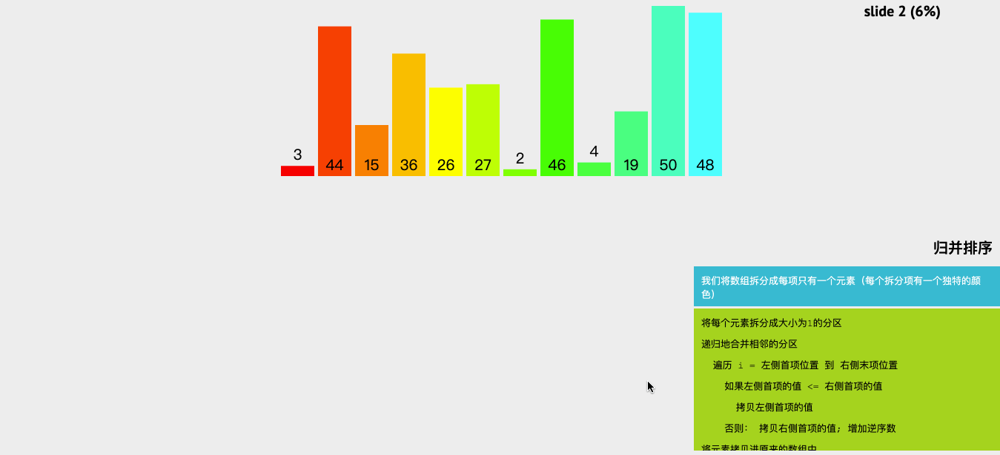

## 前言

算法对于前端程序员来说可能并没有后端程序员应用的多，但我们也得掌握一些基本算法的思想，这无论是对我们找工作还是平时工作都有极大的帮助，现在越来越多的公司都会考察前端程序员的算法能力了，所以我们有必要去学习一下前端常见算法的基本思想。

**如果这篇文章有帮助到你，❤️关注+点赞❤️鼓励一下作者，文章公众号首发，关注 `前端南玖` 第一时间获取最新的文章～**

## 冒泡排序

### 算法描述

> **冒泡排序**相信对于很多同学来说并不陌生，它应该是我们最经典的算法了，无论学什么语言，都能见到它的身影。**基本思想**：重复遍历要排序的数组，每次比较两个元素的大小，如果顺序错误就交换两个元素的顺序。遍历数组重复进行比较直到排序完成。

### 算法实现

**基本步骤**

- 比较相邻的两个元素。如果第一个比第二个大，则交换位置；
- 对每一对相邻元素重复第一个步骤，从开始第一对到结尾的最后一对，这样在最后的元素应该会是最大的数；
- 针对所有的元素重复以上的步骤，除了最后一个；
- 重复步骤1~3，直到排序完成。

**动画演示**


**代码实现**

```js
/**
 * 外循环控制需要比较的元素，比如第一次排序后，
最后一个元素就不需要比较了，内循环则负责两两元素比较，将元素放到正确位置上
*/
function bubbleSort(arr) {
    const len = arr.length
    for(let i=0; i<len; i++) {
        for(let j=0;j<len-1-i; j++) {
          // 注意边界值
            if(arr[j] > arr[j+1]){
                [arr[j],arr[j+1]] = [arr[j+1],arr[j]] // 交换位置
            }
        }
    }
    return arr
}

console.log(bubbleSort([3,44,15,36,26,27,2,46,4,19,50,48]))
//[2,3,4,15,19,26,27,36,44,46,48,50]
```

**时间复杂度：O(n^2)**

##快速排序

### 算法描述

> **快速排序**，是一种对冒泡排序改进的算法，它是处理大数据最快的排序算法之一了。**基本思想：**它是一种分而治之的算法，找出一个参考值，通过递归的方式将数据依次分解为包含较小元素和较大元素的不同子序列。该算法不断重复这个步骤直至所有数据都是有序的。

### 算法实现

**基本步骤**

- 选择一个参考元素，将列表分割成两个子序列；

- 对列表重新排序，将所有小于基准值的元素放在基准值前面，所有大于基准值的元素放在基准值的后面；

- 分别对较小元素的子序列和较大元素的子序列重复步骤1和2

**动画演示**


**代码实现**

```js

function quickSort(arr) {
    if(arr.length<=1) return arr
    const left = [],right = [],current = arr.splice(0,1)
    for(let i=0; i<arr.length; i++) {
        if(arr[i]<current) {
            // 小于参考值放左边
            left.push(arr[i]) 
        }else{
            // 否则放右边
            right.push(arr[i])
        }
    }
    //递归上述步骤
    return quickSort(left).concat(current,quickSort(right))
}

console.log(quickSort([3,44,15,36,26,27,2,46,4,19,50,48]))
//[2,  3,  4, 15, 19, 26, 27, 36, 44, 46, 48, 50]
```

**时间复杂度：O(nlogn)**

## 插入排序

### 算法描述

> **插入排序**是一种简单直观的排序算法。**基本思想：**通过构建有序序列，对于未排序数据，在已排序序列中从后向前扫描，找到相应位置并插入。插入排序在实现上，通常采用in-place排序（即只需用到O(1)的额外空间的排序），因而在从后向前扫描过程中，需要反复把已排序元素逐步向后挪位，为最新元素提供插入空间。

### 算法实现

**基本步骤**

- 从第一个元素开始，该元素可以认为已经被排序；

- 取出下一个元素，在已经排序的元素序列中从后向前扫描；

- 如果该元素（已排序）大于新元素，将该元素移到下一位置；

- 重复步骤3，直到找到已排序的元素小于或者等于新元素的位置；

- 将新元素插入到该位置后；

- 重复步骤2~5。

**动画演示**


**代码实现**

```js

/**双层循环，外循环控制未排序的元素，内循环控制已排序的元素，将未排序元素设为标杆，
与已排序的元素进行比较，小于则交换位置，大于则位置不动
*/
function insertSort(arr) {
    let tem
    for(let i=0; i<arr.length; i++) {
        tem = arr[i]
        for(let j=i; j>=0; j--){
            if(arr[j-1] > tem){
                arr[j] = arr[j-1]
            }else {
                arr[j] = tem
                break
            }
        }
    }
    return arr
}
console.log(insertSort([3,44,15,36,26,27,2,46,4,19,50,48]))
//[2,  3,  4, 15, 19, 26, 27, 36, 44, 46, 48, 50]
```

**时间复杂度O(n^2)**

## 选择排序

### 算法描述

> **选择排序**是一种简单直观的排序算法，**基本思想：**首先在待排序序列中选出最小或最大值，存放在排序序列起始位置，然后再从剩余未排序元素中继续寻找最小或最大元素，放到已排序序列末尾。以此类推，直到所有元素均排序完毕。

### 算法实现

**基本步骤**

- 初始状态：无序区为R[1..n]，有序区为空；

- 第i趟排序(i=1,2,3...n-1)开始时，当前有序区和无序区分别为R[1..i-1]和R(i..n）。该趟排序从当前无序区中-选出关键字最小的记录 R[k]，将它与无序区的第1个记录R交换，使R[1..i]和R[i+1..n)分别变为记录个数增加1个的新有序区和记录个数减少1个的新无序区；

- n-1趟结束，数组有序化了。

**动画演示**


**代码实现**

```js
/**
 * 先假设第一个元素为最小的，然后通过循环找出最小元素，
 * 然后同第一个元素交换，接着假设第二个元素，重复上述操作即可
 */

function selectSort(arr) {
    let len = arr.length, minIndex, tem
    for(let i=0; i<len-1; i++) {
        minIndex = i //最小值下标
        for(let j=i+1; j<len; j++) {
            if(arr[j] < arr[minIndex]){
                // 找出最小值
                minIndex = j //更换最小值下标
            }
        }
        // 交换位置
        tem = arr[i]
        arr[i] = arr[minIndex]
        arr[minIndex] = tem
    }
    return arr
}

console.log(selectSort([3,44,15,36,26,27,2,46,4,19,50,48]))
//[2,  3,  4, 15, 19, 26, 27, 36, 44, 46, 48, 50]
```

**时间复杂度O(n^2)**

## 归并排序

### 算法描述

> **归并排序**是一种借助“归并”进行排序的方法，归并的含义是将两个或两个以上的有序序列归并成一个有序序列的过程。**基本思想：**将若干有序序列逐步归并，最终归并为一个有序序列。和选择排序一样，归并排序的性能不受输入数据的影响，但表现比选择排序好的多，因为始终都是`O(n log n）`的时间复杂度。代价是需要额外的内存空间。

### 算法实现

**基本步骤**

- 把长度为n的输入序列分成两个长度为n/2的子序列；
- 对这两个子序列分别采用归并排序；
- 将两个排序好的子序列合并成一个最终的排序序列。

**动画演示**



**代码实现**

```js
// 将数组一直等分，然后合并
function merge(left, right) {
    let tem = []
    while(left.length && right.length) {
        if(left[0] < right[0]) {
            tem.push(left.shift())
        }else{
            tem.push(right.shift())
        }
    }
    return tem.concat(left,right)
}
function mergeSort(arr) {
    const len = arr.length
    if(len<2) return arr
    let mid = Math.floor(len / 2), left = arr.slice(0,mid), right = arr.slice(mid)
    return merge(mergeSort(left),mergeSort(right))
}
console.log(mergeSort([3,44,15,36,26,27,2,46,4,19,50,48]))
// [2,  3,  4, 15, 19, 26, 27, 36, 44, 46, 48, 50]
```

**时间复杂度O(nlogn)**

## 希尔排序

### 算法描述

> **希尔排序**是插入排序的一种。也称缩小增量排序，是直接插入排序算法的一种更高效的改进版本。希尔排序是非稳定排序算法。**基本思想：**是把记录按下标的一定增量分组，对每组使用直接插入排序算法排序；随着增量逐渐减少，每组包含的关键词越来越多，当增量减至1时，整个文件恰被分成一组，算法便终止。

### 算法实现

**基本步骤**

- 选择一个增量序列t1，t2，…，tk，其中ti>tj，tk=1；
- 按增量序列个数k，对序列进行k 趟排序；
- 每趟排序，根据对应的增量ti，将待排序列分割成若干长度为m 的子序列，分别对各子表进行直接插入排序。仅增量因子为1 时，整个序列作为一个表来处理，表长度即为整个序列的长度。

**动画演示**


**代码实现**

```js

function shellSort(arr) {
    var len = arr.length;
    for(var gap = Math.floor(len / 2); gap > 0; gap = Math.floor(gap / 2)) {
        for(var i = gap; i < len;i++) {
            var j = i;
            var current = arr[i];
            while (j - gap >= 0 && current < arr[j - gap]) {
                 arr[j] = arr[j - gap];
                 j = j - gap;
            }
            arr[j] = current;
        }
    }
    return arr;
}

console.log(shellSort([50,70,60,80,61,84,83,88,87,99]))
//[50, 60, 61, 70, 80, 83, 84, 87, 88, 99]
```

**时间复杂度：O(nlogn)**

## 计数排序

### 算法描述

> **计数排序**是一种稳定的排序算法。**基本思想：**使用一个额外的数组C，其中第i个元素是待排序数组A中值等于i的元素的个数。然后根据数组C来将A中的元素排到正确的位置。它只能对整数进行排序。

### 算法实现

**基本步骤**

- 找出待排序的数组中最大和最小的元素；
- 统计数组中每个值为i的元素出现的次数，存入数组C的第i项；
- 对所有的计数累加（从C中的第一个元素开始，每一项和前一项相加）；
- 反向填充目标数组：将每个元素i放在新数组的第C(i)项，每放一个元素就将C(i)减去1。

**动画演示**


**代码实现**

```js
function countingSort(arr) {
    let len = arr.length, b = [], c = [], min = max = arr[0]
    for(let i=0; i<len; i++) {
        min = min <= arr[i] ? min : arr[i]
        max = max >= arr[i] ? max : arr[i]
        c[arr[i]] = c[arr[i]] ? c[arr[i]] + 1 : 1 // 计数
    }

    for(let i=min; i< max; i++) {
        c[i+1] = (c[i+1] || 0) + (c[i] || 0)
    }

    for(let i=len-1; i>=0; i--) {
        b[c[arr[i]] - 1] = arr[i]
        c[arr[i]]--
    }
    return b
}
console.log(countingSort([2,3,8,7,1,2,2,2,7,3,9,8,2,1,4]))
//[ 1, 1, 2, 2, 2, 2, 2, 3, 3, 4, 7, 7, 8, 8, 9]
```

**时间复杂度：O(n+k)**，k表示输入的元素是n 个0到k之间的整数

## 基数排序

### 算法描述

> **基数排序**也是非比较的排序算法，**基本思想：**按照低位先排序，然后收集；再按照高位排序，然后再收集；依次类推，直到最高位。有时候有些属性是有优先级顺序的，先按低优先级排序，再按高优先级排序。最后的次序就是高优先级高的在前，高优先级相同的低优先级高的在前。基数排序基于分别排序，分别收集，所以是稳定的。

### 算法实现

**基本步骤**

- 取得数组中的最大数，并取得位数；
- arr为原始数组，从最低位开始取每个位组成radix数组；
- 对radix进行计数排序（利用计数排序适用于小范围数的特点）；

**动画演示**


**代码实现**

```js
function radixSort(arr, maxDigit) {
    let counter = [], mod = 10, dev = 1;
    for (let i = 0; i < maxDigit; i++, dev *= 10, mod *= 10) {
        for(let j = 0; j < arr.length; j++) {
            let bucket = parseInt((arr[j] % mod) / dev)
            if(counter[bucket]==null) {
                counter[bucket] = []
            }
            counter[bucket].push(arr[j])
        }
        let pos = 0
        for(let j = 0; j < counter.length; j++) {
            let value = null
            if(counter[j]!=null) {
                while ((value = counter[j].shift()) != null) {
                      arr[pos++] = value
                }
          }
        }
    }
    return arr;
}
console.log(radixSort([3,44,15,36,26,27,2,46,4,19,50,48],2))
// [ 2,  3,  4, 15, 19, 26, 27, 36, 44, 46, 48, 50]
```

**时间复杂度：O(n*k)**，k表示输入的元素是n 个0到k之间的整数

## 总结

| 排序算法 | 平均时间复杂度 | 最坏时间复杂度 | 空间复杂度 | 是否稳定 |
| :------: | :------------: | :------------: | :--------: | :------: |
| 冒泡排序 |     O(n^2)     |     O(n^2)     |    O(1)    |    是    |
| 快速排序 |    O(nlogn)    |     O(n^2)     |  O(long)   |   不是   |
| 插入排序 |     O(n^2)     |     O(n^2)     |    O(1)    |    是    |
| 选择排序 |     O(n^2)     |     O(n^2)     |    O(1)    |   不是   |
| 归并排序 |    O(nlogn)    |    O(nlogn)    |    O(n)    |    是    |
| 希尔排序 |    O(nlogn)    |    O(n^1.5)    |    O(1)    |   不是   |
| 计数排序 |     O(n+k)     |     O(n+k)     |   O(n+k)   |    是    |
| 基数排序 |     O(n*k)     |     O(n*k)     |    O(k)    |    是    |

