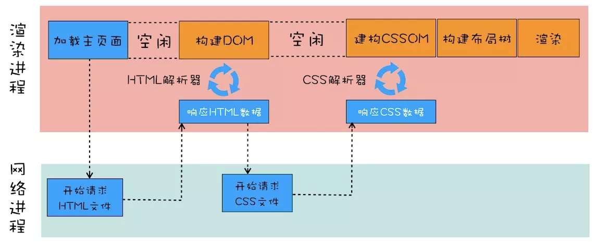
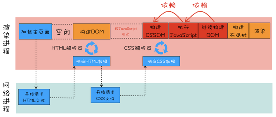
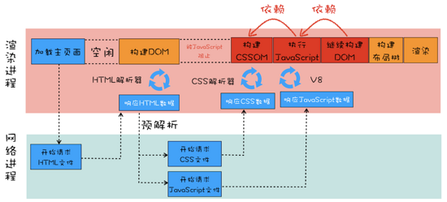
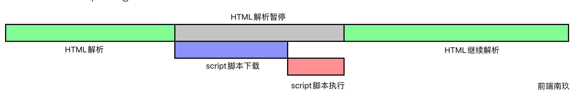
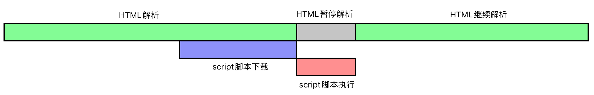
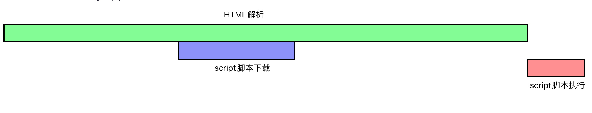

## 前言

我们知道一个页面通常由，html，css，js三部分组成，一般我们会把css文件放在head头部加载，而js文件则放在页面的最底部加载，想要知道为什么大家都会不约而同的按照这个标准进行构建页面，必须先得了解页面的加载过程。（当然以现在的技术你也可以不按这个标准，下面会有讲到js的异步加载问题）

之前写过一篇[超详细讲解页面加载过程](https://mp.weixin.qq.com/s/S1SbehiuHnCDox465u0XJQ)，这里会比较详细的介绍从输入URL到展现一个页面的详细过程，今天我们主要来看一下页面的构建过程，以及html，css，js三者之间的关系。

**如果这篇文章有帮助到你，❤️关注+点赞❤️鼓励一下作者，文章公众号首发，关注 `前端南玖` 第一时间获取最新文章～**

> 这是我的Github:[Github](https://github.com/bettersong/interview)，欢迎star🌟

## 页面构建过程

这里我们主要考虑三种情况下的构建过程

### 页面中只含有外部CSS文件



从图中我们可以看到，在构建布局树之前需要先获取到DOM树与CSSOM树，在请求回HTML文件时，HTML解析器响应HTML数据开始构建DOM，但是由于此时页面中包含的是外部CSS文件，所以他需要先去请求CSS会见，再获取到CSS数据后CSS解析器才能开始构建CSSOM。**所以这种情况下CSS没有阻塞DOM的构建，但它阻塞了页面的渲染**

### 页面中包含内联JS和外部CSS



从这张图中我们可以看到，HTML解析器在构建DOM过程中如果遇到了JS就会停止构建DOM，先去解析执行JS**（因为JS可能会修改DOM）**。但是在执行JS脚本之前，如果页面中包含外部CSS或内联CSS，会先将CSS构建成CSSOM，再去执行JS。这也就是上面说到的为什么一般将JS文件放在页面的最底部的原因。

**所以从这种情况来看，CSS、JS会阻塞DOM的构建，CSS会阻塞JS的执行，但它们不会阻塞HTML的解析**

### 页面中包含外部JS与外部CSS



从这张图我们可以看到，HTML解析器在解析过程中如果遇到外部CSS与外部JS文件，就会同时发起请求对文件进行下载，这个过程DOM构建的过程会停止，需要等CSS文件下载完成并构建完CSSOM，JS文件下载完成并执行结束，才会开始构建DOM。我们知道**CSS会阻塞JS的执行，所以JS必须要等到CSSOM构建完成之后再执行**

所以上面我们说的CSS放在头部进行加载，而JS文件放在页面的底部进行加载也就能够解释的通了。

## CSS与DOM的关系

> `CSS`不会阻塞`DOM`的解析，但会阻塞`DOM`的渲染

#### CSSOM的作用

- 第一个是提供给JavaScript操作样式表的能力
- 第二个是为布局树的合成提供基础的样式信息
- 这个CSSOM体现在DOM中就是`document.styleSheets`

由之前讲到的浏览器渲染流程我们可以看出：

- DOM和CSSOM通常是并行构建的，所以**CSS加载不会阻塞DOM的解析**
- render树是依赖DOM树和CSSOM树的，所以它必须等到两者都加载完毕才能开始构建渲染，所以**CSS加载会阻塞DOM的渲染**

## CSS与JS的关系

> `CSS`会阻塞`JS`执行，但不会阻塞`JS`文件的下载

由于JavaScript是可以操作DOM与CSS的，如果在修改这些元素属性同时渲染界面（即JavaScript线程与UI线程同时进行），那么渲染线程前后获得的元素可能就不一致了。所以为了防止渲染出现不可预期的结果，浏览器设置**GUI渲染线程与JavaScript线程为互斥**的关系

如果`JS`脚本的内容是获取元素的样式，那它就必然依赖`CSS`。因为浏览器无法感知`JS`内部到底想干什么，为避免样式获取，就只好等前面所有的样式下载完毕再执行`JS`。但JS文件与CSS文件下载是并行的，CSS文件会在后面的JS文件执行前先加载执行完毕，所以**CSS会阻塞后面JS的执行。

## JS与DOM的关系

> **JS会阻塞DOM的解析**，因此也就会阻塞页面的加载

**这也是为什么我们常说要把JS文件放在最下面的原因**

由于 JavaScript 是可操纵 DOM 的,如果在修改这些元素属性同时渲染界面（即 JavaScript 线程和 UI 线程同时运行）,那么渲染线程前后获得的元素数据就可能不一致了。

因此为了防止渲染出现不可预期的结果,浏览器设置 **「GUI 渲染线程与 JavaScript 引擎为互斥」**的关系。

当 JavaScript 引擎执行时 GUI 线程会被挂起,GUI 更新会被保存在一个队列中等到引擎线程空闲时立即被执行。

当浏览器在执行 JavaScript 程序的时候,GUI 渲染线程会被保存在一个队列中,直到 JS 程序执行完成,才会接着执行。

因此如果 JS 执行的时间过长,这样就会造成页面的渲染不连贯,导致页面渲染加载阻塞的感觉。

## 结论

- CSS不会阻塞DOM的解析，但会阻塞DOM的渲染
- CSS会阻塞JS的执行，但不会阻塞JS的下载
- JS会阻塞DOM的解析，也就会阻塞DOM的渲染

由于CSS与JS都会阻塞DOM的渲染，我们应该尽可能的提高CSS的加载速度，将JS延迟加载。

## 优化CSS加载

- 使用CDN(CDN会根据用户网络状况挑选最近的一个具有缓存内容的节点，可以减少加载时间)

- 压缩CSS文件(可以用很多打包工具，比如webpack,gulp等，也可以通过开启gzip压缩)

- 合理使用缓存(设置cache-control,expires,以及E-tag都是不错的，不过要注意一个问题，就是文件更新后，你要避免缓存而带来的影响。其中一个解决防范是在文件名字后面加一个版本号)

- 减少http请求数，将多个css文件合并，或者是干脆直接写成内联样式(内联样式的一个缺点就是不能缓存)

CSS优化部分推荐阅读[CSS性能优化的几个技巧](https://juejin.cn/post/7077347573740077069)

## JS延迟加载

在HTML中加载外部JS文件的方式一般有三种：

```js
<script src="..."></script>
<script src="..." async></script>
<script src="..." defer></script>
```

### `<script>`（默认脚本）



从上图可知，HTML解析器在解析过程中如果遇到`script`标签🏷️，就会暂停解析，先去请求下载`script`脚本，下载完接着执行该脚本代码，执行完之后再继续解析HTML。

所以script 阻塞了浏览器对 HTML 的解析，如果获取 JS 脚本的网络请求迟迟得不到响应，或者 JS 脚本执行时间过长，都会导致白屏，用户看不到页面内容。

### `<script async>`（异步脚本）



从上图可知，HTML解析器在解析过程如果遇到`script async`标签，该脚本的请求下载是异步的，不会阻塞HTML的解析，但是如果脚本下载回来时，HTML还没有解析完成，这时候会暂停HTML的解析，先去执行脚本内容，执行完成后，再继续解析HTML。

当然它还有一种情况就是当异步脚本下载回来时，HTML解析已经完成了，那该脚本就对HTML没啥影响，下载完直接执行就好了。

**所以该方法的执行是不可控的，因为无法确定脚本的下载速度与脚本内容的执行速度，如果存在多个`script async`时，他们之间的执行的顺序也是不可控的，完全取决于各自的下载速度，谁先下载完成就先执行谁。**

### `<script defer>`（异步延迟脚本）



从上图可知，HTML解析器在解析过程如果遇到`script defer`标签，该脚本的请求下载也是异步的，不会阻塞HTML的解析，并且在脚本下载完之后如果HTML还没解析完成，该脚本也不会阻塞HTML解析，而是会等HTML解析完成之后再执行。

如果存在多个`script defer`标签时，他们之间的执行顺序会按他们在HTML文档中的顺序来进行，这样能够保证JS脚本之间的依赖关系。

### 总结

- 如果脚本是模块化的，并且脚本之间没有依赖关系，使用`async`
- 如果脚本之间有依赖关系，使用`defer`
- 如果脚本内容比较小，并且被一个异步脚本依赖，使用`默认脚本`(不放任何属性)

|     脚本类型     |  是否阻塞HTML的解析  |         脚本的执行顺序         |
| :--------------: | :------------------: | :----------------------------: |
|    `<script>`    |          是          |    与在HTML文档中的顺序一致    |
| `<script async>` | 可能阻塞也可能不阻塞 | 与网络请求回脚本文件的顺序一致 |
| `<script defer>` |          否          |    与在HTML文档中的顺序一致    |

