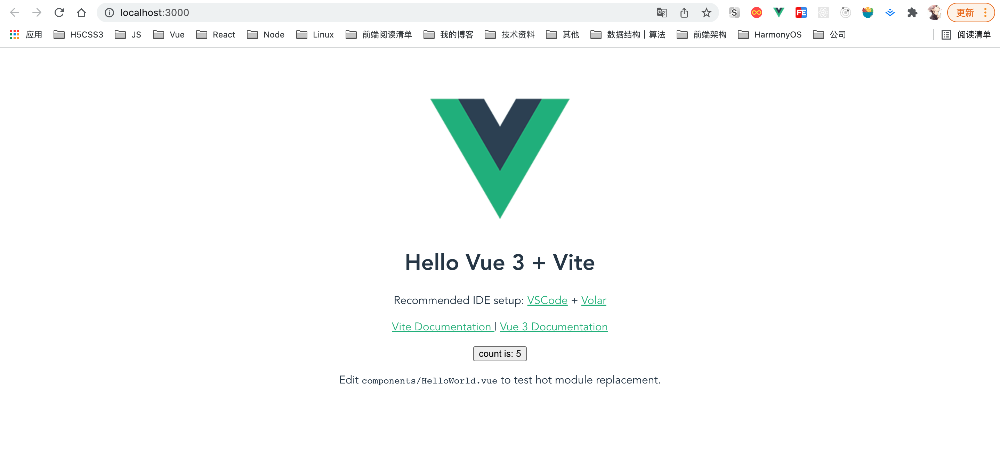
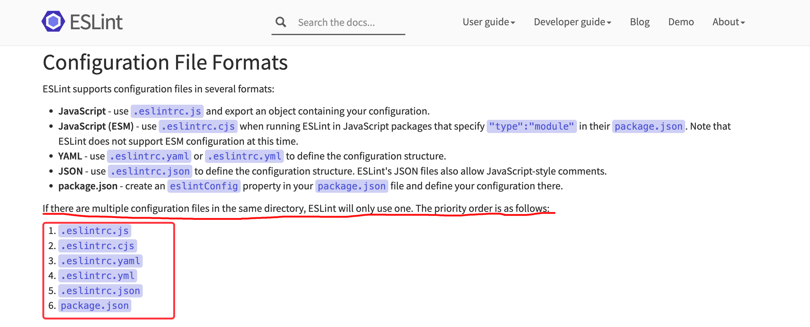
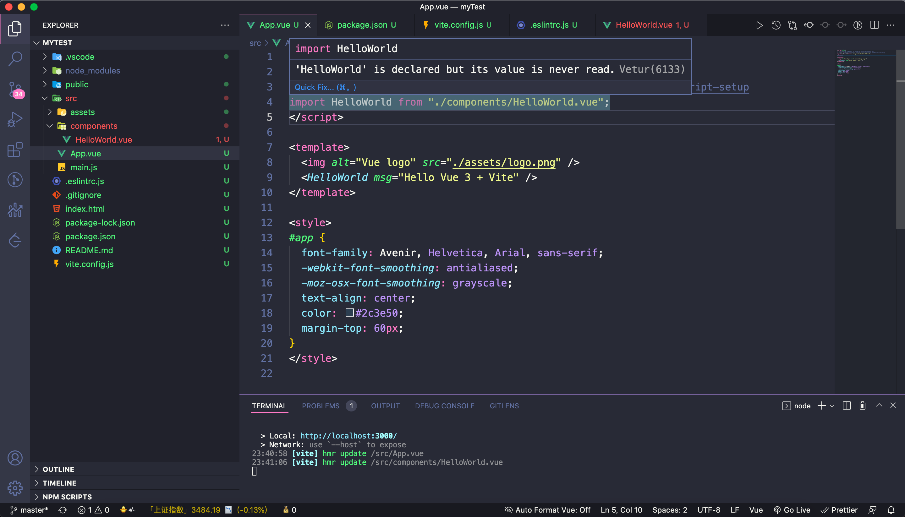

## 前言

目前主流的eslint配置方案有两种：`prettier`和`standard`，那么我们选哪种呢？哪种适合自己选哪种，这里我就选`prettier`来配置，它相比`standard`更加简洁美观，毕竟尤佬`[vue-next/.prettierrc]`用的也是它，下面就一起来看看吧，配置过程中还是有不少坑的。

## 安装

### 先来安装一个vue3项目

```shell
## 安装项目 这里选了vite工具来构建
npm init vite@latest <project-name> --template vue

## 在项目下安装依赖
npm install
## 启动项目
npm run dev
```

这时候你应该能够看到这个页面



到这里项目就算搭建好了一半，接下来我们来开始配置eslint

## 配置ESlint

### 安装依赖

```shell
npm i eslint eslint-plugin-prettier @vue/eslint-config-prettier prettier --save-dev
```

### 新建`eslintrc.js`文件

接着我们在项目根目录下新建`eslintrc.js`文件，有人可能会好奇为什么要新建这个文件，这是你配置`eslint`的入口，当然你也可以不建这个文件，直接在根目录下的`package.json`新增一个`eslint`配置项也是可以的，你也可以选择新建成其它文件，但一般统一成这个文件。



**需要注意的是ESlint会按上面这种优先级去查找配置项，`.eslintrc.js` 的优先级最高，所以推荐使用 `.eslintrc.js`。**

Ok，配置文件新建了，我们先把基本配置给写上

```js
module.exports = {
  root: true,
  env: {
    node: true,
  },
  extends: [
    "plugin:vue/vue3-essential",
    "prettier",
    "eslint:recommended",
    "@vue/prettier",
  ],
  plugins: ["prettier"],
};
```

本以为大功告成，没想到的是配置文件一保存，项目出现了诡异的一幕

- `defineProps`报语法错误，实际并没错误
- 模版下根节点只允许有一个，这还是vue2的规则
- setup中引入组件报组件`is declared but its value is never read`，其实组件在模版中使用了



为啥出现了这么多类似语法错误的提醒，但项目并没有任何异常，依旧能够正常跑，虽然不影响使用，配置的`eslint`也能够审查代码是否符合编码规范和统一的代码风格，审查代码是否存在语法错误，但这些红色提醒既然不是语法错误，那应该怎么修复它？

### 解决

更改`eslintrc.js`配置，支持Vue3 的规则校验

```js
// eslintrc.js
module.exports = {
  root: true,
  env: {
    node: true,
    "vue/setup-compiler-macros": true, // defineProps 属于 Vue3 的规则校验，需要在 eslint-plugin-vue官方指南中寻找对应配置
  },
  extends: [
    // https://github.com/vuejs/eslint-plugin-vue
    "plugin:vue/vue3-essential",
    "prettier",
    // https://github.com/vuejs/eslint-config-standard
    "eslint:recommended",
    "@vue/prettier",
  ],
  plugins: ["prettier"],
};

```

后面两点可以选择更换vscode插件或为项目新建配置文件来支持Vue3的新写法，这里还是推荐新建配置文件，如果更改vscode插件会导致Vue2项目会出现一些问题，总之这两种项目目前还没有通用的插件

在根目录新建配置文件`vetur.config.js`，[Vetur配置](https://vuejs.github.io/vetur/guide/setup.html#project-setup)，具体可以在Vetur官网查看详细配置

```js
// vetur.config.js
/** @type {import('vls').VeturConfig} */
module.exports = {
  // **optional** default: `{}`
  // override vscode settings
  // Notice: It only affects the settings used by Vetur.
  settings: {
    "vetur.useWorkspaceDependencies": true,
    "vetur.experimental.templateInterpolationService": true,
  },
  // **optional** default: `[{ root: './' }]`
  // support monorepos
  projects: [
    "./packages/repo2", // Shorthand for specifying only the project root location
    {
      // **required**
      // Where is your project?
      // It is relative to `vetur.config.js`.
      root: "./packages/repo1",
      // **optional** default: `'package.json'`
      // Where is `package.json` in the project?
      // We use it to determine the version of vue.
      // It is relative to root property.
      package: "./package.json",
      // **optional**
      // Where is TypeScript config file in the project?
      // It is relative to root property.
      tsconfig: "./tsconfig.json",
      // **optional** default: `'./.vscode/vetur/snippets'`
      // Where is vetur custom snippets folders?
      snippetFolder: "./.vscode/vetur/snippets",
      // **optional** default: `[]`
      // Register globally Vue component glob.
      // If you set it, you can get completion by that components.
      // It is relative to root property.
      // Notice: It won't actually do it. You need to use `require.context` or `Vue.component`
      globalComponents: ["./src/components/**/*.vue"],
    },
  ],
};
```

这样上面那些问题就全都解决了，当然你也可以使用官方的脚手架来搭建，但自己配置能够彻底了解配置项以及需要的依赖。
