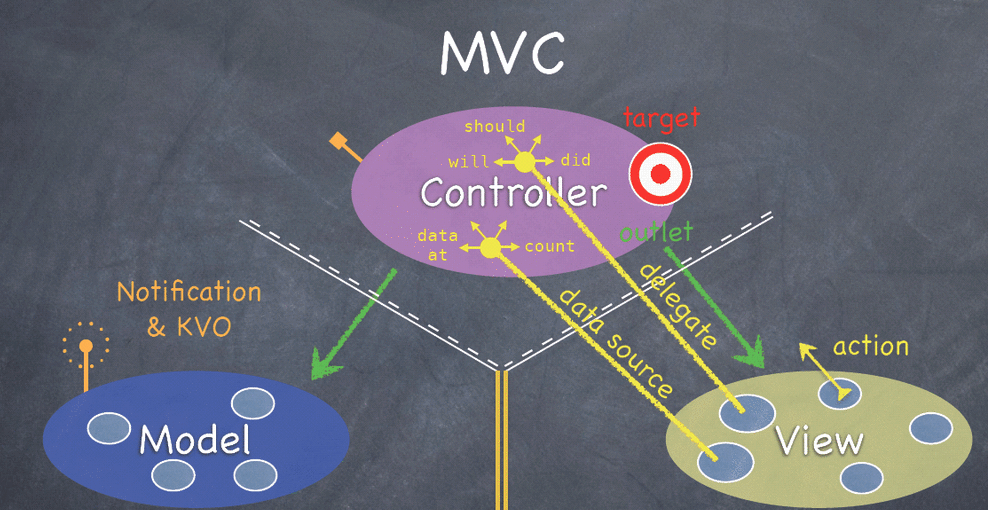

## 前言

本文会对Vue中一些常见的重要特性以及框架原理进行整理汇总，意在帮助作者以及读者自测Vue的熟练度以及方便查询与复习。金三银四的到来，想必vue会是很多面试官的重点考核内容，希望小伙伴们读完本文，能够有一定自我提升，也希望这篇文章能够为大家的面试的保驾护航～

**如果这篇文章有帮助到你，❤️关注+点赞❤️鼓励一下作者，文章公众号首发，关注 `前端南玖` 第一时间获取最新文章～**

## 1.MVC 与 MVVM的区别

### MVC

MVC 全名是 Model View Controller，是模型(model)－视图(view)－控制器(controller)的缩写，一种软件设计典范

- Model（模型）：是应用程序中用于处理应用程序数据逻辑的部分。通常模型对象负责在数据库中存取数据
- View（视图）：是应用程序中处理数据显示的部分。通常视图是依据模型数据创建的
- Controller（控制器）：是应用程序中处理用户交互的部分。通常控制器负责从视图读取数据，控制用户输入，并向模型发送数据

下面看斯坦福大学公开课上的这幅图来说明，这可以说是最经典和最规范的MVC标准

> 几乎所有的App都只干这么一件事：将数据展示给用户看，并处理用户对界面的操作。
> MVC的思想：一句话描述就是Controller负责将Model的数据用View显示出来，换句话说就是在Controller里面把Model的数据赋值给View。

### MVVM

MVVM：Model、View、ViewModel。

你会下意识地把它和MVC来对比，你会发现，MVVM多了一个ViewModel而少了Controller。

首先说一下多出来的ViewModel（VM，不是显存）。
VM的意义，和Model一样，在于数据。
Model负责对数据进行取和存，然而我们对数据的操作除了取和存以外，还有一个非常重要的操作：解析

M：对应于MVC的M

V：对应于MVC的V

VM：ViewModel，是把MVC里的controller的数据加载，加工功能分离出来

### 区别

> MVVM 与 MVC 最大的区别就是：它实现了 View 和 Model 的自动同步，也就是当 Model 的属性改变时，我们不用再自己手动操作 Dom 元素，来改变 View 的显示，而是改变属性后该属性对应 View 层显示会自动改变（对应Vue数据驱动的思想）

### Vue 并没有完全遵循 MVVM 的思想

这一点Vue官网自己也有说明

这是因为从严格意义上来讲，MVVM要求View与Model是不能直接通信的，而 Vue 提供了$refs 这个属性，让 Model 可以直接操作 View，违反了这一规定，所以说 Vue 没有完全遵循 MVVM。

## 2.为什么data需要是一个函数？

这个说法主要是在组件中出现，因为组件是可以复用的，js里对象是引用关系，如果组件data是一个对象，那么子组件中的data 属性值会相互污染，产生副作用。如果组件中 data 选项是一个函数，那么每个实例可以维护一份被返回对象的独立的拷贝，组件实例之间的 data 属性值不会互相影响；而 new Vue 的实例，是不会被复用的，因此不存在引用对象的问题。

## 3.v-if与v-show

### v-if与v-show的区别

**v-if** 是**真正**的条件渲染，因为它会确保在切换过程中条件块内的事件监听器和子组件适当地被销毁和重建；也是**惰性的**：如果在初始渲染时条件为假，则什么也不做——直到条件第一次变为真时，才会开始渲染条件块。

**v-show** 就简单得多——不管初始条件是什么，元素总是会被渲染，并且只是简单地基于 CSS 的 “display” 属性进行切换。

所以，v-if 适用于在运行时很少改变条件，不需要频繁切换条件的场景；v-show 则适用于需要非常频繁切换条件的场景。

### v-show指令算是重排吗？

v-show本质是通过元素css的display属性来控制是否显示，在DOM渲染时仍然会先渲染元素，然后才会进行判断是否显示（通过display属性），而对于重排的定义是渲染树中的节点信息发生了大小、边距等改变，要重新计算各节点和css具体的大小和位置。
当用display来控制元素的显示和隐藏时，会改变节点的大小和渲染树的布局，导致发生重排，因此v-show指令算是重排。

## 4.v-for

### v-if 与 v-for 为什么不建议一起使用？

首先，关于v-if和v-for的优先级，可以在源码compiler/codegen/index.js中找到genElement方法，里面的if else判断，可以清楚看到for的判断在if判断之上，由此，可证明v-for的优先级高于v-if

如果v-if和v-for同时出现，分两种情况：

- 当同时出现在同一标签内,可以通过`vue.$options.render`打印出渲染函数，可以清晰的看到会优先执行for循环，再执行if判断

- 当v-if出现在父级中，子级有v-for，此时再打印`vue.$options.render`，会发现会优先执行if判断。

若想优化，提升性能，v-if需要优先执行，可以在v-for外层加一层template搭配v-if使用。
若是v-if与v-for必须出现在同一层或v-if为v-for的子级的情况下，优化的方式可以将for循环的数组提前通过计算属性处理，尽量减少过多渲染导致的性能消耗。

### v-for中的key有什么作用？为什么在v-for中的key不推荐使用随机数或者index？

**key的作用：**可以使vue的diff操作更加准确和快速

如果不使用 key，Vue 会使用一种最大限度减少动态元素并且尽可能的尝试就地修改/复用相同类型元素的算法。key 是为 Vue 中 vnode 的唯一标记，通过这个 key，我们的 diff 操作可以更准确、更快速

**更准确**：因为带 key 就不是就地复用了，在 sameNode 函数 a.key === b.key 对比中可以避免就地复用的情况。所以会更加准确。

**更快速**：利用 key 的唯一性生成 map 对象来获取对应节点，比遍历方式更快

### v-for遍历对象时，是按什么顺序遍历的？如何保证顺序？

## 5.常见的Vue内置指令

## 6.Vue组件通信的几种方式

## 7.怎么理解Vue的单向数据流？

## 8.computed 和 watch 的区别和运用的场景？

## 9.Vue2最低兼容到IE几？

## 10.说说Vue的生命周期，一般在哪个钩子发请求？

## 11.说说Vue2的数据响应式原理

### Vue如何检测数组变化

### Vue2与Vue3的数据响应式原理有什么区别

## 12.Vue 的父组件和子组件生命周期钩子函数执行顺序？

## 13.Vue事件绑定原理

## 14.直接给一个数组项赋值，Vue 能检测到变化吗？

## 15.vue中data的属性可以和methods中的方法同名吗？为什么？

## 16.父组件可以监听到子组件的生命周期吗？

## 17.虚拟DOM

### 虚拟DOM是什么？

### 虚拟DOM的优缺点

## 18.Vue-router 的路由钩子函数是什么，以及执行顺序是怎样的？

## 19.动态路由

## 20.说说你对slot的理解

## 21.说说Vue的$nextTick的原理

## 22.Vue如何优化首页的加载速度

## 23.说说你对函数式组件的理解

## 24.写一个Vue的过滤器

## 25.用过vuex吗，说说你对vuex的理解

## 26.说出Vue中使用了哪些设计模式

## 27.常见的Vue性能优化有哪些？

## 28.Vue.set的作用及原理

## 29.Vue.mixin的使用场景及原理

## 30.Vue.extend的作用与原理

