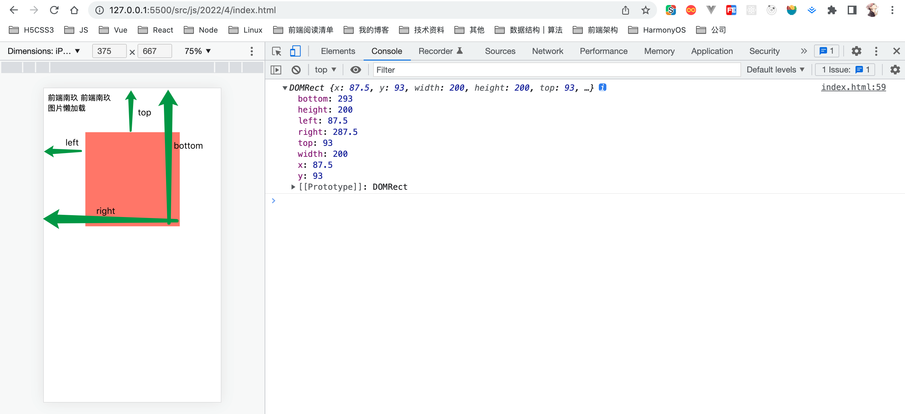
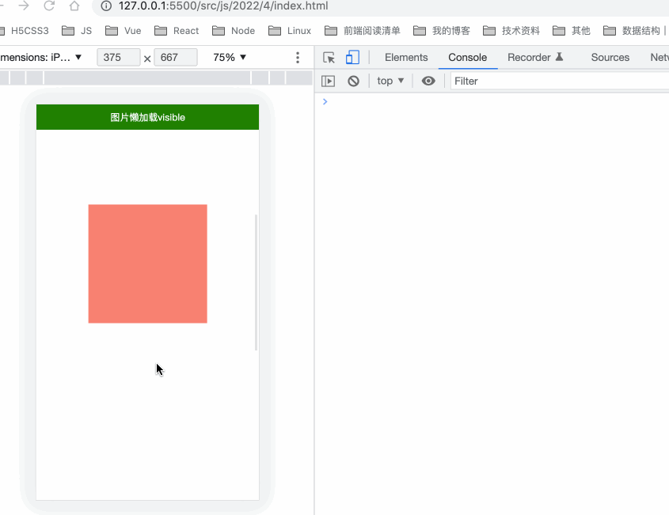
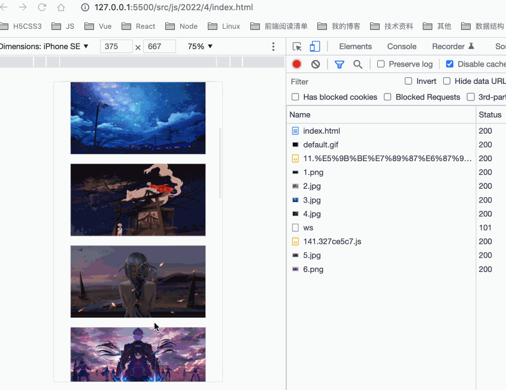
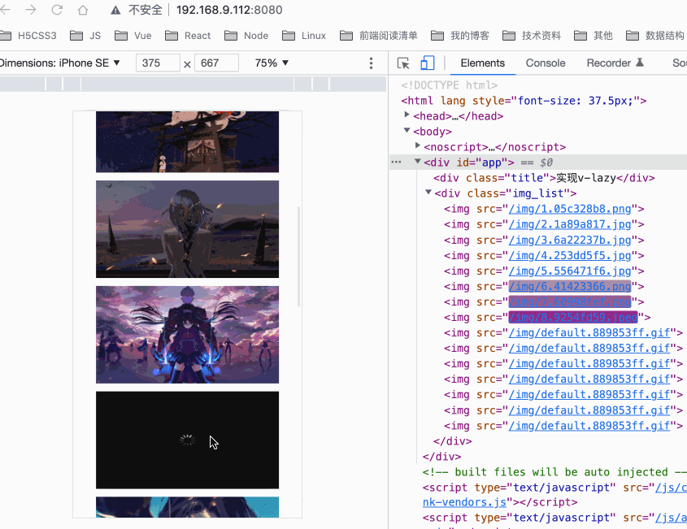

## 前言

我们在做项目性能优化的过程中往往会优先去考虑对图片的优化，尤其是一些电商类项目或者书籍类项目，往往会存在大量的图片。虽然图片比文字更能吸引用户，但是项目中图片过多或者图片过大也会影响我们页面的加载速度，从而影响用户体验，所以对图片的优化不容忽视。

**如果这篇文章有帮助到你，❤️关注+点赞❤️鼓励一下作者，文章公众号首发，关注 `前端南玖` 第一时间获取最新文章～**

## 为什么需要图片懒加载

在老版本的Chrome中，图片的加载其实是会阻塞DOM渲染的。在我们现代浏览器中，这一点基本不用担心了，也就是说现在的图片加载不会阻塞DOM渲染，但是每一个图片都会对应一个HTTP请求，而浏览器允许同时并发请求的数量是有限的，假设你的网站有大量的图片，那么加载的过程是很耗时的，尤其像那些电商类需要大量图片的网站，可想而知，网站的初始加载时间会很长，再加上网络等其它影响，用户体验会很差。为了解决这个问题，提高用户体验，所以就出现了懒加载这种方式来减轻服务器的压力，优先加载可视区域的内容，其他部分等进入了可视区域再加载，从而提高性能。

## 图片懒加载原理

原理其实非常简单，主要就是需要判断元素是否进入了可视区，进入了可视区就去请求对应的图片，否则就显示一张兜底的占位图。

### getBoundingClientRect

> 返回值是一个`DOMRect`对象，这个对象是由该元素的`getClientRects()`方法返回的一组矩形的集合，就是该元素的 CSS 边框大小。返回的结果是包含完整元素的最小矩形，并且拥有`left`, `top`, `right`, `bottom`, `x`, `y`, `width`, 和 `height`这几个以像素为单位的只读属性用于描述整个边框。除了`width` 和 `height` 以外的属性是相对于视图窗口的左上角来计算的。

这么说可能不是很清晰，看着下面这张图再来理解一下：



- top、left和css中的理解很相似，width、height是元素自身的宽高;

- right，bottom与css中的理解不一样。right是指元素右边界距窗口最左边的距离，bottom是指元素下边界距窗口最上面的距离。

理解了这个那判断元素是否在可视区就很简单了

#### 判断是否在可视区

```html
<!DOCTYPE html>
<html lang="en">
<head>
    <meta charset="UTF-8">
    <meta http-equiv="X-UA-Compatible" content="IE=edge">
    <meta name="viewport" content="width=device-width, initial-scale=1.0">
    <title>Document</title>
    <style>
        .box{
            width:200px;
            height:200px;
            background:salmon;
            margin:700px auto 1000px;
        }
        .fixed_head{
            position: fixed;
            top:0;
            left:0;
            width:100%;
            padding:10px 0;
            color:#fff;
            text-align: center;
        }
    </style>
</head>
<body>
    <div id="head" class="fixed_head">图片懒加载<span id="text"></span></div>
    <div class="box"></div>
    <script>
        
        function isVisible() {
            const boxRect = document.querySelector('.box').getBoundingClientRect()
            document.querySelector('.box').childNodes
            const viewHeight = document.documentElement.clientHeight;
            if(boxRect.top <= viewHeight && boxRect.bottom >= 0) {
               text.innerText = 'visible'
               head.style.backgroundColor = 'green'
            }else{
                text.innerText = 'Invisible'
                head.style.backgroundColor = 'red'
            }
        }
        isVisible()
        window.addEventListener('scroll', isVisible)
    </script>
</body>
</html>
```



#### 懒加载实现

OK，通过上面的演示我们清楚了判断元素是否在可视区的逻辑，那么现在实现图片懒加载就很简单了，我们只需要依据上面的判断来给出现在可视区的图片去请求正确的图片地址就好了

```html
<!DOCTYPE html>
<html lang="en">
<head>
    <meta charset="UTF-8">
    <meta http-equiv="X-UA-Compatible" content="IE=edge">
    <meta name="viewport" content="width=device-width, initial-scale=1.0">
    <title>Document</title>
    <style>
        .img_box{
            display: block;
            width: 300px;
            height: 160px;
            margin:0 auto 20px;
            border: 1px solid #ccc;
            /* object-fit: cover; */
        }
    </style>
</head>
<body>
    <div>图片懒加载</div>
    <div class="img_list">
        
        
        
        
        
        
        
        
        
        
        
        
        
        
        
    </div>
    <script>
        function lazyLoad() {
            // 第一种方法判断图片是否进入了可视区
            // 先获取当前可视区的高度
            let viewHeight = document.documentElement.clientHeight
            console.log(viewHeight)
            // 获取当前页面所有图片
            let imgs = document.querySelectorAll('.img_box')

            imgs.forEach(item => {
                if(!item.getAttribute('src')) return
                let rect = item.getBoundingClientRect()
                console.log(rect)
                //判断元素是否在可视区
                if(rect.bottom >= 0 && rect.top < viewHeight && item.dataset.src) {
                    // 当前元素距离底部距离大于等于0并且距离顶部距离小于当前可视区高度，则说明元素在可视区
                    item.src = item.dataset.src
                }
            })
        }
        lazyLoad()
        window.addEventListener('scroll',lazyLoad)
    </script>
</body>
</html>
```



### IntersectionObserver

上面那种方法虽然能够实现图片懒加载，但需要自己手动去计算，并且会引起回流与重绘，性能相对来说较差，还不了解回流与重绘的同学可以看我上一篇文章[介绍回流与重绘（Reflow & Repaint），以及如何进行优化?](https://juejin.cn/post/7064077572132323365)

现在就来介绍一种基于`IntersectionObserver`实现懒加载的方案

> **`IntersectionObserver()`**构造器创建并返回一个IntersectionObserver对象。 如果指定`rootMargin`则会检查其是否符合语法规定，检查阈值以确保全部在0.0到1.0之间，并且阈值列表会按升序排列。如果阈值列表为空，则默认为一个[0.0]的数组。

`IntersectionObserver` 是一个新的 API，可以自动"观察"元素是否可见，Chrome 51+ 已经支持。由于可见（visible）的本质是，目标元素与视口产生一个交叉区，所以这个 API 叫做"交叉观察器"。

#### 简单介绍一下语法

```js
let observer = new IntersectionObserver(callback[, options])
```

**参数**

- `callback`：当元素可见比例超过指定阈值，会调用这个回调函数，该函数接受两个参数
  - `entries`：一个IntersectionObserverEntry对象的数组，每个被触发的阈值，都或多或少与指定阈值有偏差。
  - `observer`：被调用的IntersectionObserver实例
- `options`(可选)一个可以用来配置observer实例的对象。如果`options`未指定，observer实例默认使用文档视口作为root，并且没有margin，阈值为0%（意味着即使一像素的改变都会触发回调函数）
  - root：监听元素的祖先元素，其边界盒将被视作视口。目标在根的可见区域的的任何不可见部分都会被视为不可见。
  - rootMargin：一个在计算交叉值时添加至根的边界盒中的一组偏移量，类型为字符串(string) ，可以有效的缩小或扩大根的判定范围从而满足计算需要。
  - threshold：规定了一个监听目标与边界盒交叉区域的比例值，可以是一个具体的数值或是一组0.0到1.0之间的数组。若指定值为0.0，则意味着监听元素即使与根有1像素交叉，此元素也会被视为可见. 若指定值为1.0，则意味着整个元素都在可见范围内时才算可见。

**返回值**

一个可以使用规定阈值监听目标元素可见部分与`root`交叉状况的新的`IntersectionObserver` 实例。调用自身的`observe()`方法开始使用规定的阈值监听指定目标。

**方法**

- observe：向IntersectionObserver对象监听的目标集合添加一个元素。一个监听者有一组阈值和一个根， 但是可以监视多个目标元素，以查看这些目标元素可见区域的变化。
- unobserve：命令`IntersectionObserver`停止对一个元素的观察。

#### 懒加载实现

OK，了解完IntersectionObserver的语法，我们就可以来实现一下基于IntersectionObserver的图片懒加载，实现起来更加简单。

```js
function lazyLoadWithObserver() {
    // 推荐使用IntersectionObserver
    let observer = new IntersectionObserver((entries, observe) => {
        entries.forEach(item => {
            // 获取当前正在观察的元素
            let target = item.target
            if(item.isIntersecting && target.dataset.src) {
                    target.src = target.dataset.src
                    // 删除data-src属性
                    target.removeAttribute('data-src')
                    // 取消观察
                    observe.unobserve(item.target)
                
            }
        })
    })

    let imgs = document.querySelectorAll('.img_box')

    imgs.forEach(item => {
      // 遍历观察元素
        observer.observe(item)
    })
}

lazyLoadWithObserver()
```


### img标签的loading属性

我们前面两种都是基于JavaScript来实现的，下面介绍的这种可以直接基于img标签来实现，但这种方式的兼容性比较差，所以也比较少见。这里只需要了解一下

我们只需要在图片标签上加上`loading=lazy`

```html
      
```

## 实现基于IntersectionObserver的图片懒加载指令

下面就来写一个vue的图片懒加载指令吧

```js
// v-lazy.js
export default {
   install(Vue) {
       // 默认图片
       let defaultSrc = require('../../../../src/js/2022/4/images/default.gif')
       // 懒加载
       const lazyLoad = (el, binding) => {
            el.src = defaultSrc  // 给图片添加一个默认图
            const observer = new IntersectionObserver((entries, observe) => {
                entries.forEach(item => {
                    let target = item.target
                    if(item.isIntersecting) {
                            target.src = binding.value
                            // 取消观察
                            observe.unobserve(item.target)
                        
                    }
                })
            })
            observer.observe(el)
       }

       Vue.directive('lazy', {
           inserted: lazyLoad,
           updated: lazyLoad
       })
   }
}
```

注册该指令

```js
// main.js
import Vue from 'vue'
import App from './App.vue'
import {toRem} from "./utils/toRem"
import vLazy from './utils/v-lazy'
toRem()
window.addEventListener('resize', () => {
  toRem()
})
Vue.config.productionTip = false
Vue.use(vLazy) // 注册懒加载指令

new Vue({
  render: h => h(App),
}).$mount('#app')

```

使用该指令

```vue
<template>
    <div class="img_list">
        
    </div>
</template>

<script>
export default {
    data() {
        return {
            imgList: Object.freeze([
                {id:1, img:require("../../../../src/js/2022/4/images/1.png")},
                {id:2, img:require("../../../../src/js/2022/4/images/2.jpg")},
                {id:3, img:require("../../../../src/js/2022/4/images/3.jpg")},
                {id:4, img:require("../../../../src/js/2022/4/images/4.jpg")},
                {id:5, img:require("../../../../src/js/2022/4/images/5.jpg")},
                {id:6, img:require("../../../../src/js/2022/4/images/6.png")},
                {id:7, img:require("../../../../src/js/2022/4/images/7.png")},
                {id:8, img:require("../../../../src/js/2022/4/images/8.jpeg")},
                {id:9, img:require("../../../../src/js/2022/4/images/9.png")},
                {id:10, img:require("../../../../src/js/2022/4/images/10.jpg")},
                {id:11, img:require("../../../../src/js/2022/4/images/11.jpeg")},
                {id:12, img:require("../../../../src/js/2022/4/images/12.jpg")},
                {id:13, img:require("../../../../src/js/2022/4/images/13.jpeg")},
                {id:14, img:require("../../../../src/js/2022/4/images/14.jpeg")},
                {id:15, img:require("../../../../src/js/2022/4/images/15.jpeg")},

            ])
        }
    }
}
</script>

<style lang="less">
.img_list{
    img{
        width: (300/@rem);
        height: (160/@rem);
    }
}
</style>
```




## 总结

图片懒加载的基本原理就是通过判断元素是否在可视区来加载对应的图片，第一种方案是基于getBoundingClientRect来计算实现的，这种方案性能相对较差一些，可以配合节流来使用；第二种方案是基于IntersectionObserver来实现的，该方案无需手动计算，只需要注册对应的观察器来判断，性能较好，需要考虑一下兼容性，主流浏览器都兼容；第三种方案是基于img标签的loading属性来实现的，这种方案兼容性较差。

