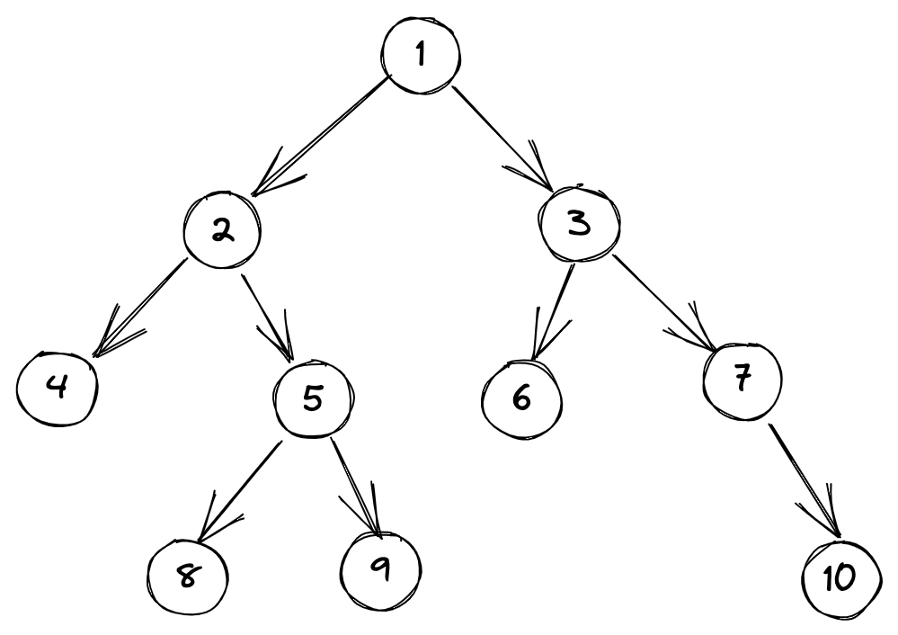
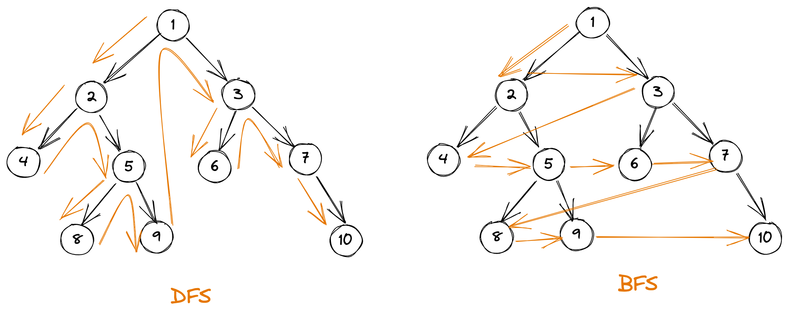
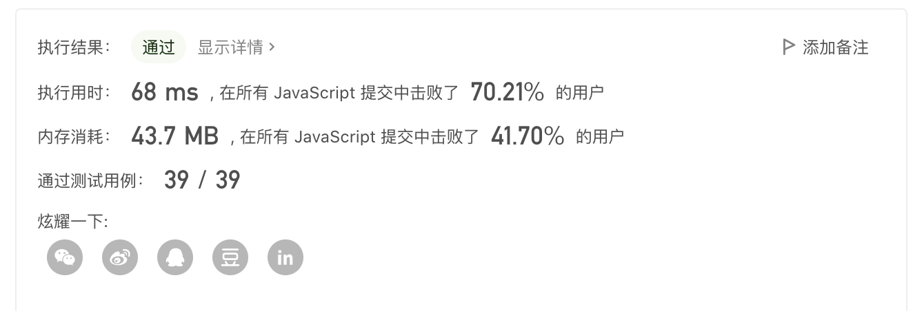
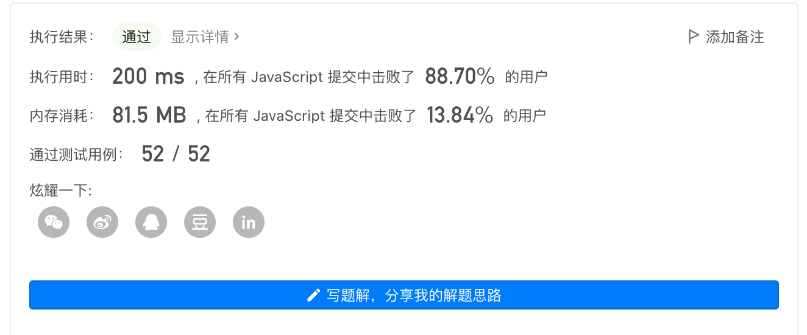
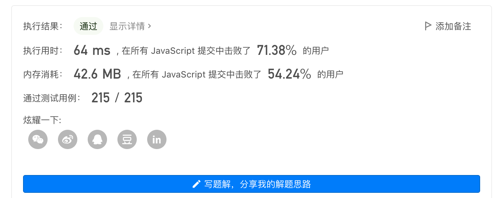
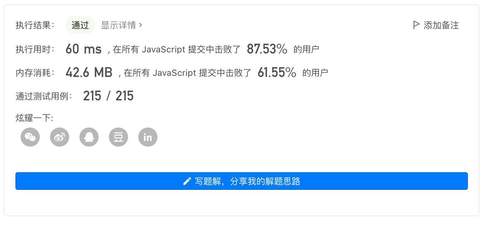
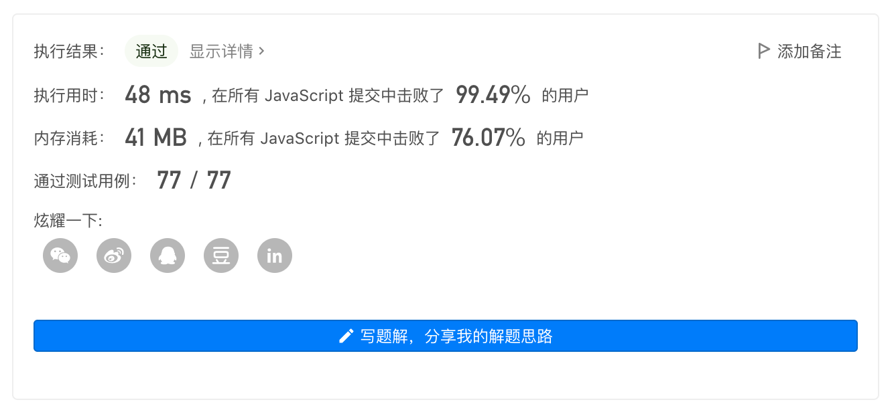
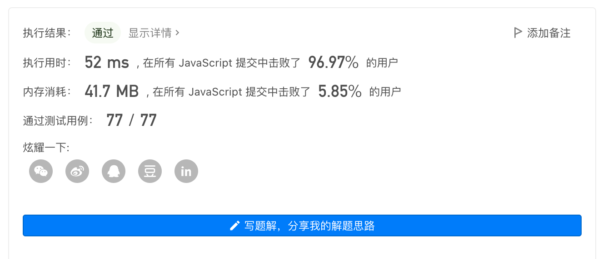

## 前言

相信大家在面试大厂的过程中都或多或少会遇到一些数据结构与算法的手写题，虽然我们平常工作中可能对这些内容运用的比较少，但我们也应该了解一些常见的数据结构与算法，学习其中的思想，这对我们的代码逻辑能力会有很大的提升。

**如果这篇文章有帮助到你，❤️关注+点赞❤️鼓励一下作者，文章公众号首发，关注 `前端南玖` 第一时间获取最新文章～**

## 树

上面两种算法一般出现在树或图的算法中，最常见的就是在树中的应用，所以我们有必要先来了解一下什么是树？

> 首先是树的定义：是一类重要的非线性数据结构，是以分支关系定义的层次结构。每个结点有零个或多个子结点；没有父结点的结点称为根结点；每一个非根结点有且只有一个父结点；除了根结点外，每个子结点可以分为多个不相交的子树

## 二叉树

二叉树就是在树的基础上加了一点限制：每个节点最多拥有两个字节点，左子树和右子树是有顺序的不能颠倒。



### 二叉树的遍历

- **先序遍历：** 先访问根节点，再访问左子节点，最后访问右子节点。所以以上二叉树的先序遍历结果是：（1，2，4，5，8，9，3，6，7，10）
- **中序遍历：** 先访问左子节点，再访问根节点，最后访问右子节点。所以以上二叉树的中序遍历结果是：（4，2，8，5，9，1，6，3，7，10）
- **后序遍历：** 先访问左子节点，再访问右子节点，最后访问根节点。所以以上二叉树的后序遍历结果是：（4，8，9，5，2，6，10，7，3，1）

## DFS、BFS

**DFS（深度优先遍历）：** 从根节点出发，然后依次向下继续搜索，直到遇到叶子🍃节点才向上回溯，**DFS通常采用的是栈的形式来处理，即后进先出。**

**BFS（广度优先遍历）：**从根节点出发，沿着树的宽度，每次都**访问同一层的节点**，若同一层都访问完，再访问下一层，若所有的节点都被访问，则算法终止，最后BFS找到的路径即为最短路径。**BFS通常采用的是队列的形式来处理，即先进先出。**

看下面这张图理解起来应该会更加清晰



**BFS 和 DFS 是很重要的算法，BFS 的重点在于队列，而 DFS 的重点在于递归；它们在搜素领域有非常大的发挥空间。BFS相对于DFS，DFS是一条路走到底，没有先后顺序，BFS按层级遍历，好记录当前遍历层级，更利于求最优路径。**

## 高频算法题

### 1.二叉树的最大深度（104.easy）

给定一个二叉树，找出其最大深度。

二叉树的深度为根节点到最远叶子节点的最长路径上的节点数。

**示例：**
给定二叉树 `[3,9,20,null,null,15,7]`

```
    3
   / \
  9  20
    /  \
   15   7
```

返回它的最大深度3。（题目来源于leetcode)

#### DFS解法

**思路：**

- 采用递归遍历左右节点
- 每次递归，深度加1

```js
/**
 * Definition for a binary tree node.
 * function TreeNode(val, left, right) {
 *     this.val = (val===undefined ? 0 : val)
 *     this.left = (left===undefined ? null : left)
 *     this.right = (right===undefined ? null : right)
 * }
 */
/**
 * @param {TreeNode} root
 * @return {number}
 */
var maxDepth = function(root) {
    if(!root){
        return 0
    }else {
        const left = maxDepth(root.left)
        const right = maxDepth(root.right)
        return Math.max(left, right) + 1
    } 
};
```


#### BFS解法

**思路：**

- 维护一个队列，先将根节点推入队列
- 开启一个while循环，然后再遍历该队列，将每一项取出来看是否存在左右子节点，有则推入队列
- 这样while这一层就只控制了二叉树的层数，而里面的for循环则控制了每一层的节点树

```js
/**
 * Definition for a binary tree node.
 * function TreeNode(val, left, right) {
 *     this.val = (val===undefined ? 0 : val)
 *     this.left = (left===undefined ? null : left)
 *     this.right = (right===undefined ? null : right)
 * }
 */
/**
 * @param {TreeNode} root
 * @return {number}
 */
var maxDepth = function(root) {
    if(!root) return 0
    let res = 0, queue = [root]
    while(queue.length) {
        const len = queue.length
        for(let i=0; i<len; i++) {
             const currentNode = queue.shift()
             if(currentNode.left) queue.push(currentNode.left)
             if(currentNode.right) queue.push(currentNode.right)
        }
        res++
       
    }
    return res
};
```



### 2.二叉树的最小深度（111.easy）

给定一个二叉树，找出其最小深度。

最小深度是从根节点到最近叶子节点的最短路径上的节点数量。

**示例：**
给定二叉树 `[3,9,20,null,null,15,7]`

```
    3
   / \
  9  20
    /  \
   15   7
```

返回它的最小深度2。（题目来源于leetcode)

#### DFS解法

**思路：**

- 深度优先遍历，每次递归深度加1，找出最小值

```js
/**
 * Definition for a binary tree node.
 * function TreeNode(val, left, right) {
 *     this.val = (val===undefined ? 0 : val)
 *     this.left = (left===undefined ? null : left)
 *     this.right = (right===undefined ? null : right)
 * }
 */
/**
 * @param {TreeNode} root
 * @return {number}
 */
var minDepth = function(root) {
    if(!root) return 0 // 根节点为空就是0
    if(root.left === null && root.right === null) return 1 //无左右子节点就是1
    let res = Number.MAX_SAFE_INTEGER;
    // 递归左右节点
    if(root.left) {
        res = Math.min(res, minDepth(root.left))
    }
    if(root.right) {
        res = Math.min(res, minDepth(root.right))
    }
    return res + 1

};
```



#### BFS解法

**思路：**

- 广度优先遍历
- 找到第一个没有左右子节点的层级就是最小深度

```js
/**
 * Definition for a binary tree node.
 * function TreeNode(val, left, right) {
 *     this.val = (val===undefined ? 0 : val)
 *     this.left = (left===undefined ? null : left)
 *     this.right = (right===undefined ? null : right)
 * }
 */
/**
 * @param {TreeNode} root
 * @return {number}
 */
var minDepth = function(root) {
    if(!root) return 0
    let queue = [root], res = 1

    while(queue.length) {
        let len = queue.length//
        for(let i=0; i<len; i++) {
            let current = queue.shift()
            if(!current.left && !current.right) {
                return res
            }
            if(current.left) {
                queue.push(current.left)
            }
            if(current.right) {
                queue.push(current.right)
            }
        }
        res++
    }

};
```


### 3.二叉树的右视图（199.middle)

给定一个二叉树的 **根节点** `root`，想象自己站在它的右侧，按照从顶部到底部的顺序，返回从右侧所能看到的节点值。（题目来源于leetcode)

**示例：**


```
输入: [1,2,3,null,5,null,4]
输出: [1,3,4]
```

#### DFS解法

**思路：**

- 递归遍历二叉树
- 由于是右视图，所以优先遍历根节点再遍历右子节点最后遍历左子节点
- 记录一个层级，当层级与返回值res的length相等，则说明它是当前层级最右边的节点，所以将它push进res

```js
/**
 * Definition for a binary tree node.
 * function TreeNode(val, left, right) {
 *     this.val = (val===undefined ? 0 : val)
 *     this.left = (left===undefined ? null : left)
 *     this.right = (right===undefined ? null : right)
 * }
 */
/**
 * @param {TreeNode} root
 * @return {number[]}
 */
var rightSideView = function(root) {
    if(!root) return []
    let res = []
    dfs(root, 0)
    function dfs(node, depth) {
        if(res.length === depth) res.push(node.val)
        if(node.right) dfs(node.right, depth+1)
        if(node.left) dfs(node.left, depth+1)

    }
    return res
};
```



#### BFS解法

**思路：**

- 采用BFS的关键是push每一层的第一个
- 而保证是右视图的关键是每次先将右子节点push进去（队列先进先出）

```js
/**
 * Definition for a binary tree node.
 * function TreeNode(val, left, right) {
 *     this.val = (val===undefined ? 0 : val)
 *     this.left = (left===undefined ? null : left)
 *     this.right = (right===undefined ? null : right)
 * }
 */
/**
 * @param {TreeNode} root
 * @return {number[]}
 */
var rightSideView = function(root) {
    if(!root) return []
    let queue = [root], res = []
    while(queue.length) {
        let len = queue.length        
        for(let i=0; i<len; i++) {
            let current = queue.shift()
            if(i === 0) res.push(current.val) // i为0说明是该层的第一个
            if(current.right) queue.push(current.right) // 队列先进先出，先将右子节点push进去
            if(current.left) queue.push(current.left)
        }
    } 
    return res
};
```



### 4.翻转二叉树（226.easy）

给你一棵二叉树的根节点 `root` ，翻转这棵二叉树，并返回其根节点。（题目来源于leetcode)

**示例 ：**


```
输入：root = [4,2,7,1,3,6,9]
输出：[4,7,2,9,6,3,1]
```

#### DFS解法

**思路：**

- DFS递归二叉树
- 左右交换位置

```js
/**
 * Definition for a binary tree node.
 * function TreeNode(val, left, right) {
 *     this.val = (val===undefined ? 0 : val)
 *     this.left = (left===undefined ? null : left)
 *     this.right = (right===undefined ? null : right)
 * }
 */
/**
 * @param {TreeNode} root
 * @return {TreeNode}
 */
var invertTree = function(root) {
    if(!root) return root

    dfs(root)
    function dfs(node) {
        if(node.left===null && node.right===null) return // 递归出口，叶子节点
        [node.left, node.right] = [node.right, node.left] //交换位置
        if(node.left) dfs(node.left)
        if(node.right) dfs(node.right)
    }
    return root
};
```



#### BFS解法

**思路：**

- BFS按层级左右交换位置

```js
/**
 * Definition for a binary tree node.
 * function TreeNode(val, left, right) {
 *     this.val = (val===undefined ? 0 : val)
 *     this.left = (left===undefined ? null : left)
 *     this.right = (right===undefined ? null : right)
 * }
 */
/**
 * @param {TreeNode} root
 * @return {TreeNode}
 */
var invertTree = function(root) {
    if(!root) return root
    
    let queue = [root]

    while(queue.length) {
        const len = queue.length
        
        for(let i=0; i<len; i++) {
            let current = queue.shift()
            if(!current) return current
             // 翻转左右子节点
            let temp = current.left;
            current.left = current.right;
            current.right = temp;
            if(current.left) queue.push(current.left)
            if(current.right) queue.push(current.right)
        }
    }
    return root
};
```



### 5.二叉树的层序遍历（102.middle）

给你二叉树的根节点 `root` ，返回其节点值的 **层序遍历** 。 （即逐层地，从左到右访问所有节点）。（题目来源于leetcode)

**示例 ：**


```
输入：root = [3,9,20,null,null,15,7]
输出：[[3],[9,20],[15,7]]
```

#### DFS解法

**思路：**

