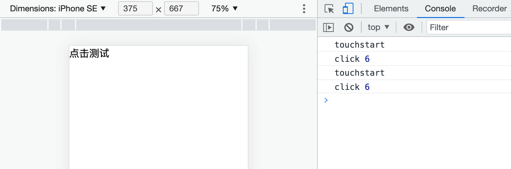

相信大家都遇到过移动端点击延迟这个问题吧，研究表明，当延迟超过100ms，用户就能感受到界面的卡顿。那么为什么移动端的点击会有这个大约300ms的延迟呢？

## 追溯移动端点击300毫秒延迟历史

这还得从乔布斯时代说起，当时苹果在发布第一款iPhone不久前，它们发现当时的网站页面大都是为PC端这种大屏设备设计的。为了解决这个问题，于是苹果的工程师做了一些约定以应对iPhone等这种移动端小屏设备，其中最出名的就是**双击缩放**这个功能，这就是现在我们遇到的300毫秒延迟的主要原因。

### ‘罪魁祸首’

> 用户在屏幕上用手指快速点击两次，iOS自带的Safari浏览器会将网页缩放至原始比例。

假如用户在 iOS Safari 里边点击了一个链接。由于用户可以进行双击缩放或者双击滚动的操作，当用户一次点击屏幕之后，浏览器并不能立刻判断用户是确实要打开这个链接，还是想要进行双击操作。因此，iOS Safari 就等待 300 毫秒，以判断用户是否再次点击了屏幕。

这就是300毫秒延迟的由来

### 后浪跟随

鉴于 iPhone 的成功，其他移动浏览器都复制了 iPhone Safari 浏览器的多数约定，包括双击缩放。几乎现在所有的移动端浏览器都有这个功能。 

这也就导致了所有的移动端点击都有了300毫秒的延迟。在当时这种移动互联网还不是这么发达的时代，这300毫秒的延迟是可以接受的，但随着移动互联网的快速发展，人们越来越追求移动端的极致用户体验，这300毫秒也就越来越不能够让人接受。

## 点击延迟原因

主要是因为移动端事件 `touchstart –> touchmove –> touchend or touchcancel –> click`，在 touch 事件触发之后，浏览器需要判断用户是否会做出双击屏幕的操作，所以会等待 300ms 来判断，再做出是否触发 click 事件的处理，所以就会有 300ms 的延迟。

```html
<!DOCTYPE html>
<html lang="en">
<head>
    <meta charset="UTF-8">
    <meta http-equiv="X-UA-Compatible" content="IE=edge">
    <title>Document</title>
</head>
<body>
    <div id="title">测试点击</div>
    <script>
        let t1, t2
        title.ontouchstart = function(e) {
            t1 = +new Date()
            console.log('touchstart')
        }

        title.onclick = function(e) {
            console.log('click', +new Date() - t1)
        }

    </script>
</body>
</html>
```


## 解决方案

可喜的是，浏览器开发商已经意识到这个问题，并相继提出了一些解决方案。

### 方案一：禁用缩放

既然双击缩放仅对那些**可被缩放**的页面来说有存在意义，那对于**不可缩放**的页面，直接去掉点击延迟，何乐而不为呢？

```html
<meta name="viewport" content="user-scalable=no">
<!-- 或 -->
<meta name="viewport" content="initial-scale=1,maximum-scale=1">
```


### 方案二：修改默认视口宽度

除了双击缩放的约定外，iPhone 诞生时就有的另一个约定是，在渲染桌面端站点的时候，使用 980 像素的视口宽度，而非设备本身的宽度（这里不理解的可以看我另一篇文章：[超详细讲解H5移动端适配](https://juejin.cn/post/7085931616136069156)）

```html
<meta name="viewport" content="width=device-width">
```


### 方案三：touch-action

`touch-action`这个属性指定了相应元素上能够触发的用户代理（也就是浏览器）的默认行为。如果将该属性值设置为`touch-action: none`，那么表示在该元素上的操作不会触发用户代理的任何默认行为，就无需进行300ms的延迟判断。

```html
<!DOCTYPE html>
<html lang="en">
<head>
    <meta charset="UTF-8">
    <meta http-equiv="X-UA-Compatible" content="IE=edge">
    <!-- <meta name="viewport" content="user-scalable=no"> -->
    <!-- <meta name="viewport" content="width=device-width, initial-scale=1.0, user-scalable=no"> -->
    <title>Document</title>
    <style>
        #title {
            font-size: 20px;
            touch-action: none;
        }
    </style>
</head>
<body>
    <div id="title">点击测试</div>
    <script>
          let t1
          title.ontouchstart = function(e) {
              t1 = +new Date()
              console.log('touchstart')
          }

          title.onclick = function(e) {
              console.log('click', +new Date() - t1)
          }
    </script>
</body>
</html>
```




### 方案四：fast-click

FastClick 是 FT Labs 专门为解决移动端浏览器 300 毫秒点击延迟问题所开发的一个轻量级的库。原理就是，FastClick 在检测到 `touchend` 事件的时候，会通过 DOM 自定义事件立即触发一个模拟 `click` 事件，并把浏览器在 300 毫秒之后真正触发的 `click` 事件阻止掉。

FastClick 的使用方法非常简单，在 window load 事件之后，在 `<body>` 上调用 `FastClick.attach()` 即可。

```javascript
window.addEventListener( "load", function() {
    FastClick.attach( document.body );
}, false );
```

#### 原理实现

```js
// FastClick简单实现
let targetElement = null;
title.addEventListener('touchstart', function () {
  // 记录点击的元素
  targetElement = event.target;
});
title.addEventListener('touchend', function (event) {
  // 阻止默认事件（屏蔽之后的click事件）
  event.preventDefault();
  let touch = event.changedTouches[0];
  // 合成click事件，并添加可跟踪属性forwardedTouchEvent
  let clickEvent = document.createEvent('MouseEvents');
  clickEvent.initMouseEvent('click', true, true, window, 1, touch.screenX, touch.screenY, touch.clientX, touch.clientY, false, false, false, false, 0, null);
  clickEvent.forwardedTouchEvent = true;
  targetElement.dispatchEvent(clickEvent);
});
```

## 总结

前三种方案是浏览器开发商提出的解决方案，对于缩放被禁用的网站，Android 平台上的 Chrome 和 Firefox 浏览器会禁用双击缩放功能；如果站点内配置了内容为 `width=device-width` 的 `<meta>` 标签，Chrome 32 及以上版本的浏览器也会禁用双击缩放功能；Internet Explorer 则对元素引入了全新的 CSS 属性，`touch-action`，若将其置为 `none`，也会取消该元素上的点击延迟。

由于这些解决方案较为零碎，社区里也有一些基于 JavaScript 的解决方案，像 FastClick 之类就是专为解决这个问题而生的脚本。