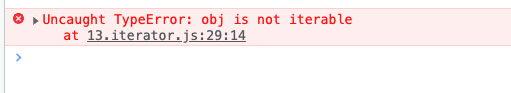
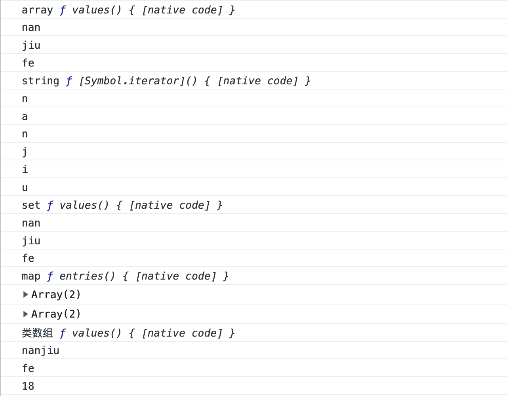

## 前言

JavaScript中表示集合的数据结构一般有Array、Object、Set、Map这四种，它们的数据结构各不相同，但都是可遍历的，为了实现一种统一的遍历机制，于是ES6中提出了遍历器（Iterator）这样一种统一的接口机制来处理这些不同的数据结构。

**如果这篇文章有帮助到你，❤️关注+点赞❤️鼓励一下作者，文章公众号首发，关注 `前端南玖` 第一时间获取最新文章～**

## Iterator

Iterator它是一种接口，为各种不同的数据结构提供统一的访问机制。任何数据结构只要部署 Iterator 接口，就可以完成遍历操作。

### Iterator的作用

- 为各种数据结构提供一种统一的接口机制便于遍历
- 使数据结构成员能够按顺序排序
- 供ES6中提出的`for...of`使用

### Iterator的遍历过程

- 遍历器对象本质上是一个指针对象
- 每调用一次指针对象的`next`方法，指针就会指向对应的值，并且会返回当前成员的信息，包含`value`和`done`的对象
- `value`属性是当前成员的值，`done`属性是一个布尔值，表示当前遍历是否结束

了解完`Iterator`的基本概念，我们可以来实现一下遍历器：

```js
function createIterator(arr) {
    let nextIndex = 0

    return {
        next: function() {
            return nextIndex < arr.length ?
            {value: arr[nextIndex++], done: false} :
            {value: undefined, done: true}
        }
    }
}
let iterator = createIterator([1, 2, 3])

console.log(iterator.next())  // {value:1, done: false}
console.log(iterator.next())  // {value:2, done: false}
console.log(iterator.next())  // {value:3, done: false}
console.log(iterator.next())  // {value: undefined, done: true}
```

ES6 规定，默认的 Iterator 接口部署在数据结构的`Symbol.iterator`属性，或者说，一个数据结构只要具有`Symbol.iterator`属性，就可以认为是“可遍历的”（iterable）。

### Iterator使用场合

从上面介绍的作用我们可以知道**Iterator是供ES6中提出的`for...of`使用的**，那么除了`for...of`，还有哪些场合也会用到`Iterator`?

- 解构赋值
- 扩展运算符
- yield
- 接收数组作为参数的场合
  - for...of
  - Array.from()
  - Set()、Map()、WeakSet()、WeakMap()
  - Promise.all()
  - Promise.race()
  - 等...

## for...of

> ES6 借鉴 C++、Java、C# 和 Python 语言，引入了for...of循环。作为遍历所有数据结构的统一的方法。

### 运行机制

当调用`for...of`的时候，JS引擎会自动调用该对象上的迭代器方法（Symbol.iterator），依次执行迭代器对象上的`next`方法，然后会将`next`返回值的`value`赋值给`for...of`内部的变量。

### 普通对象不能使用for...of遍历

知道了`for...of	`的运行机制后我们可以来试一试。

```js
const obj = {
    name: 'nanjiu',
    hobby: 'fe'
}

for(let v of obj) {
    console.log(v)
}
```

我们会发现普通对象调用`for...of`直接报错了，从报错信息来看obj不是可遍历的



我们知道`for...of`的运行机制实际上是调用的对象上的迭代器方法，我们可以再来看一下普通对象有没有迭代器方法

```js
const obj = {
    name: 'nanjiu',
    hobby: 'fe'
}
let arr = [1,2,3]
console.log(obj[Symbol.iterator]) // undefined
console.log(arr[Symbol.iterator]) // ƒ values() { [native code] }
```

从上面打印结果我们可以看出，普通对象是没有迭代器方法的，而我们的数组有迭代器方法，并且它的迭代器方法就是它的values方法。

这也就是为什么普通对象为什么不能够使用`for...of`遍历，而数组可以使用`for...of`遍历

### 默认可遍历的对象

上面我们可以发现数组是有迭代器方法的，并且它的`Symbol.iterator`就是它的`values`方法，那么除了数组还有哪些数据结构是默认可遍历的？

- 数组
- 字符串
- Set
- Map
- 类数组（arguments、nodeList）

以上这些都是默认部署了`Symbol.iterator`属性，所以它们也就默认可以使用`for...of`遍历

```js
// 数组
let arr = ['nan', 'jiu', 'fe']
console.log('array',arr[Symbol.iterator])
for(let v of arr) {
    console.log(v)
}

// 字符串
let str = 'nanjiu'
console.log('string',str[Symbol.iterator])
for(let v of str) {
    console.log(v)
}

// set
let set = new Set(arr)
console.log('set',set[Symbol.iterator])
for(let v of set) {
    console.log(v)
}

// map
let map = new Map([
    ['name', 'nanjiu'],
    ['hobby', 'fe']
])
console.log('map',map[Symbol.iterator])
for(let v of map) {
    console.log(v)
}

// 类数组
function say() {
    console.log('类数组', arguments[Symbol.iterator])
    for(let v of arguments) {
        console.log(v)
    }
}
say('nanjiu', 'fe', '18')
```



从上图可以看到不同数组结构的`Symbol.iterator`属性指向的方法也各不相同，但统一了接口机制，只要部署了`Symbol.iterator`就可以使用`for...of`来遍历

### 怎么让普通对象能够使用for...of遍历

既然我们知道了`for...of`的运行机制是调用的`Symbol.iterator`上的迭代器方法，那我们给普通对象实现一下迭代器方法，那么它不就可以使用`for...of`来遍历了吗

```js
function createIterator(arr) {
    let nextIndex = 0

    return {
        next: function() {
            return nextIndex < arr.length ?
            {value: arr[nextIndex++], done: false} :
            {value: undefined, done: true}
        }
    }
}

let person = {
    name: 'nanjiu',
    age: 18,
    hobby: 'fe'
}

person[Symbol.iterator] = function() {
    return createIterator(Object.values(person))
}

for(let v of person) {
    console.log(v)
}
/** 
	nanjiu
	18
	fe
**/
```

OK，我们通过实现普通对象的`Symbol.iterator`上的迭代器方法，能够让普通对象也能够使用`for...of`来遍历，那么为什么JS原生却不支持普通对象使用`for...of`遍历呢？

### 普通对象为什么默认不部署Symbol.iterator

前面我们说到了`Iterator`的作用其中有一点是**使数据结构成员能够按顺序排序**，但我们知道对象属性是无序的，所以对象属性的遍历先后顺序是不确定的，我们可以根据情况来手动指定。

## 遍历方法对比

### for

JavaScript 提供多种遍历语法，最早的写法就是`for`循环。

```javascript
let arr = [1, 2, 3]
for (let i = 0; i < arr.length; i++) {
  console.log(arr[i]);
}
```

虽然for循环的性能较高，但这种写法比较麻烦，所以就有了下面的forEach

### forEach

```javascript
arr.forEach(function (v) {
  console.log(v);
});
```

但是`forEach`的问题在于，无法中途跳出循环，`break`命令或`return`命令都没有。

### for...in

`for...in`循环可以遍历数组的键名。

```javascript
for (var i in arr) {
  console.log(arr[i]);
}
```

`for...in`循环有几个缺点。

- 数组的键名是数字，但是`for...in`循环是以字符串作为键名。
- `for...in`循环不仅遍历数字键名，还会遍历手动添加的其他键，甚至包括原型链上的键。
- 某些情况下，`for...in`循环会以任意顺序遍历键名。

**`for...in`循环主要是为遍历对象而设计的，不适用于遍历数组。**

### for...of

`for...of`循环相比上面几种做法，有一些显著的优点。

```javascript
for (let v of arr) {
  console.log(v);
}
```

- 语法简洁，并且没有for...in的那些缺点
- 它可以使用`break`、`continue`和`return`
- 提供了遍历所有数据结构的统一操作接口


