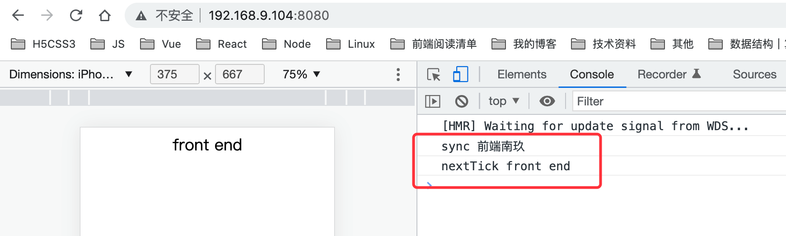
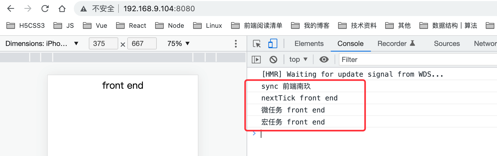
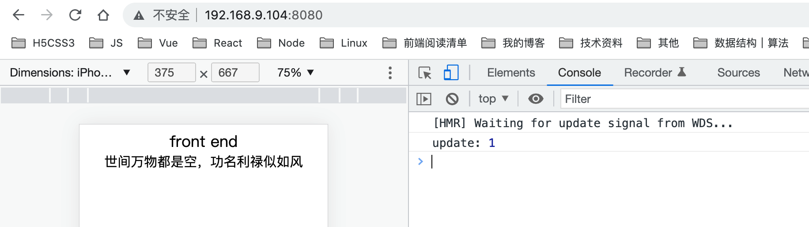
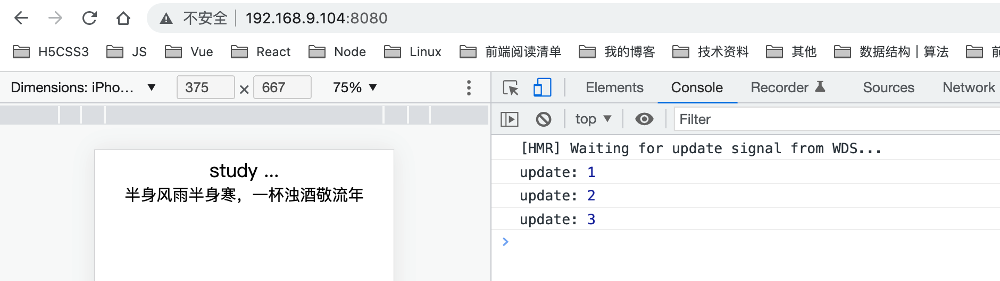
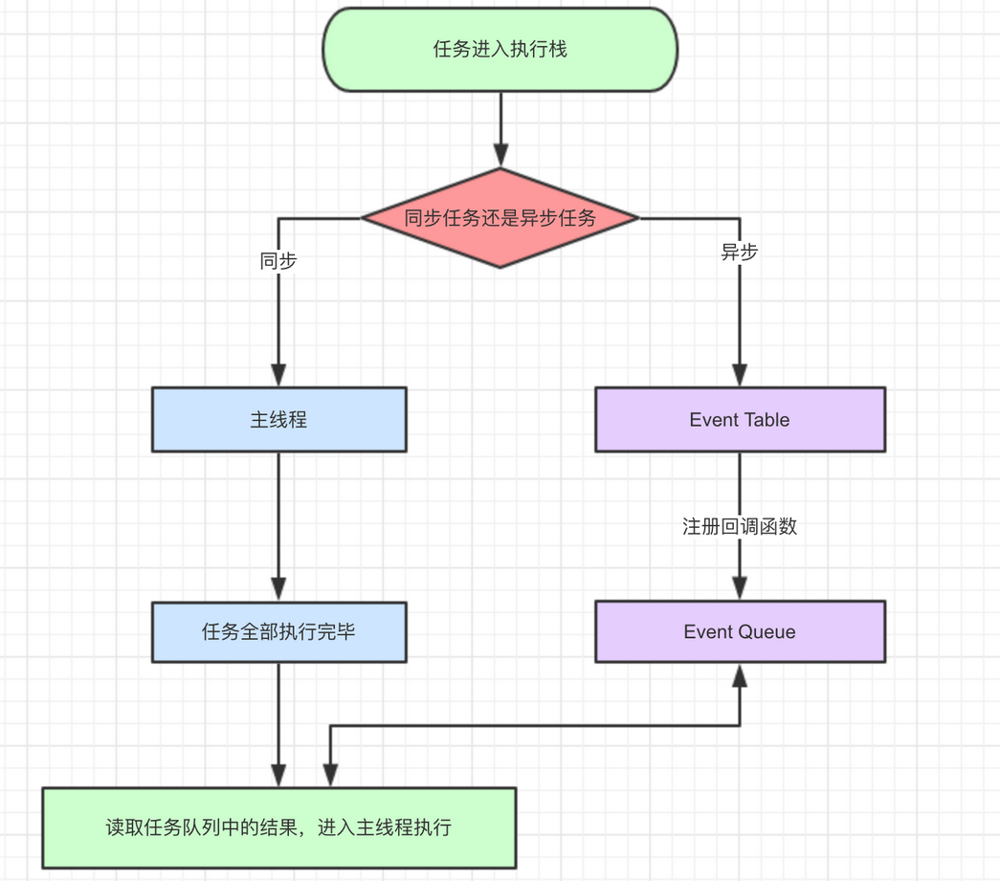
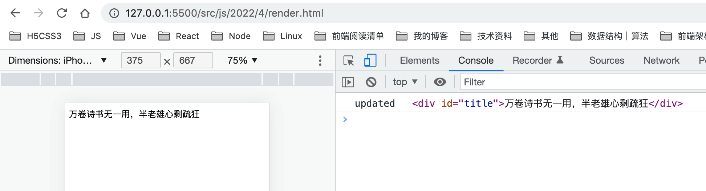
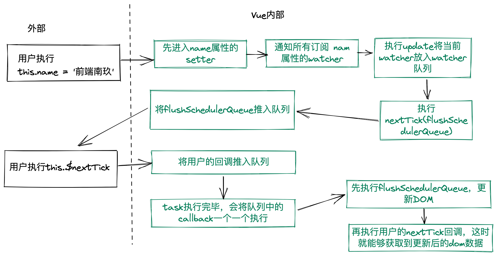

相信很多人会好奇Vue内部的更新机制，或者平时工作中遇到的一些奇怪的问题需要使用`$nextTick`来解决，今天我们就来聊一聊Vue中的异步更新机制以及`$nextTick`原理

## Vue的异步更新

> 可能你还没有注意到，Vue异步执行DOM更新。只要观察到数据变化，Vue将开启一个队列，并缓冲在同一事件循环中发生的所有数据改变。如果同一个watcher被多次触发，只会被推入到队列中一次。这种在缓冲时去除重复数据对于避免不必要的计算和DOM操作上非常重要。然后，在下一个的事件循环“tick”中，Vue刷新队列并执行实际 (已去重的) 工作。

### DOM更新是异步的

当我们在更新数据后立马去获取DOM中的内容是会发现获取的依然还是旧的内容。

```vue
<template>
  <div class="next_tick">
      <div ref="title" class="title">{{name}}</div>
  </div>
</template>
<script>
export default {
    data() {
        return {
            name: '前端南玖'
        }
    },
    mounted() {
        this.name = 'front end'
        console.log('sync',this.$refs.title.innerText)
        this.$nextTick(() => {
            console.log('nextTick',this.$refs.title.innerText)
        })
    }
}
</script>

```



从图中我们可以发现数据改变后同步获取dom元素中的内容是老的数据，而在nextTick里面获取的是更新后的数据，这是为什么呢？

其实这里你用微任务或宏任务去获取dom元素中的内容也是更新后的数据，我们可以来试试：

```js
mounted() {
  this.name = 'front end'
  console.log('sync',this.$refs.title.innerText)
  Promise.resolve().then(() => {
    console.log('微任务',this.$refs.title.innerText)
  })
  setTimeout(() => {
    console.log('宏任务',this.$refs.title.innerText)
  }, 0)
  this.$nextTick(() => {
    console.log('nextTick',this.$refs.title.innerText)
  })
}
```



是不是觉得有点不可思议，其实没什么奇怪的，在vue源码中它的实现原理就是利用的微任务与宏任务，慢慢往下看，后面会一一解释。

### DOM更新还是批量的

没错，vue中的DOM更新还是批量处理的，这样做的好处无疑就是能够最大程度的优化性能。OK这里也有看点，别着急

vue同时更新了多个数据，你觉得dom是更新多次还是更新一次？我们来试试

```vue
<template>
  <div class="next_tick">
      <div ref="title" class="title">{{name}}</div>
      <div class="verse">{{verse}}</div>
  </div>
</template>

<script>
export default {
    name: 'nextTick',
    data() {
        return {
            name: '前端南玖',
            verse: '如若东山能再起，大鹏展翅上九霄',
            count:0
        }
    },
    mounted() {
        this.name = 'front end'
        this.verse = '世间万物都是空，功名利禄似如风'
        // console.log('sync',this.$refs.title.innerText)
        // Promise.resolve().then(() => {
        //     console.log('微任务',this.$refs.title.innerText)
        // })
        // setTimeout(() => {
        //     console.log('宏任务',this.$refs.title.innerText)
        // }, 0)
        // this.$nextTick(() => {
        //     console.log('nextTick',this.$refs.title.innerText)
        // })
    },
    updated() {
        this.count++
        console.log('update:',this.count)
    }

}
</script>
<style lang="less">
.verse{
    font-size: (20/@rem);
}
</style>
```



我们可以看到updated钩子只执行了一次，说明我们**同时更新了多个数据，DOM只会更新一次**

再来看另一种情况，同步与异步混合，DOM会更新几次？

```js
mounted() {
  this.name = 'front end'
  this.verse = '世间万物都是空，功名利禄似如风'
  Promise.resolve().then(() => {
    this.name = 'study ...'
  })
  setTimeout(() => {
    this.verse = '半身风雨半身寒，一杯浊酒敬流年'
  })
  // console.log('sync',this.$refs.title.innerText)
  // Promise.resolve().then(() => {
  //     console.log('微任务',this.$refs.title.innerText)
  // })
  // setTimeout(() => {
  //     console.log('宏任务',this.$refs.title.innerText)
  // }, 0)
  // this.$nextTick(() => {
  //     console.log('nextTick',this.$refs.title.innerText)
  // })
},
  updated() {
    this.count++
    console.log('update:',this.count)
  }
```



从图中我们会发现，DOM会渲染三次，分别是同步的一次（2个同步一起更新），微任务的一次，宏任务的一次。并且在用setTimeout更新数据时会明显看见页面数据变化的过程。（这句话是重点，记好小本本）这也就是为什么nextTick源码中setTimeout做最后兜底用的，优先使用微任务。

## 事件循环

没错，这里跟事件循环还有很大的关系，这里稍微提一下，更详细可以看[探索JavaScript执行机制](https://mp.weixin.qq.com/s/ilqWYlKOfcm_KeHfURdiQA)

由于JavaScript是单线程的，这就决定了它的任务不可能只有同步任务，那些耗时很长的任务如果也按同步任务执行的话将会导致页面阻塞，所以JavaScript任务一般分为两类：同步任务与异步任务，而异步任务又分为宏任务与微任务。

**宏任务：** script（整体代码）、setTimeout、setInterval、setImmediate、I/O、UI rendering

**微任务：** promise.then、MutationObserver

### 执行过程

1. 同步任务直接放入到主线程执行，异步任务（点击事件，定时器，ajax等）挂在后台执行，等待I/O事件完成或行为事件被触发。
2. 系统后台执行异步任务，如果某个异步任务事件（或者行为事件被触发），则将该任务添加到任务队列，并且每个任务会对应一个回调函数进行处理。
3. 这里异步任务分为宏任务与微任务，宏任务进入到宏任务队列，微任务进入到微任务队列。
4. 执行任务队列中的任务具体是在执行栈中完成的，当主线程中的任务全部执行完毕后，去读取微任务队列，如果有微任务就会全部执行，然后再去读取宏任务队列
5. 上述过程会不断的重复进行，也就是我们常说的**「事件循环（Event-Loop）」**。

**总的来说，在事件循环中，微任务会先于宏任务执行。而在微任务执行完后会进入浏览器更新渲染阶段，所以在更新渲染前使用微任务会比宏任务快一些，一次循环就是一次tick 。**



在一次event loop中，microtask在这一次循环中是一直取一直取，直到清空microtask队列，而macrotask则是一次循环取一次。

如果执行事件循环的过程中又加入了异步任务，如果是macrotask，则放到macrotask末尾，等待下一轮循环再执行。如果是microtask，则放到本次event loop中的microtask任务末尾继续执行。直到microtask队列清空。

## 源码深入

### 异步更新队列

在Vue中DOM更新一定是由于数据变化引起的，所以我们可以快速找到更新DOM的入口，也就是set时通过`dep.notify`通知watcher更新的时候

```js
// watcher.js
// 当依赖发生变化时，触发更新
update() {
  if(this.lazy) {
    // 懒执行会走这里, 比如computed
    this.dirty = true
  }else if(this.sync) {
    // 同步执行会走这里，比如this.$watch() 或watch选项，传递一个sync配置{sync: true}
    this.run()
  }else {
    // 将当前watcher放入watcher队列， 一般都是走这里
    queueWatcher(this)
  }

}
```

从这里我们可以发现vue默认就是走的异步更新机制，它会实现一个队列进行缓存当前需要更新的watcher

```js
// scheduler.js
/*将一个观察者对象push进观察者队列，在队列中已经存在相同的id则该观察者对象将被跳过，除非它是在队列被刷新时推送*/
export function queueWatcher (watcher: Watcher) {
  /*获取watcher的id*/
  const id = watcher.id
  /*检验id是否存在，已经存在则直接跳过，不存在则标记在has中，用于下次检验*/
  if (has[id] == null) {
    has[id] = true
    // 如果flushing为false， 表示当前watcher队列没有在被刷新，则watcher直接进入队列
    if (!flushing) {
      queue.push(watcher)
    } else {
      // 如果watcher队列已经在被刷新了，这时候想要插入新的watcher就需要特殊处理
      // 保证新入队的watcher刷新仍然是有序的
      let i = queue.length - 1
      while (i >= 0 && queue[i].id > watcher.id) {
        i--
      }
      queue.splice(Math.max(i, index) + 1, 0, watcher)
    }
    // queue the flush
    if (!waiting) {
      // wating为false，表示当前浏览器的异步任务队列中没有flushSchedulerQueue函数
      waiting = true
      // 这就是我们常见的this.$nextTick
      nextTick(flushSchedulerQueue)
    }
  }
}
```

ok，从这里我们就能发现vue并不是跟随数据变化立即更新视图的，它而是维护了一个watcher队列，并且id重复的watcher只会推进队列一次，因为我们关心的只是最终的数据，而不是它更新多少次。等到下一个tick时，这些watcher才会从队列中取出，更新视图。

### nextTick

> nextTick的目的就是产生一个回调函数加入task或者microtask中，当前栈执行完以后（可能中间还有别的排在前面的函数）调用该回调函数，起到了异步触发（即下一个tick时触发）的目的。

```js
// next-tick.js
const callbacks = []
let pending = false

// 批处理
function flushCallbacks () {
  pending = false
  const copies = callbacks.slice(0)
  callbacks.length = 0
  // 依次执行nextTick的方法
  for (let i = 0; i < copies.length; i++) {
    copies[i]()
  }
}

export function nextTick (cb, ctx) {
  let _resolve
  callbacks.push(() => {
    if (cb) {
      try {
        cb.call(ctx)
      } catch (e) {
        handleError(e, ctx, 'nextTick')
      }
    } else if (_resolve) {
      _resolve(ctx)
    }
  })
  // 因为内部会调nextTick，用户也会调nextTick，但异步只需要一次
  if (!pending) {
    pending = true
    timerFunc()
  }
  // 执行完会会返回一个promise实例，这也是为什么$nextTick可以调用then方法的原因
  if (!cb && typeof Promise !== 'undefined') {
    return new Promise(resolve => {
      _resolve = resolve
    })
  }
}
```

兼容性处理，优先使用promise.then 优雅降级(兼容处理就是一个不断尝试的过程，谁可以就用谁。

Vue 在内部对异步队列尝试使用原生的 Promise.then、MutationObserver 和 setImmediate，如果执行环境不支持，则会采用 setTimeout(fn, 0) 代替。

```js
// timerFunc 
// promise.then -> MutationObserver -> setImmediate -> setTimeout
// vue3 中不再做兼容性处理，直接使用的就是promise.then 任性

if (typeof Promise !== 'undefined' && isNative(Promise)) {
  const p = Promise.resolve()
  timerFunc = () => {
    p.then(flushCallbacks)
    if (isIOS) setTimeout(noop)
  }
  isUsingMicroTask = true
} else if (!isIE && typeof MutationObserver !== 'undefined' && (
  isNative(MutationObserver) ||
  // PhantomJS and iOS 7.x
  MutationObserver.toString() === '[object MutationObserverConstructor]'
)) {
  let counter = 1
  const observer = new MutationObserver(flushCallbacks) // 可以监听DOM变化，监听完是异步更新的
  // 但这里并不是想用它做DOM监听，而是利用它是微任务这一特点
  const textNode = document.createTextNode(String(counter))
  observer.observe(textNode, {
    characterData: true
  })
  timerFunc = () => {
    counter = (counter + 1) % 2
    textNode.data = String(counter)
  }
  isUsingMicroTask = true
} else if (typeof setImmediate !== 'undefined' && isNative(setImmediate)) {
  timerFunc = () => {
    setImmediate(flushCallbacks)
  }
} else {
  // Fallback to setTimeout.
  timerFunc = () => {
    setTimeout(flushCallbacks, 0)
  }
}
```

### $nextTick

我们平常调用的`$nextTick`其实就是上面这个方法，只不过在源码中`renderMixin`中将该方法挂在了vue的原型上方便我们使用

```js
export function renderMixin (Vue) {
  // install runtime convenience helpers
  installRenderHelpers(Vue.prototype)

  Vue.prototype.$nextTick = function (fn) {
    return nextTick(fn, this)
  }
  
  Vue.prototype._render = function() {
    //...
  }
  // ...
}
```

## 总结

### 一般更新DOM是同步的

上面说了那么多，相信大家对Vue的异步更新机制以及`$nextTick`原理已经有了初步的了解。每一轮事件循环的最后会进行一次页面渲染，并且从上面我们知道渲染过程也是个宏任务，这里可能会有个误区，那就是DOM tree的修改是同步的，只有渲染过程是异步的，也就是说我们在修改完DOM后能够立即获取到更新的DOM，不信我们可以来试一下：

```html
<!DOCTYPE html>
<html lang="en">
<head>
    <meta charset="UTF-8">
    <meta http-equiv="X-UA-Compatible" content="IE=edge">
    <meta name="viewport" content="width=device-width, initial-scale=1.0">
    <title>Document</title>
</head>
<body>
    <div id="title">欲试人间烟火，怎料世道沧桑</div>
    <script>
        title.innerText = '万卷诗书无一用，半老雄心剩疏狂'
        console.log('updated',title)
    </script>
</body>
</html>
```



### 既然更新DOM是个同步的过程，那为什么Vue却需要借用$nextTick来处理呢？

答案很明显，因为Vue处于性能考虑，Vue会将用户同步修改的多次数据缓存起来，等同步代码执行完，说明这一次的数据修改就结束了，然后才会去更新对应DOM，一方面可以省去不必要的DOM操作，比如同时修改一个数据多次，只需要关心最后一次就好了，另一方面可以将DOM操作聚集，提升render性能。

看下面这个图理解起来应该更容易一点



### 为什么优先使用微任务？

这个应该不用多说吧，因为微任务一定比宏任务优先执行，如果nextTick是微任务，它会在当前同步任务执行完立即执行所有的微任务，也就是修改DOM的操作也会在当前tick内执行，等本轮tick任务全部执行完成，才是开始执行UI rendering。如果nextTick是宏任务，它会被推进宏任务队列，并且在本轮tick执行完之后的某一轮执行，注意，它并不一定是下一轮，因为你不确定宏任务队列中它之前还有所少个宏任务在等待着。所以为了能够尽快更新DOM，Vue中优先采用的是微任务，并且在Vue3中，它没有了兼容判断，直接使用的是`promise.then`微任务，不再考虑宏任务了。

