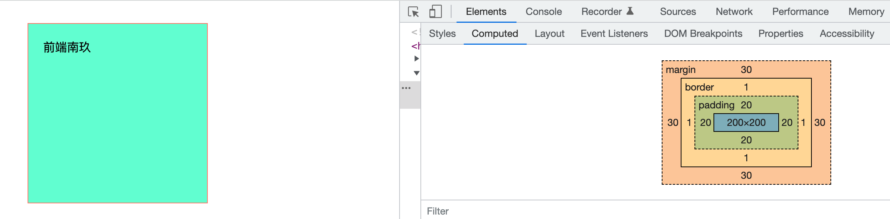
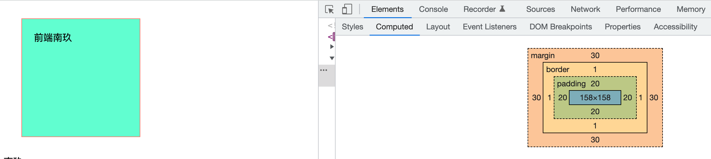

## 标签语意化

- header：定义文档的页眉（头部）；
- nav：定义导航链接的部分；
- footer：定义文档或节的页脚（底部）；
- article：定义文章内容；
- section：定义文档中的节（section、区段）；
- aside：定义其所处内容之外的内容（侧边）；

### 标签语意化优点

- 让人更容易读懂（增加代码可读性）。
- 让搜索引擎更容易读懂，有助于爬虫抓取更多的有效信息，爬虫依赖于标签来确定上下文和各个关键字的权重（SEO）。
- 在没有 CSS 样式下，页面也能呈现出很好地内容结构、代码结构。

## 页面加载过程

推荐阅读[超详细讲解页面加载过程](https://juejin.cn/post/7028385332391477255)

## script标签的async与defer属性

### `<script async>`（异步脚本）

HTML解析器在解析过程如果遇到`script async`标签，该脚本的请求下载是异步的，不会阻塞HTML的解析，但是如果脚本下载回来时，HTML还没有解析完成，这时候会暂停HTML的解析，先去执行脚本内容，执行完成后，再继续解析HTML。

当然它还有一种情况就是当异步脚本下载回来时，HTML解析已经完成了，那该脚本就对HTML没啥影响，下载完直接执行就好了。

**所以该方法的执行是不可控的，因为无法确定脚本的下载速度与脚本内容的执行速度，如果存在多个`script async`时，他们之间的执行的顺序也是不可控的，完全取决于各自的下载速度，谁先下载完成就先执行谁。**

### `<script defer>`（异步延迟脚本）

HTML解析器在解析过程如果遇到`script defer`标签，该脚本的请求下载也是异步的，不会阻塞HTML的解析，并且在脚本下载完之后如果HTML还没解析完成，该脚本也不会阻塞HTML解析，而是会等HTML解析完成之后再执行。

如果存在多个`script defer`标签时，他们之间的执行顺序会按他们在HTML文档中的顺序来进行，这样能够保证JS脚本之间的依赖关系。

### 总结

- 如果脚本是模块化的，并且脚本之间没有依赖关系，使用`async`
- 如果脚本之间有依赖关系，使用`defer`
- 如果脚本内容比较小，并且被一个异步脚本依赖，使用`默认脚本`(不放任何属性)

| 脚本类型         | 是否阻塞HTML的解析   | 脚本的执行顺序                 |
| ---------------- | -------------------- | ------------------------------ |
| `<script>`       | 是                   | 与在HTML文档中的顺序一致       |
| `<script async>` | 可能阻塞也可能不阻塞 | 与网络请求回脚本文件的顺序一致 |
| `<script defer>` | 否                   | 与在HTML文档中的顺序一致       |


推荐阅读[性能优化之html、css、js三者的加载顺序](https://juejin.cn/post/7083744760048910366)

## 行内元素与块级元素

### 常见的行内元素

span、a、img、input、textarea、select、label等

### 常见的块级元素

div、tabel、form、p、ul、h1...h6、pre、address等

### 常见的空元素

空元素，即没有内容的HTML元素。空元素是在开始标签中关闭的，也就是空元素没有闭合标签：

br、hr、img、input、link、meta等

### 两者的区别

**块级元素**

- 每个块级元素独占一行，默认垂直向下排列
- 宽高、margin、padding都是可控的，设置有效，有边距效果
- 宽度没设置时，默认为父级的100%
- 块级元素内可以包含块级元素与行内元素

**行内元素**

- 与其他行内元素共享一行
- 行内元素的宽高由内容决定
- 行内元素不能为其设置宽高以及上下的内外边距，可以设置左右的内外边距
- 行内元素的padding-top、padding-bottom从显示的效果上是增加的，但其实设置的是无效的。并不会对他周围的元素产生任何影响。
- 行内元素不能嵌套块级元素

## 盒模型

### 谈谈你对CSS盒模型的理解

所有HTML元素都可以看作是一个个方框，在CSS中谈论设计或布局时，一般会称这些方框为**盒模型**。CSS盒模型实质上是一个包围每个HTML元素的盒子。

它一般包括：

- 外边距margin：清除边框外的区域，外边距是透明的（可以为负值）
- 边框border：围绕在内边距盒内容外的边框
- 内边距padding：清除内容周围的区域，内边距是透明（不可以为负值）
- 实际内容content：盒子的内容，显示文本或图像

并且它有**标准盒模型**与**IE盒模型**两种。

### 标准盒模型与IE盒模型的区别

两者计算宽高的方式不同

- 标准盒模型盒子的宽高指的就是内容的宽高，不包括padding和border
- IE盒模型的宽高是包含内容、padding和border的

#### 标准盒模型（W3C盒模型）

```css
#title {
  width: 200px;
  height: 200px;
  border: 1px solid salmon;
  padding: 20px;
  margin: 30px;
  background: aquamarine;
}
```



我们可以看到上面这个盒子默认就是标准盒模型，所以它的content就是200*200

盒子实际的宽高为：**width【height】= 设置的content的宽【高】 + padding + border **

#### IE盒模型（怪异盒模型）

```css
#title {
  box-sizing: border-box; // IE盒模型
  width: 200px;
  height: 200px;
  border: 1px solid salmon;
  padding: 20px;
  margin: 30px;
  background: aquamarine;
}
```



我们可以看到上面这个盒子为怪异盒模型，它的content实际为158*158

而上面设置的200px实际为1+20+158+20+1，也就是content+padding+border

**盒子实际的宽高就等于width（height）**

### CSS何如设置这两种盒模型

- 标准盒模型：box-sizing:content-box
- IE盒模型：box-sizing:border-box

### JS如何设置/获取盒模型对应的宽高

```js
dom.style.width/height【只能取到内联元素】
dom.currentStyle.width/height【只有IE支持】
document.getComputedStyle(dom,null).width/height  
dom.getBoundingClientRect().width/height 
dom.offsetWidth/offsetHeight【常用】
```

## CSS选择器与优先级

| **选择器**     | **格式**      | **优先级权重** |
| -------------- | ------------- | -------------- |
| id选择器       | #id           | 100            |
| 类选择器       | #classname    | 10             |
| 属性选择器     | a[ref=“eee”]  | 10             |
| 伪类选择器     | li:last-child | 10             |
| 标签选择器     | div           | 1              |
| 伪元素选择器   | li:after      | 1              |
| 相邻兄弟选择器 | h1+p          | 0              |
| 子选择器       | ul>li         | 0              |
| 后代选择器     | li a          | 0              |
| 通配符选择器   | *             | 0              |

对于选择器的**优先级**：

- 标签选择器、伪元素选择器：1
- 类选择器、伪类选择器、属性选择器：10
- id 选择器：100
- 内联样式：1000

**注意事项：**

- !important声明的样式的优先级最高；
- 如果优先级相同，则最后出现的样式生效；
- 继承得到的样式的优先级最低；
- 通用选择器（*）、子选择器（>）和相邻同胞选择器（+）并不在这四个等级中，所以它们的权值都为 0 ；
- 样式表的来源不同时，优先级顺序为：内联样式 > 内部样式 > 外部样式 > 浏览器用户自定义样式 > 浏览器默认样式。

## BFC

推荐阅读[前端人员不要只知道KFC，你应该了解 BFC、IFC、GFC 和 FFC](https://juejin.cn/post/7072174649735381029#heading-6)

### 什么是BFC？

`BFC` 全称：`Block Formatting Context`， 名为 **块级格式化上下文**。

`W3C`官方解释为：`BFC`它决定了元素如何对其内容进行定位，以及与其它元素的关系和相互作用，当涉及到可视化布局时，`Block Formatting Context`提供了一个环境，`HTML`在这个环境中按照一定的规则进行布局。

### 如何触发BFC？

- 根元素或其它包含它的元素
- 浮动 `float: left/right/inherit`
- 绝对定位元素 `position: absolute/fixed`
- 行内块` display: inline-block`
- 表格单元格 `display: table-cell`
- 表格标题 `display: table-caption`
- 溢出元素 `overflow: hidden/scroll/auto/inherit`
- 弹性盒子 `display: flex/inline-flex`

### BFC布局规则

- 内部的Box会在垂直方向，一个接一个地放置。
- Box垂直方向的距离由margin决定。属于同一个BFC的两个相邻Box的margin会发生重叠。
- 每个元素的margin box的左边， 与包含块border box的左边相接触(对于从左往右的格式化，否则相反)。即使存在浮动也是如此。
- BFC的区域不会与float box重叠。
- BFC就是页面上的一个隔离的独立容器，容器里面的子元素不会影响到外面的元素。反之也如此。
- 计算BFC的高度时，浮动元素也参与计算

### BFC应用场景

#### 解决块级元素垂直方向margin重叠

我们来看下面这种情况：

```html
<style>
  .box{
    width:180px;
    height:180px;
    background:rosybrown;
    color:#fff;
    margin: 60px auto;
  }
</style>
<body>
    <div class="box">nanjiu</div>
    <div class="box">南玖</div>
</body>
```

按我们习惯性思维，上面这个box的`margin-bottom`是`60px`，下面这个box的`margin-top`也是`60px`，那他们垂直的间距按道理来说应该是`120px`才对。（可事实并非如此，我们可以来具体看一下）


**从图中我们可以看到，两个box的垂直间距只有60px，并不是120px!**

这种情况下的margin边距为两者的最大值，而不是两者相加，那么我们可以使用BFC来解决这种margin塌陷的问题。

```html
<style>
  .box{
    width:180px;
    height:180px;
    background:rosybrown;
    color:#fff;
    margin: 60px auto;
  }
  .outer_box{
    overflow: hidden;
  }
</style>
<body>
    <div class="outer_box">
        <div class="box">nanjiu</div>
    </div>
    <div class="box">南玖</div>
</body>
```


由上面可以看到，我们通过给第一个box外面再包裹一层容器，并触发它形成`BFC`，此时的两个box就不属于同一个`BFC`了，它们的布局互不干扰，所以这时候他们的垂直间距就是两者间距相加了。

#### 解决高度塌陷问题

我们再来看这种情况，内部box使用`float`脱离了普通文档流，导致外层容器没办法撑起高度，使得背景颜色没有显示出来。

```html
<style>
  .box{
    float:left;
    width:180px;
    height:180px;
    background:rosybrown;
    color:#fff;
    margin: 60px;
  }
  .outer_box{
    background:lightblue;
  }
</style>
<body>
    <div class="outer_box">
        <div class="box">nanjiu</div>
        <div class="box">南玖</div>
    </div>
</body>
```


从这张图，我们可以看到此时的外层容器的高度为0，导致背景颜色没有渲染出来，这种情况我们同样可以使用BFC来解决，可以直接为外层容器触发BFC，我们来看看效果：

```html
<style>
  .box{
    float:left;
    width:180px;
    height:180px;
    background:rosybrown;
    color:#fff;
    margin: 60px;
  }
.outer_box{
  display:inline-block;
  background:lightblue;
}
</style>
<body>
    <div class="outer_box">
        <div class="box">nanjiu</div>
        <div class="box">南玖</div>
    </div>
</body>
```


#### 清除浮动

在早期前端页面大多喜欢用浮动来布局，但浮动元素脱离普通文档流，会覆盖旁边内容：

```html
<style>
.aside {
  float: left;
  width:180px;
  height: 300px;
  background:lightpink;
  }
  .container{
    width:500px;
    height:400px;
    background:mediumturquoise;
  }
</style>
<body>
    <div class="outer_box">
        <div class="aside">nanjiu</div>
        <div class="container">南玖</div>
    </div>
</body>
```


我们可以通过触发后面这个元素形成BFC，从而来清楚浮动元素对其布局造成的影响

```html
<style>
.aside {
  float: left;
  width:180px;
  height: 300px;
  background:lightpink;
  }
  .container{
    width:500px;
    height:400px;
    background:mediumturquoise;
    overflow: hidden;
  }
</style>
<body>
    <div class="outer_box">
        <div class="aside">nanjiu</div>
        <div class="container">南玖</div>
    </div>
</body>
```


## 重绘与回流

推荐阅读[介绍回流与重绘（Reflow & Repaint），以及如何进行优化?](https://juejin.cn/post/7064077572132323365)

###  什么是回流（Reflow）与重绘（Repaint）？

#### 回流（Reflow）

当渲染树`render tree`中的一部分(或全部)因为元素的规模尺寸，布局，隐藏等改变而需要重新构建。这就称为**回流(reflow)**。每个页面至少需要一次回流，就是在页面第一次加载的时候，这时候是一定会发生回流的，因为要构建`render tree`。在回流的时候，浏览器会使渲染树中受到影响的部分失效，并重新构造这部分渲染树，完成回流后，浏览器会重新绘制受影响的部分到屏幕中，该过程称为**重绘**。

**简单来说，回流就是计算元素在设备内的确切位置和大小并且重新绘制**

**回流的代价要远大于重绘。并且回流必然会造成重绘，但重绘不一定会造成回流。**

#### 重绘（Repaint）

当渲染树`render tree`中的一些元素需要更新样式，但这些样式属性只是改变元素的外观，风格，而不会影响布局的，比如`background-color`。则就叫称为**重绘(repaint)**。

**简单来说，重绘就是将渲染树节点转换为屏幕上的实际像素，不涉及重新布局阶段的位置与大小计算**

### 为什么不建议频繁操作DOM？

我们都知道操作DOM其实是非常耗性能的，所以我们**不仅要避免去操作DOM，还要减少访问DOM的次数。**

因为在浏览器中，`DOM`和`JS`的实现，并不是在同一个引擎中完成的。`DOM`是属于`渲染引擎`中的东⻄，⽽`JS`⼜是`JS引擎`中的东⻄。当我们通过`JS`操作`DOM`的时候，就涉及到了两个线程之间的通信，那么势必会带来⼀些性能上的损耗。操作DOM次数⼀多，也就等同于⼀直在进⾏线程之间的通信，并且操作DOM可能还会带来重绘回流的情况，所以也就导致了性能上的问题。

> 把DOM和JavaScript各自想象成一个岛屿，它们之间用收费桥梁连接。 --《高性能JavaScript》

### 何时会发生回流（Reflow）与重绘（Repaint）？

#### 会导致回流的操作：

- 页面首次渲染（无法避免且开销最大的一次）
- 浏览器窗口大小发生改变（resize事件）
- 元素尺寸或位置发生改变（边距、宽高、边框等）
- 元素内容变化（文字数量或图片大小等等）
- 元素字体大小变化（font-size）
- 添加或者删除**可见**的`DOM`元素
- 激活`CSS`伪类（例如：`:hover`）
- 查询某些属性或调用某些方法

####一些常用且会导致回流的属性和方法：

| 引起回流属性和方法      | --                       | --                 | --         |
| ----------------------- | ------------------------ | ------------------ | ---------- |
| width                   | height                   | margin             | padding    |
| display                 | border-width             | border             | position   |
| overflow                | font-size                | vertical-align     | min-height |
| clientWidth             | clientHeight             | clientTop          | clientLeft |
| offsetWidth             | offsetHeight             | offsetTop          | offsetLeft |
| scrollWidth             | scrollHeight             | scrollTop          | scrollLeft |
| scrollIntoView()        | scrollTo()               | getComputedStyle() |            |
| getBoundingClientRect() | scrollIntoViewIfNeeded() |                    |            |

#### 为什么获取一些属性或调用方法也会导致回流？

因为以上属性和方法都需要返回最新的布局信息，因此浏览器不得不触发回流重绘来返回正确的值。

#### 会导致重绘的属性

| 属性：          | --               | --                  | --                |
| --------------- | ---------------- | ------------------- | ----------------- |
| color           | border-style     | visibility          | background        |
| text-decoration | background-image | background-position | background-repeat |
| outline-color   | outline          | outline-style       | border-radius     |
| outline-width   | box-shadow       | background-size     |                   |

具体可以在这个网站查找[CSS Triggers](https://link.juejin.cn?target=https%3A%2F%2Fcsstriggers.com%2F)

### 浏览器的优化机制

由于每次重排都会造成额外的计算消耗，因此大多数浏览器都会通过队列化修改并批量执行来优化重排过程。浏览器会将修改操作放入到队列里，直到过了一段时间或者操作达到了一个阈值，才会进行批量修改并清空队列。但是，**在获取布局信息的时候，会强制刷新队列**，比如当你访问以下属性或者使用以下方法：

- clientTop、clientLeft、clientWidth、clientHeight
- offsetTop、offsetLeft、offsetWidth、offsetHeight
- scrollTop、scrollLeft、scrollWidth、scrollHeight
- getComputedStyle()
- getBoundingClientRect
- 具体可以访问这个网站：[paulirish](https://link.juejin.cn?target=https%3A%2F%2Fgist.github.com%2Fpaulirish%2F5d52fb081b3570c81e3a)

以上属性和方法都需要返回最新的布局信息，因此浏览器不得不清空队列，触发回流重绘来返回正确的值。因此，我们在修改样式的时候，**最好避免使用上面列出的属性，他们都会刷新渲染队列。**

###如何减少回流（Reflow）与重绘（Repaint）？（优化）

#### 合并对`DOM`样式的修改，采用`css class`来修改

```js
const el = document.querySelector('.box')
el.style.margin = '5px'
el.style.borderRadius = '12px'
el.style.boxShadow = '1px 3px 4px #ccc'
复制代码
```

建议使用`css class`

```js
.update{
  margin: 5px;
  border-dadius: 12px;
  box-shadow: 1px 3px 4px #ccc
}
const el = document.querySelector('.box')
el.classList.add('update')
复制代码
```

**如果需要对DOM进行多次访问，尽量使用局部变量缓存该DOM**

**避免使用table布局，可能很⼩的⼀个⼩改动会造成整个table的重新布局**

**CSS选择符从右往左匹配查找，避免节点层级过多**

#### DOM离线处理，减少回流重绘次数

**离线的DOM不属于当前DOM树中的任何一部分，这也就意味着我们对离线DOM处理就不会引起页面的回流与重绘。**

- 使用`display: none`，上面我们说到了 (`display: none`) 将元素从渲染树中完全移除，元素既不可见，也不是布局的组成部分，之后在该DOM上的操作不会触发回流与重绘，操作完之后再将`display`属性改为显示，只会触发这一次回流与重绘。

​       提醒⏰：`visibility : hidden` 的元素只对重绘有影响，不影响重排。

- 通过 [documentFragment](https://link.juejin.cn?target=https%3A%2F%2Fdeveloper.mozilla.org%2Fzh-CN%2Fdocs%2FWeb%2FAPI%2FDocumentFragment) 创建一个 `dom` 文档片段,在它上面批量操作 `dom`，操作完成之后，再添加到文档中，这样只会触发一次重排。

```js
const el = document.querySelector('.box')
const fruits = ['front', 'nanjiu', 'study', 'code'];
const fragment = document.createDocumentFragment();
fruits.forEach(item => {
  const li = document.createElement('li');
  li.innerHTML = item;
  fragment.appendChild(li);
});
el.appendChild(fragment);
复制代码
```

- 克隆节点，修改完再替换原始节点

```js
const el = document.querySelector('.box')
const fruits = ['front', 'nanjiu', 'study', 'code'];
const cloneEl = el.cloneNode(true)
fruits.forEach(item => {
  const li = document.createElement('li');
  li.innerHTML = item;
  cloneEl.appendChild(li);
});
el.parentElement.replaceChild(cloneEl,el)
复制代码
```

#### DOM脱离普通文档流

使用`absoult`或`fixed`让元素脱离普通文档流，使用绝对定位会使的该元素单独成为渲染树中 `body` 的一个子元素，重排开销比较小，不会对其它节点造成太多影响。

#### CSS3硬件加速（GPU加速）

使用css3硬件加速，可以让`transform、opacity、filters`这些动画不会引起回流重绘 。但是对于动画的其它属性，比如`background-color`这些，还是会引起回流重绘的，不过它还是可以提升这些动画的性能。

**常见的触发硬件加速的css属性：**

- transform
- opacity
- filters
- Will-change

####将节点设置为图层

图层能够阻⽌该节点的渲染⾏为影响别的节点。⽐如对于video标签来说，浏览器会⾃动将该节点变为图层。

## 圣杯布局与双飞翼布局

圣杯布局和双飞翼布局的目的：

- 三栏布局，中间一栏最先加载和渲染。
- 两侧内容固定，中间内容随着宽度自适应。
- 一般用于 PC 网页。

圣杯布局和双飞翼布局的技术总结：

- 使用 `float` 布局。
- 两侧使用 `margin` 负值，以便和中间内容横向重叠。
- 防止中间内容被两侧覆盖，圣杯布局用 `padding` ，双飞翼布局用 `margin` 。

### 圣杯布局

> 利用浮动和负边距来实现。父级元素设置左右的 padding，三列均设置向左浮动，中间一列放在最前面，宽度设置为父级元素的宽度，因此后面两列都被挤到了下一行，通过设置 margin 负值将其移动到上一行，再利用相对定位，定位到两边。

```html
<!DOCTYPE html>
<html lang="en">
<head>
    <meta charset="UTF-8">
    <meta http-equiv="X-UA-Compatible" content="IE=edge">
    <meta name="viewport" content="width=device-width, initial-scale=1.0, user-scalable=no">
    <title>Document</title>
    <style>
        .container {
            overflow: hidden;
        }
        .center {
            float: left;
            box-sizing: border-box;
            width:100%;
            height: 500px;
            padding:0 300px;
            background: salmon;

        }
        .left{
            float: left;
            width:300px;
            height:500px;
            margin-left: -100%;
            background:lavenderblush;
        }
        .right{
            float: left;
            width:300px;
            height:500px;
            margin-left:-300px;
            background:rosybrown;
        }
    </style>
</head>
<body>
    <div class="container">
        <div class="center">中间</div>
        <div class="left">左边侧栏</div>
        <div class="right">右边侧栏</div>
    </div>
</body>
</html>
```

### 双飞翼布局

> 双飞翼布局相对于圣杯布局来说，左右位置的保留是通过中间列的 margin 值来实现的，而不是通过父元素的 padding 来实现的。本质上来说，也是通过浮动和外边距负值来实现的。

```html
<!DOCTYPE html>
<html lang="en">
<head>
    <meta charset="UTF-8">
    <meta http-equiv="X-UA-Compatible" content="IE=edge">
    <meta name="viewport" content="width=device-width, initial-scale=1.0">
    <title>Document</title>
    <style>
        html,body{
            width:100%;
        }
        .container {
            float: left;
            width:100%;
        }
        .center {
            height: 500px;
            margin:0 300px;
            background: salmon;

        }
        .left{
            float: left;
            width:300px;
            height:500px;
            margin-left: -100%;
            background:lavenderblush;
        }
        .right{
            float: left;
            width:300px;
            height:500px;
            margin-left:-300px;
            background:rosybrown;
        }
    </style>
</head>
<body>
    <div class="container">
        <div class="center"></div>
    </div>

    <div class="left">左边侧栏</div>
    <div class="right">右边侧栏</div>
</body>
</html>
```

## 水平垂直居中的多种实现方案

- 利用绝对定位，设置 `left: 50%` 和 `top: 50%` 现将子元素左上角移到父元素中心位置，然后再通过 `translate` 来调整子元素的中心点到父元素的中心。该方法可以**不定宽高**。

```css
.father {
  position: relative;
}
.son {
  position: absolute;
  left: 50%;
  top: 50%;
  transform: translate(-50%, -50%);
}
```

- 利用绝对定位，子元素所有方向都为 `0` ，将 `margin` 设置为 `auto` ，由于宽高固定，对应方向实现平分，该方法必须**盒子有宽高**。

```css
.father {
  position: relative;
}
.son {
  position: absolute;
  top: 0;
  left: 0;
  right: 0;
  bottom: 0px;
  margin: auto;
  height: 100px;
  width: 100px;
}
```

- 利用绝对定位，设置 `left: 50%` 和 `top: 50%` 现将子元素左上角移到父元素中心位置，然后再通过 `margin-left` 和 `margin-top` 以子元素自己的一半宽高进行负值赋值。该方法**必须定宽高**。

```css
.father {
  position: relative;
}
.son {
  position: absolute;
  left: 50%;
  top: 50%;
  width: 200px;
  height: 200px;
  margin-left: -100px;
  margin-top: -100px;
}
```

- 利用 `flex` ，最经典最方便的一种了，不用解释，定不定宽高无所谓的。

```css
.father {
  display: flex;
  justify-content: center;
  align-items: center;
}
```

## line-height


## flex布局

### 介绍flex布局

### 使用flex实现九宫格布局

### flex:1的含义


## grid布局


## 移动端适配


### 1px问题


### 介绍移动端适配方案及各自的优缺点


## 层叠上下文z-index

