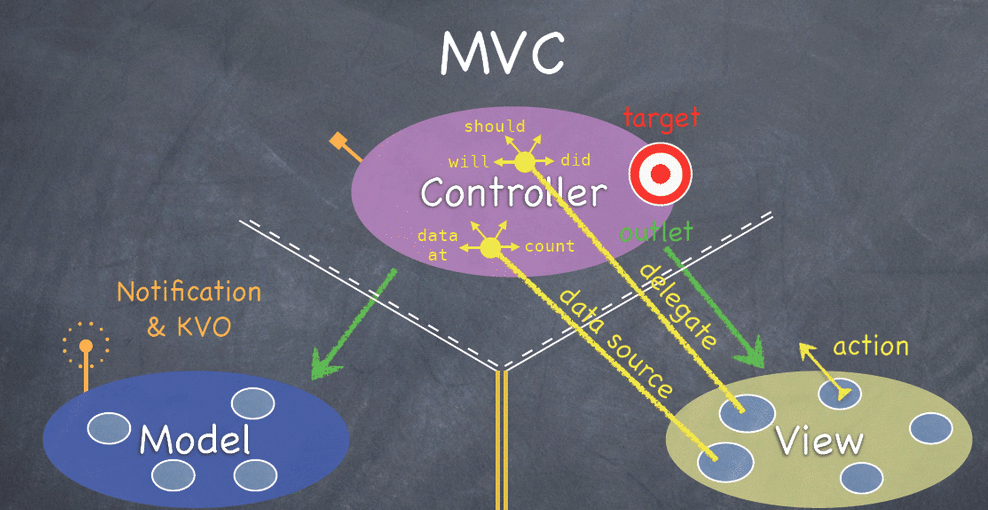
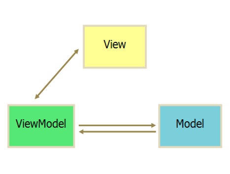
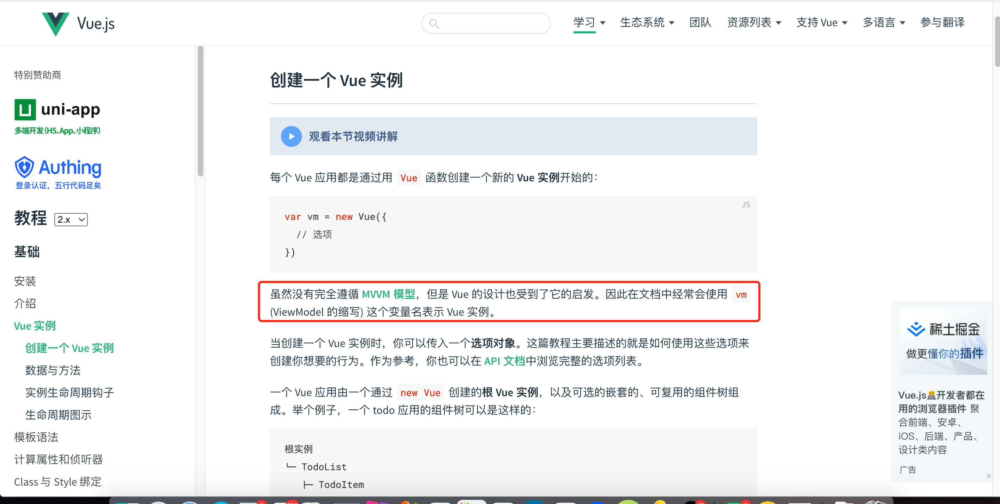

## MVVM、MVC的区别

### MVC

MVC 全名是 Model View Controller，是模型(model)－视图(view)－控制器(controller)的缩写，一种软件设计典范

- Model（模型）：是应用程序中用于处理应用程序数据逻辑的部分。通常模型对象负责在数据库中存取数据
- View（视图）：是应用程序中处理数据显示的部分。通常视图是依据模型数据创建的
- Controller（控制器）：是应用程序中处理用户交互的部分。通常控制器负责从视图读取数据，控制用户输入，并向模型发送数据

下面看斯坦福大学公开课上的这幅图来说明，这可以说是最经典和最规范的MVC标准



> 几乎所有的App都只干这么一件事：将数据展示给用户看，并处理用户对界面的操作。
> MVC的思想：一句话描述就是Controller负责将Model的数据用View显示出来，换句话说就是在Controller里面把Model的数据赋值给View。

### MVVM

MVVM：Model、View、ViewModel。

你会下意识地把它和MVC来对比，你会发现，MVVM多了一个ViewModel而少了Controller。

首先说一下多出来的ViewModel（VM，不是显存）。
VM的意义，和Model一样，在于数据。
Model负责对数据进行取和存，然而我们对数据的操作除了取和存以外，还有一个非常重要的操作：解析



M：对应于MVC的M

V：对应于MVC的V

VM：ViewModel，是把MVC里的controller的数据加载，加工功能分离出来

### 区别

> MVVM 与 MVC 最大的区别就是：它实现了 View 和 Model 的自动同步，也就是当 Model 的属性改变时，我们不用再自己手动操作 Dom 元素，来改变 View 的显示，而是改变属性后该属性对应 View 层显示会自动改变（对应Vue数据驱动的思想）

### Vue 并没有完全遵循 MVVM 的思想

这一点Vue官网自己也有说明



这是因为从严格意义上来讲，MVVM要求View与Model是不能直接通信的，而 Vue 提供了$refs 这个属性，让 Model 可以直接操作 View，违反了这一规定，所以说 Vue 没有完全遵循 MVVM。

## 响应式原理🌟🌟🌟

Vue是采用数据劫持与发布订阅的方式，通过`Object.defineProperty`来劫持各个属性的setter、getter，在数据变动时通知订阅者，触发相应的监听回调。

- 对象内部通过defineReactive方法，使用`Object.defineProperty`将属性进行劫持（只会劫持已存在的属性），数组则是通过重写数组原型上的方法来实现的
- 当页面使用对应属性时，每个属性都拥有自己的dep属性，存放它所依赖的watcher（依赖收集），当属性变化后会通知自己对应的watcher去更新（派发更新）

### 劫持对象

```js
// 把data中数据使用Object.defineProperty重新定义 es5
// Object.defineProperty 不能兼容IE8及以下，所以vue2无法兼容IE8版本
import {isObject,def} from "../util/index"
import {arrayMethods} from "./array.js"  // 数组方法
export function observe (data) {
    // console.log(data,'observe')
    let isObj = isObject(data)
    if(!isObj) return 
    return new Observer(data) // 观测数据
}

 class Observer {
     constructor(v){
        // 如果数据层次过多，需要递归去解析对象中的属性，依次增加set和get方法
        def(v,'__ob__',this)
        if(Array.isArray(v)) {
            // 如果是数组的话并不会对索引进行监测，因为会导致性能问题
            // 前端开发中很少去操作索引 push shift unshift
            v.__proto__ = arrayMethods
            // 如果数组里放的是对象，再进行监测
            this.observerArray(v)
        }else{
          //对象则调用walk进行劫持
            this.walk(v)
        }
        
     }
     observerArray(value) {
         for(let i=0; i<value.length;i++) {
             observe(value[i])
         }
     }
   /* 遍历每一个对象并且为它们绑定getter与setter。该方法只有在数据类型为对象时才能被调用  */
     walk(data) {
         let keys = Object.keys(data); //获取对象key
         keys.forEach(key => {
            defineReactive(data,key,data[key]) // 定义响应式对象
         })
     }
 }

 function  defineReactive(data,key,value){
     observe(value) // 递归实现深度监测，注意性能
     Object.defineProperty(data,key,{
         get(){
             // 依赖收集，下期探讨
             //获取值
            return value
         },
         set(newV) {
             //设置值
            if(newV === value) return
            observe(newV) //继续劫持newV,用户有可能设置的新值还是一个对象
            value = newV
           /*dep对象通知所有的观察者，下期探讨*/
      			//dep.notify()
            console.log('值变化了',value)
         }
     })
 }

```

### 数组方法重写

```js

// 重写数组的7个方法： push,pop,shift,unshift,reverse,sort,splice会导致数组本身改变

let oldArrayMethods = Array.prototype
// value.__proto__ = arrayMethods 
// arrayMethods.__proto__ = oldArrayMethods
export let arrayMethods = Object.create(oldArrayMethods)

const methods = [
    'push','pop','shift','unshift','reverse','sort','splice'
]

methods.forEach(method=>{
    arrayMethods[method] = function(...args) {
        console.log('用户调用了：'+method,args)
        const res = oldArrayMethods[method].apply(this, args) // 调用原生数组方法
        // 添加的元素可能还是一个对象

        let inserted = args //当前插入的元素
        //数组新插入的元素需要重新进行observe才能响应式
        let ob = this.__ob__
        switch (method) {
            case 'push':
            case 'unshift':
                inserted = args
                break;
            case 'splice':
                inserted = args.slice(2)
                break;
            default:
                break;
        }
        if(inserted) {
            ob.observerArray(inserted)  //将新增属性继续
        }

        console.log('数组更新了：'+ JSON.stringify(inserted))
        //通知所有注册的观察者进行响应式处理,这里下期再来探讨
        // ob.dep.notify() 
        return res
    }
})
```

推荐阅读

[【Vue源码学习】响应式原理探秘](https://juejin.cn/post/7056586928568664094)

[【Vue源码学习】依赖收集](https://juejin.cn/post/7058444984432721957)

## 生命周期

**beforeCreate** 在实例初始化之后，数据观测(data observer) 和 event/watcher 事件配置之前被调用。在当前阶段 data、methods、computed 以及 watch 上的数据和方法都不能被访问

**created** 实例已经创建完成之后被调用。在这一步，实例已完成以下的配置：数据观测(data observer)，属性和方法的运算， watch/event 事件回调。这里没有`$el`,如果非要想与 Dom 进行交互，可以通过 `vm.$nextTick` 来访问 Dom

**beforeMount** 在挂载开始之前被调用：相关的 render 函数首次被调用。

**mounted** 在挂载完成后发生，在当前阶段，真实的 Dom 挂载完毕，数据完成双向绑定，可以访问到 Dom 节点

**beforeUpdate** 数据更新时调用，发生在虚拟 DOM 重新渲染和打补丁（patch）之前。可以在这个钩子中进一步地更改状态，这不会触发附加的重渲染过程

**updated** 发生在更新完成之后，当前阶段组件 Dom 已完成更新。要注意的是避免在此期间更改数据，因为这可能会导致无限循环的更新，该钩子在服务器端渲染期间不被调用。

**beforeDestroy** 实例销毁之前调用。在这一步，实例仍然完全可用。我们可以在这时进行善后收尾工作，比如清除计时器。

**destroyed** Vue 实例销毁后调用。调用后，Vue 实例指示的所有东西都会解绑定，所有的事件监听器会被移除，所有的子实例也会被销毁。 该钩子在服务器端渲染期间不被调用。

**activated** keep-alive 专属，组件被激活时调用

**deactivated** keep-alive 专属，组件被销毁时调用

### 异步请求在哪一步发起

异步请求一般是与数据有关，所以我们需要等data创建完才可以发起异步请求，一般可以在：created、beforeMount、mounted进行异步请求。

如果异步请求不需要依赖 Dom 推荐在 created 钩子函数中调用异步请求，因为在 created 钩子函数中调用异步请求有以下优点：

- 能更快获取到服务端数据，减少页面  loading 时间；
- ssr  不支持 beforeMount 、mounted 钩子函数，所以放在 created 中有助于一致性；

### 父子组件生命周期钩子函数执行顺序🌟

- 加载渲染过程

父 beforeCreate->父 created->父 beforeMount->子 beforeCreate->子 created->子 beforeMount->子 mounted->父 mounted

- 子组件更新过程

父 beforeUpdate->子 beforeUpdate->子 updated->父 updated

- 父组件更新过程

父 beforeUpdate->父 updated

- 销毁过程

父 beforeDestroy->子 beforeDestroy->子 destroyed->父 destroyed

## computed、watch🌟🌟🌟

**区别：**

**computed：**  是计算属性，依赖其它属性值，并且 computed 的值有缓存，只有它依赖的属性值发生改变，下一次获取 computed 的值时才会重新计算 computed  的值；

- 支持缓存，只有依赖数据发生改变，才会重新进行计算
- 不支持异步，当computed内有异步操作时无效，无法监听数据的变化
- computed 属性值会默认走缓存，计算属性是基于它们的响应式依赖进行缓存的，也就是基于data中声明过或者父组件传递的props中的数据通过计算得到的值
- 如果一个属性是由其他属性计算而来的，这个属性依赖其他属性，是一个多对一或者一对一，一般用computed
- 如果computed属性属性值是函数，那么默认会走get方法；函数的返回值就是属性的属性值；在computed中的，属性都有一个get和一个set方法，当数据变化时，调用set方法。

**watch：**  更多的是「观察」的作用，类似于某些数据的监听回调 ，每当监听的数据变化时都会执行回调进行后续操作；

- 不支持缓存，数据变，直接会触发相应的操作；
- watch支持异步；
- 监听的函数接收两个参数，第一个参数是最新的值；第二个参数是输入之前的值；
- 当一个属性发生变化时，需要执行对应的操作；一对多；
- 监听数据必须是data中声明过或者父组件传递过来的props中的数据，当数据变化时，触发其他操作，

**watch和computed各自处理的数据关系场景不同:**

- watch擅长处理的场景：一个数据影响多个数据
- computed擅长处理的场景：一个数据受多个数据影响

## slot插槽🌟🌟


### slot作用

### slot原理


## directive指令

### 内置指令

### 自定义指令

#### 原理

#### 自定义指令生命周期


## v-if、v-show


## v-for


## vue组件通信方式


## vue事件绑定原理


## 虚拟DOM与diff算法

### 虚拟DOM是什么

### 为什么需要虚拟DOM？它解决了什么问题？

### 说一下Vue的diff策略

### key有什么用

### vue与react的diff算法有什么不同


## keep-alive使用场景与原理


## 全局API


### Vue.extend


### Vue.nextTick


### Vue.set


### Vue.delete


### Vue.directive


### Vue.filter


### Vue.component


### Vue.use


### Vue.mixin


### Vue.compile


### Vue.observable

