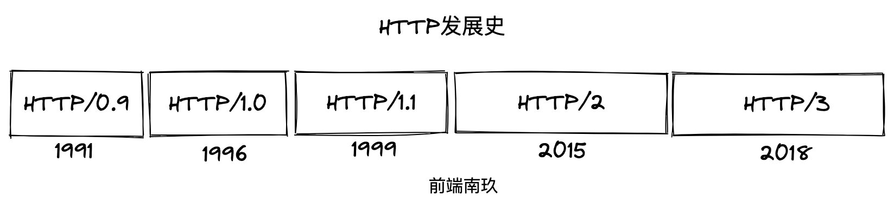
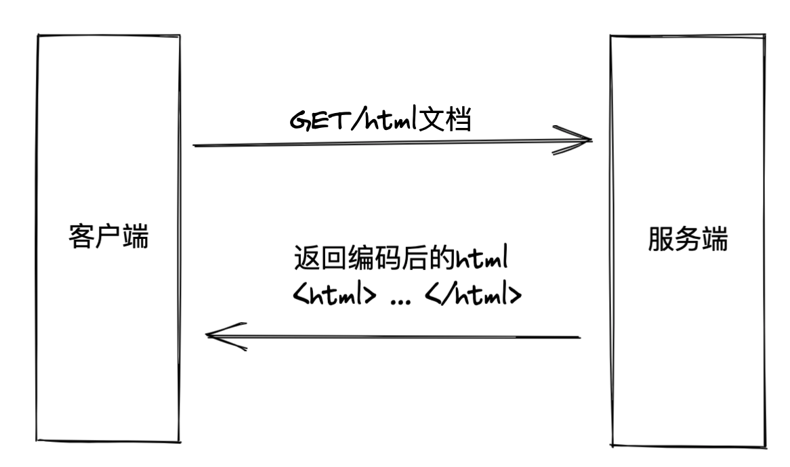
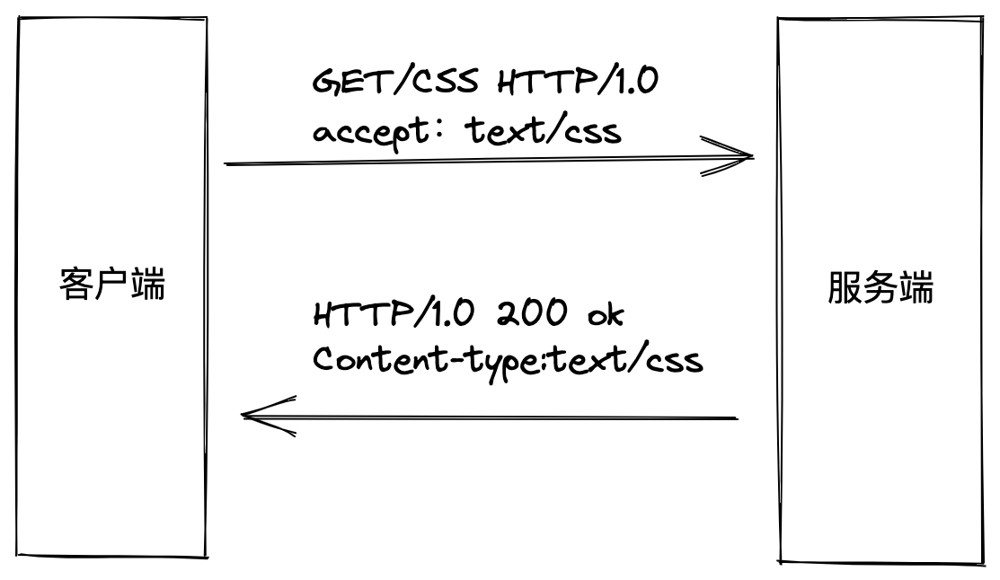
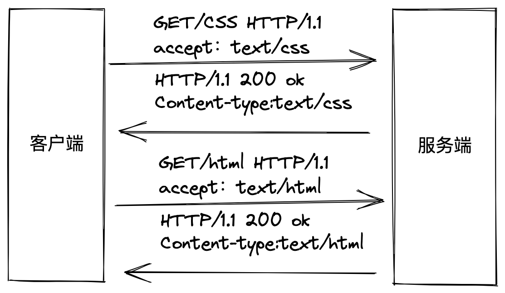
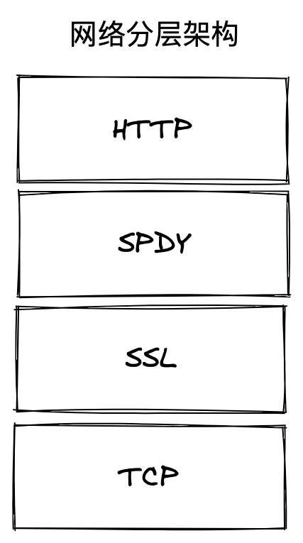
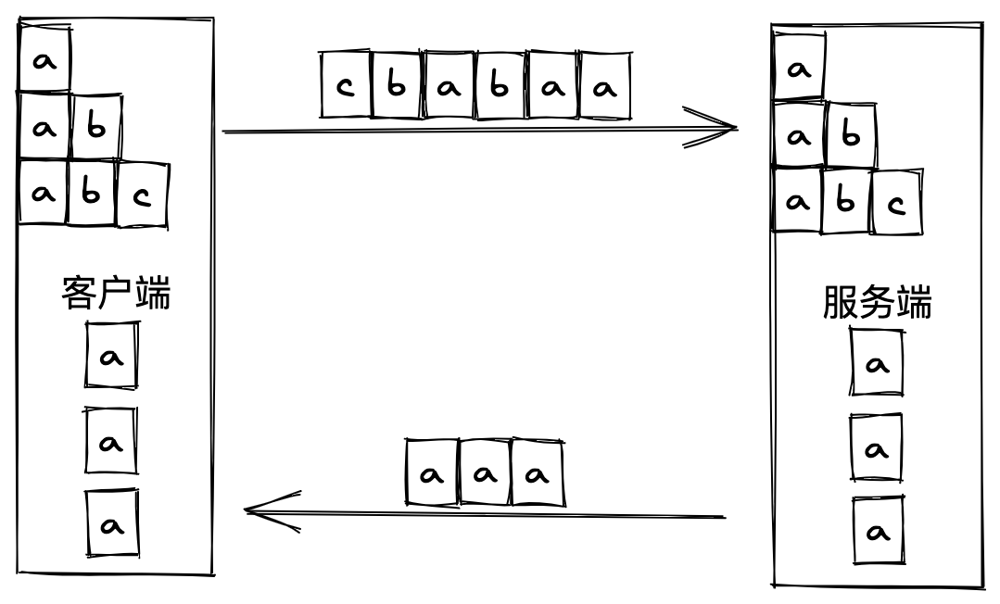

## 前言

我们知道HTTP是浏览器中最重要且使用最多的协议，它不仅是浏览器与服务端的通信语言，更是互联网的基石。随着浏览器的不断更新迭代，HTTP为了适应技术的更新也在不断进化，学习HTTP的最佳途径就是从浏览器的发展视角来了解HTTP的演进：**即将完成使命的HTTP/1、正在向我们走来的HTTP/2、未来的HTTP/3**

**如果这篇文章有帮助到你，❤️关注+点赞❤️鼓励一下作者，文章公众号首发，关注 `前端南玖` 第一时间获取最新文章～**

## HTTP发展史

**HTTP 是浏览器与服务端最主要的通信协议**

20 世纪 60 年代，美国国防部高等研究计划署（ARPA）建立了 ARPA 网，这被认为是互联网的起源。70 年代，研究人员基于对 ARPA 网的实践和思考，发明出了著名的 TCP/IP 协议。该协议具有良好的分层结构和稳定的性能，并在 80 年代中期进入了 UNIX 系统内核，促使更多的计算机接入了网络。

1989 年，蒂姆伯纳斯-李博士发表了一篇论文，提出了在互联网上构建超链接文档系统的构想。在篇文章中他确立了三项关键技术：URI、HTML、HTTP。



### HTTP/0.9

1991年HTTP（HyperText Transfer Protocol，超文本传输协议）正式诞生，万维网协会（World Wide Web Consortium，W3C）和互联网工程任务组（IETF）制定了 HTTP 0.9 标准。该协议诞生之初的作用是传输超文本内容HTML，并且只支持GET请求。

协议定义了客户端发起请求、服务端响应请求的通信模式。所以当时的请求报文只有一行：

> GET + 请求的文件路径

服务端在收到请求后会返回一个以 ASCII 字符流编码的 HTML 文档。



**请求：** GET /index.html

**响应：** `<html><body>Hello HTTP/0.9</body></html>`

**流程：**

- 客户端和服务端建立TCP连接。
- 客户端发送GET请求到服务端，请求index.html页面的数据。
- 服务端发送完响应，关闭TCP连接。

**特点：** 简单，一个请求需要一个连接。

**HTTP/0.9 虽然简单，但是它充分验证了 Web 服务的可行性**

- 首先它只有一个命令GET。
- 它没有HEADER等描述数据的信息。因为这个时候的请求非常简单，它需要达到的目的也非常简单，没有那么多数据格式。
- 服务器发送完内容之后，就关闭TCP连接。这里需要注意一点，这里的TCP连接和http请求是不一样的。http请求和TCP连接不是一个概念。一个http请求通过TCP连接发送，而一个TCP连接里面可以发送很多个http请求（HTTP/0.9不能这么做，但是HTTP/1.1可以这么做，而且在HTTP/2这方面会更大程度地优化，来提高HTTP协议传输的效率以及服务器的性能）

### HTTP/1.0

随着互联网的发展，之前的HTTP/0.9已经无法满足用户需求了，浏览器希望通过HTTP来传输脚本、样式、图片、音视频等不同类型的文件，所以在1996年HTTP进行了一次版本更新：

- 增加了HEAD、POST等新方法
- 增加了响应状态码，标记可能的错误原因
- 引入了协议版本号概念
- 引入了HTTP header的概念，让HTTP处理请求和响应更加灵活
- 传输的数据不再局限于文本



**请求：**第一行请求命令+版本信息，后面的多行为头信息

```http
GET / HTTP/1.0
User-Agent: Mozilla/5.0 (Macintosh; Intel Mac OS X 10_10_5)
Accept: */*
```

**响应：** 响应头信息 + 空行(\r\n) + 数据部分

```http
HTTP/1.0 200 OK
Content-Type: text/plain
Content-Length: 2345
Expires: Thu, 05 Dec 2020 16:00:00 GMT
Last-Modified: Wed, 5 August 2020 15:55:28 GMT
Server: Apache 0.84

<html>
   <body>Hello World</body>
</html>
```

HTTP/1.0最主要的缺点还是跟HTTP/0.9一样，每一个TCP连接只能发送一个HTTP请求，服务器发送完响应，就关闭连接。如果后面需要请求新的数据，则需要再次建立TCP连接，但是TCP建立连接的三次握手成本比较高，并且TCP连接初始的时候发送数据的速度相对较慢，有一个慢启动和拥塞避免的阶段。极端情况，如果每次请求的数据很少，但是请求很频繁，这样每次请求很少的数据都需要建立连接然后断开。

为了解决这个问题，在1.0版本使用了一个非标准的`Connection`头部字段。当客户端再请求头部信息里面带上`Connection：keep-alive`的时候，服务器在发送完响应数据之后，就不会断开TCP连接了，从而达到复用同一个TCP连接的目的。但是由于不是标准字段，不同的实现可能导致表现得不一致，因此不能从根本上解决这个问题。

HTTP/1.0最核心的改变是增加了头部设定，头部内容以键值对的形式设置。请求头部通过 Accept 字段来告诉服务端可以接收的文件类型，响应头部再通过 `Content-Type` 字段来告诉浏览器返回文件的类型。头部字段不仅用于解决不同类型文件传输的问题，也可以实现其他很多功能如缓存、认证信息等。

**HTTP/1.0 并不是一个“标准”，只是一份参考文档，不具有实际的约束力。**

### HTTP/1.1

随着互联网的快速发展，HTTP/1.0也无法满足用户需求了，最根本的问题就是链接问题， HTTP/1.0 每进行一次通信，都需要经历**建立连接**、**传输数据**和**断开连接**三个阶段。当一个页面引用了较多的外部文件时，这个建立连接和断开连接的过程就会增加大量网络开销。

**为了解决 HTTP/1.0 的问题，1999 年推出的 HTTP/1.1 有以下特点：**

- 长连接：引入了 TCP 连接复用，即一个 TCP 默认不关闭，可以被多个请求复用
- 并发连接：对一个域名的请求允许分配多个长连接（缓解了长连接中的「队头阻塞」问题）
- 引入管道机制（pipelining），一个 TCP 连接，可以同时发送多个请求。（响应的顺序必须和请求的顺序一致，因此不常用）
- 增加了 PUT、DELETE、OPTIONS、PATCH 等新的方法
- 新增了一些缓存的字段（If-Modified-Since, If-None-Match）
- 请求头中引入了 range 字段，支持断点续传
- 允许响应数据分块（chunked），利于传输大文件
- 强制要求 Host 头，让互联网主机托管称为可能



**随着网络的发展，HTTP 1.1 还是暴露出一些局限性:**

1. 虽然加入 `keep-alive` 可以复用一部分连接，但域名分片等情况下仍然需要建立多个` connection`，耗费资源，给服务器带来性能压力。
2. `pipeling` 只部分解决了队头阻塞（ `HOLB`）。 HTTP 1.1 尝试使用 `pipeling` 来解决队头阻塞问题，即浏览器可以一次性发出多个请求（同个域名、同一条 TCP 链接）。 但 pipeling 要求返回是按序的，那么前一个请求如果很耗时（比如处理大图片），那么后面的请求即使服务器已经处理完，仍会等待前面的请求处理完才开始按序返回。
3. 协议开销大，没有相应的压缩传输优化方案。 HTTP/1.1 在使用时，header 里携带的内容过大，在一定程度上增加了传输的成本，并且每次请求 header 基本不怎么变化，尤其在移动端增加用户流量。

**HTTP/1.1 通过长连接减少了大量创建/断开连接造成的性能消耗，但是它的并发能力受到限制，表现在两个方面：**

- HTTP/1.1 中使用持久连接时，一个连接中同一时刻只能处理一个请求。当前的请求没有结束之前，其他的请求只能处于阻塞状态，这种情况被称为**队头阻塞**
- 浏览器为了减轻服务器的压力，限制了同一个域名下的 HTTP 连接数，一般为 6 ~ 8 个。为了解决数量限制，出现了 `域名分片` 技术，其实就是资源分域，将资源放在不同域名下 (比如二级子域名下)，这样就可以针对不同域名创建连接并请求，以一种讨巧的方式突破限制，但是滥用此技术也会造成很多问题，比如每个 TCP 连接本身需要经过 DNS 查询、三步握手、慢启动等，还占用额外的 CPU 和内存，对于服务器来说过多连接也容易造成网络拥挤、交通阻塞等。

### SPDY：HTTP1.X的优化（改进版HTTP/1.1）

2012年google提出了SPDY的方案，优化了HTTP1.X的请求延迟，解决了HTTP1.X的安全性，具体如下：

1. **降低延迟**：针对HTTP高延迟的问题，SPDY优雅的采取了多路复用（multiplexing）。多路复用通过多个请求stream共享一个tcp连接的方式，解决了HOL blocking的问题，降低了延迟同时提高了带宽的利用率。
2. **请求优先级**（request prioritization）：多路复用带来一个新的问题是，在连接共享的基础之上有可能会导致关键请求被阻塞。SPDY允许给每个request设置优先级，这样重要的请求就会优先得到响应。比如浏览器加载首页，首页的html内容应该优先展示，之后才是各种静态资源文件，脚本文件等加载，这样可以保证用户能第一时间看到网页内容。
3. **header压缩**：前面提到HTTP1.x的header很多时候都是重复多余的。选择合适的压缩算法可以减小包的大小和数量。
4. **基于HTTPS的加密协议传输**：大大提高了传输数据的可靠性。
5. **服务端推送**（server push）：可以让服务端主动把资源文件推送给客户端。当然客户端也有权利选择是否接收。



### HTTP/2

2015 年正式发布的 HTTP/2 默认不再使用 ASCII 编码传输，而是改为二进制数据，来提升传输效率。

客户端在发送请求时会将每个请求的内容封装成不同的带有编号的二进制帧（Frame），然后将这些帧同时发送给服务端。服务端接收到数据之后，会将相同编号的帧合并为完整的请求信息。同样，服务端返回结果、客户端接收结果也遵循这个帧的拆分与组合的过程。

有了二进制分帧后，对于同一个域，客户端只需要与服务端建立一个连接即可完成通信需求，这种利用一个连接来发送多个请求的方式称为**多路复用**。每一条路都被称为一个` stream（流）`。

**特点：**

- **二进制协议：** HTTP/1.1版本的头部信息是文本，数据部分可以是文本也可以是二进制。HTTP/2版本的头部和数据部分都是二进制，且统称为‘帧’
- **多路复用：**废弃了 HTTP/1.1 中的管道，同一个TCP连接里面，客户端和服务器可以同时发送多个请求和多个响应，并且不用按照顺序来。由于服务器不用按顺序来处理响应，所以避免了“对头堵塞”的问题。
- **头部信息压缩：**使用专用算法压缩头部，减少数据传输量，主要是通过服务端和客户端同时维护一张头部信息表，所有的头部信息在表里面都会有对应的记录，并且会有一个索引号，这样后面只需要发送索引号即可
- **服务端主动推送：**允许服务器主动向客户推送数据

- **数据流：**由于HTTP/2版本的数据包不是按照顺序发送的，同一个TCP连接里面相连的两个数据包可能是属于不同的响应，因此，必须要有一种方法来区分每一个数据包属于哪个响应。HTTP/2版本中，每个请求或者响应的所有数据包，称为一个`数据流（stream）`，并且每一个数据流都有一个唯一的编号ID，请求数据流的编号ID为奇数，响应数据流的编号ID为偶数。每个数据包在发送的时候带上对应数据流的编号ID，这样服务器和客户端就能分区是属于哪一个数据流。最后，客户端还能指定数据流的优先级，优先级越高，服务器会越快做出响应。



**缺点：**

HTTP/2虽然解决了许多问题，但在TCP协议级别上仍然存在类似的队头问题，而TCP仍然是Web的构建基础。当 TCP 数据包在传输过程中丢失时，在服务器重新发送丢失的数据包之前，接收方无法确认传入的数据包。由于 TCP 在设计上不遵循 HTTP 之类的高级协议，因此单个丢失的数据包将阻塞所有进行中的 HTTP 请求的流，直到重新发送丢失的数据为止。这个问题在不可靠的连接上尤为突出，这在无处不在的移动设备时代并不罕见。

### HTTP/3

HTTP/2 由于采用二进制分帧进行多路复用，通常只使用一个 TCP 连接进行传输，在丢包或网络中断的情况下后面的所有数据都被阻塞。

HTTP/2 的问题不能仅靠应用程序层来解决，因此协议的新迭代必须更新传输层。但是，创建新的传输层协议并非易事。传输协议需要硬件供应商的支持，并且需要大多数网络运营商的部署才能普及。

幸运的是还有另一种选择。UDP 协议与 TCP 一样得到广泛支持，但前者足够简单，可以作为在其之上运行的自定义协议的基础。**UDP 数据包是一劳永逸的：没有握手、持久连接或错误校正。**HTTP3 背后的主要思想是放弃 TCP，转而使用基于 UDP 的 QUIC （快速UDP互联网连接）协议。

与 HTTP2 在技术上允许未加密的通信不同，QUIC 严格要求加密后才能建立连接。此外，加密不仅适用于 HTTP 负载，还适用于流经连接的所有数据，从而避免了一大堆安全问题。建立持久连接、协商加密协议，甚至发送第一批数据都被合并到 QUIC 中的单个请求/响应周期中，从而大大减少了连接等待时间。如果客户端具有本地缓存的密码参数，则可以通过简化的握手重新建立与已知主机的连接。

为了解决传输级别的线头阻塞问题，通过 QUIC 连接传输的数据被分为一些流。流是持久性 QUIC 连接中短暂、独立的“子连接”。每个流都处理自己的错误纠正和传递保证，但使用连接全局压缩和加密属性。每个客户端发起的 HTTP 请求都在单独的流上运行，因此丢失数据包不会影响其他流/请求的数据传输。

## 各版本对比

| 协议版本 |      解决的核心问题      |                解决方式                |
| :------: | :----------------------: | :------------------------------------: |
|   0.9    |      HTML 文件传输       | 确立了客户端请求、服务端响应的通信流程 |
|   1.0    |     不同类型文件传输     |              设立头部字段              |
|   1.1    | 创建/断开 TCP 连接开销大 |           建立长连接进行复用           |
|    2     |        并发数有限        |               二进制分帧               |
|    3     |       TCP 丢包阻塞       |             采用 UDP 协议              |
|   SPDY   |    HTTP1.X的请求延迟     |                多路复用                |

## HTTP的三次握手🤝与四次挥手🙋‍♂️

一个完整的HTTP是包含请求与响应的，所以需要通过TCP来创建连接通道

**一个TCP通道可以通过多个HTTP请求**

一般来讲需要通过三次握手来确认连接过程，规避因为网络原因从而产生的资源消耗，从而创建TCP连接


### 三次握手

**第一次握手：**客户端发送syn包(syn=x)到服务器，并进入SYN_SEND状态，等待服务器确认；

**第二次握手：**服务器收到syn包，必须确认客户的SYN（ack=x+1），同时自己也发送一个SYN包（syn=y），即SYN+ACK包，此时服务器进入SYN_RECV状态；

**第三次握手：**客户端收到服务器的SYN＋ACK包，向服务器发送确认包ACK(ack=y+1)，此包发送完毕，客户端和服务器进入ESTABLISHED状态，完成三次握手。

握手过程中传送的包里不包含数据，三次握手完毕后，客户端与服务器才正式开始传送数据。理想状态下，TCP连接一旦建立，在通信双方中的任何一方主动关闭连接之前，TCP 连接都将被一直保持下去。

### 四次挥手

与建立连接的“三次握手”类似，断开一个TCP连接则需要“四次握手”。

**第一次挥手：** 主动关闭方发送一个FIN，用来关闭主动方到被动关闭方的数据传送，也就是主动关闭方告诉被动关闭方：我已经不 会再给你发数据了(当然，在fin包之前发送出去的数据，如果没有收到对应的ack确认报文，主动关闭方依然会重发这些数据)，但是，此时主动关闭方还可 以接受数据。

**第二次挥手：** 被动关闭方收到FIN包后，发送一个ACK给对方，确认序号为收到序号+1（与SYN相同，一个FIN占用一个序号）。
**第三次挥手：** 被动关闭方发送一个FIN，用来关闭被动关闭方到主动关闭方的数据传送，也就是告诉主动关闭方，我的数据也发送完了，不会再给你发数据了。
**第四次挥手：** 主动关闭方收到FIN后，发送一个ACK给被动关闭方，确认序号为收到序号+1，至此，完成四次挥手。

## HTTP/1.0与HTTP/1.1的区别

1. **缓存处理**：在HTTP1.0中主要使用header里的`If-Modified-Since`,`Expires`来做为缓存判断的标准，HTTP1.1则引入了更多的缓存控制策略例如`Entity tag`，`If-Unmodified-Since`,` If-Match`, `If-None-Match`等更多可供选择的缓存头来控制缓存策略。
2. **带宽优化及网络连接的使用**：HTTP1.0中，存在一些浪费带宽的现象，例如客户端只是需要某个对象的一部分，而服务器却将整个对象送过来了，并且不支持断点续传功能，HTTP1.1则在请求头引入了range头域，它允许只请求资源的某个部分，即返回码是206（Partial Content），这样就方便了开发者自由的选择以便于充分利用带宽和连接。
3. **错误通知的管理**：在HTTP1.1中新增了24个错误状态响应码，如409（Conflict）表示请求的资源与资源的当前状态发生冲突；410（Gone）表示服务器上的某个资源被永久性的删除。
4. **Host头处理**：在HTTP1.0中认为每台服务器都绑定一个唯一的IP地址，因此，请求消息中的URL并没有传递主机名（hostname）。但随着虚拟主机技术的发展，在一台物理服务器上可以存在多个虚拟主机（Multi-homed Web Servers），并且它们共享一个IP地址。HTTP1.1的请求消息和响应消息都应支持Host头域，且请求消息中如果没有Host头域会报告一个错误（400 Bad Request）。
5. **长连接**：HTTP 1.1支持长连接（PersistentConnection）和请求的流水线（Pipelining）处理，在一个TCP连接上可以传送多个HTTP请求和响应，减少了建立和关闭连接的消耗和延迟，在HTTP1.1中默认开启Connection： keep-alive，一定程度上弥补了HTTP1.0每次请求都要创建连接的缺点。

## HTTP/2与SPDY的区别

1. HTTP2.0 支持明文 HTTP 传输，而 SPDY 强制使用 HTTPS
2. HTTP2.0 消息头的压缩算法采用 **HPACK**，而非 SPDY 采用的 **DEFLATE**

## HTTP/1.1与HTTP/2的区别

- **新的二进制格式**（Binary Format），HTTP1.x解析是基于文本的，基于文本协议的格式解析存在天然缺陷，文本的表现形式有多样性，要做到健壮性考虑的场景必然很多，二进制则不同，只认0和1的组合。基于这种考虑HTTP2.0的协议解析决定采用二进制格式，实现方便且健壮。
- **多路复用**（MultiPlexing），即连接共享，即每一个request都是是用作连接共享机制的。一个request对应一个id，这样一个连接上可以有多个request，每个连接的request可以随机的混杂在一起，接收方可以根据request的 id将request再归属到各自不同的服务端请求里面。
- **header压缩**，如上文中所言，对前面提到过HTTP1.x的header带有大量信息，而且每次都要重复发送，HTTP2.0使用encoder来减少需要传输的header大小，通讯双方各自cache一份header fields表，既避免了重复header的传输，又减小了需要传输的大小。
- **服务端推送**（server push），同SPDY一样，HTTP2.0也具有server push功能。

## HTTP2.0的多路复用和HTTP1.X中的长连接复用的区别

- HTTP/1.X 一次请求-响应，建立一个连接，用完关闭；每一个请求都要建立一个连接；
- HTTP/1.1 Pipeling解决方式为，若干个请求排队串行化单线程处理，后面的请求等待前面请求的返回才能获得执行机会，一旦有某请求超时等，后续请求只能被阻塞，毫无办法，也就是人们常说的线头阻塞；
- HTTP/2多个请求可同时在一个连接上并行执行。某个请求任务耗时严重，不会影响到其它连接的正常执行；

## HTTP/1.1与HTTP/2性能对比

官网提供了多种版本的对比测试有HTTP1.1与HTTP2的比较，还有服务器端推送(server-push)不同个数之间的比较：（由于网络延迟不同，测试结果或有差异）


可以看到分别使用HTTP/1.1和HTTP/2加载同一张由多张小图片组成的大图片：HTTP/1.1用了7.41s，而HTTP/2只用了1.47s。HTTP2比HTTP/1.1快了将近5倍。
因为为了加载这张大图，需要请求许多的小图，HTTP/1.1采用的是串行地请求，所以速度要比采用并行请求的HTTP/2要慢上许多。